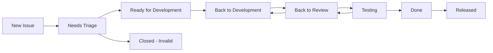

# 📊 Project Management Guide

This document outlines the project management processes, tools, and workflows for the Multimodal LLM Stack project.

## 🎯 Project Structure

### GitHub Projects Integration

We use **GitHub Projects (Beta)** for project management with automated workflows:

#### Project Boards

1. **🚀 Main Development Board**
   - **URL**: `https://github.com/orgs/your-org/projects/1`
   - **Purpose**: Track all development work
   - **Views**: Kanban, Sprint Planning, Roadmap

2. **🐛 Bug Triage Board**
   - **URL**: `https://github.com/orgs/your-org/projects/2`
   - **Purpose**: Manage bug reports and fixes
   - **Views**: Priority Matrix, Component Breakdown

3. **📚 Documentation Board**
   - **URL**: `https://github.com/orgs/your-org/projects/3`
   - **Purpose**: Track documentation tasks
   - **Views**: Content Type, Status

### Board Columns

#### Main Development Board
- **📥 Backlog**: New issues awaiting triage
- **🔍 Ready**: Triaged and ready for development
- **🏗️ In Progress**: Currently being worked on
- **👀 In Review**: Pull request under review
- **🧪 Testing**: In testing/QA phase
- **✅ Done**: Completed and merged
- **🚀 Released**: Deployed to production

#### Automated Workflows
- **New Issues**: Auto-added to "Backlog"
- **PR Created**: Move to "In Review"
- **PR Merged**: Move to "Done"
- **Release Created**: Move to "Released"

## 🏷️ Issue Management

### Issue Templates

We provide structured templates for consistent issue reporting:

1. **🐛 Bug Report** (`bug_report.yml`)
   - Pre-flight checklist
   - Component selection
   - Severity classification
   - Reproduction steps
   - Environment details

2. **✨ Feature Request** (`feature_request.yml`)
   - Feature categorization
   - Priority assessment
   - Problem statement
   - Acceptance criteria

3. **📋 Task/Chore** (`task.yml`)
   - Task type classification
   - Priority level
   - Impact assessment
   - Dependencies

### Label System

#### Type Labels
- `bug` 🐛 - Something isn't working
- `enhancement` ✨ - New feature or request
- `task` 📋 - Maintenance or technical debt
- `documentation` 📚 - Documentation improvements
- `question` ❓ - Further information requested

#### Priority Labels
- `priority/critical` 🚨 - Blocking issue, needs immediate attention
- `priority/high` 🔴 - Important issue, should be addressed soon
- `priority/medium` 🟡 - Normal priority
- `priority/low` 🟢 - Nice to have, can wait

#### Component Labels
- `component/api` 🔌 - API related issues
- `component/worker` ⚙️ - Multimodal worker service
- `component/proxy` 🔍 - Retrieval proxy service
- `component/database` 💾 - Database related
- `component/docker` 🐳 - Docker/containerization
- `component/docs` 📚 - Documentation
- `component/ci` 👷 - CI/CD pipeline

#### Status Labels
- `status/needs-triage` 🏷️ - Needs initial review
- `status/blocked` 🚫 - Blocked by external factors
- `status/wip` 🚧 - Work in progress
- `status/ready-for-review` 👀 - Ready for code review
- `status/needs-testing` 🧪 - Needs testing

### Issue Lifecycle



## 🎯 Sprint Planning

### Sprint Structure
- **Duration**: 2 weeks
- **Sprint Planning**: Every other Monday
- **Sprint Review**: Every other Friday
- **Retrospective**: After sprint review

### Sprint Ceremonies

#### 1. Sprint Planning (2 hours)
**Attendees**: Development team, Product Owner
**Agenda**:
- Review previous sprint
- Discuss upcoming priorities
- Estimate story points
- Commit to sprint backlog

#### 2. Daily Standups (15 minutes)
**Format**: Async via GitHub comments
**Questions**:
- What did you work on yesterday?
- What will you work on today?
- Any blockers or impediments?

#### 3. Sprint Review (1 hour)
**Attendees**: Development team, stakeholders
**Agenda**:
- Demo completed features
- Review metrics and KPIs
- Gather feedback
- Update roadmap

#### 4. Sprint Retrospective (1 hour)
**Attendees**: Development team
**Format**: Start/Stop/Continue
**Focus**: Process improvements

### Story Point Estimation

We use **Fibonacci sequence** for story points:

| Points | Complexity | Time Estimate |
|--------|------------|---------------|
| 1 | Trivial | 1-2 hours |
| 2 | Simple | Half day |
| 3 | Medium | 1 day |
| 5 | Complex | 2-3 days |
| 8 | Very Complex | 1 week |
| 13 | Epic | Needs breakdown |

## 📈 Metrics and KPIs

### Development Metrics

#### Velocity Tracking
- **Sprint Velocity**: Story points completed per sprint
- **Burndown Charts**: Progress tracking within sprints
- **Cumulative Flow**: Work item flow through stages

#### Quality Metrics
- **Bug Rate**: Bugs per feature/sprint
- **Code Coverage**: Percentage of code covered by tests
- **Technical Debt**: Time spent on maintenance vs features

#### Performance Metrics
- **Lead Time**: Idea to production deployment
- **Cycle Time**: Development start to completion
- **Deployment Frequency**: How often we deploy
- **Mean Time to Recovery**: Time to fix production issues

### Automated Metrics Collection

```yaml
# .github/workflows/metrics.yml
name: 📊 Collect Metrics
on:
  schedule:
    - cron: '0 9 * * 1' # Every Monday at 9 AM
  workflow_dispatch:

jobs:
  collect-metrics:
    runs-on: ubuntu-latest
    steps:
      - name: 📊 Collect GitHub metrics
        run: |
          # Collect issues, PRs, deployments, etc.
          # Generate reports
          # Update dashboards
```

## 🗺️ Roadmap Planning

### Quarterly Planning

#### Q1 2024: Foundation
- ✅ Core multimodal stack implementation
- ✅ Basic CI/CD pipeline
- ✅ Documentation framework
- ✅ Initial performance optimization

#### Q2 2024: Enhancement
- 🔄 Advanced monitoring and observability
- 🔄 Performance optimization
- 🔄 Security hardening
- 🔄 API v2 development

#### Q3 2024: Scale
- 📋 Horizontal scaling capabilities
- 📋 Advanced model integrations
- 📋 Enterprise features
- 📋 Multi-cloud deployment

#### Q4 2024: Innovation
- 📋 AI-powered optimization
- 📋 Advanced multimodal capabilities
- 📋 Integration ecosystem
- 📋 Community features

### Feature Prioritization

#### Priority Framework (RICE)
- **Reach**: How many users will benefit?
- **Impact**: How much will it improve their experience?
- **Confidence**: How sure are we about reach/impact?
- **Effort**: How much development time needed?

**Score = (Reach × Impact × Confidence) / Effort**

## 👥 Team Roles and Responsibilities

### Core Team
- **🎯 Product Owner**: Define requirements, prioritize backlog
- **👨‍💻 Tech Lead**: Architecture decisions, code review
- **🔧 DevOps Engineer**: Infrastructure, CI/CD, monitoring
- **📚 Technical Writer**: Documentation, user guides
- **🧪 QA Engineer**: Testing, quality assurance

### Responsibilities Matrix

| Role | Planning | Development | Review | Testing | Deployment |
|------|----------|-------------|--------|---------|------------|
| Product Owner | ✅ Lead | ❌ | ✅ Requirements | ✅ Acceptance | ❌ |
| Tech Lead | ✅ Technical | ✅ Architecture | ✅ Lead | ✅ Technical | ✅ Approve |
| Developer | ✅ Estimation | ✅ Implementation | ✅ Peer Review | ✅ Unit Tests | ❌ |
| DevOps | ✅ Infrastructure | ✅ CI/CD | ✅ Infrastructure | ✅ Integration | ✅ Execute |
| QA | ✅ Test Planning | ❌ | ✅ Quality | ✅ Lead | ❌ |

## 🔄 Release Management

### Release Cycle
- **Major Releases**: Quarterly (v1.0.0, v2.0.0)
- **Minor Releases**: Monthly (v1.1.0, v1.2.0)
- **Patch Releases**: As needed (v1.1.1, v1.1.2)
- **Hotfixes**: Emergency fixes

### Release Process

1. **🎯 Release Planning**
   - Define scope and goals
   - Create release milestone
   - Assign issues to release

2. **🏗️ Development Phase**
   - Feature development
   - Code reviews
   - Testing

3. **🧪 Testing Phase**
   - Integration testing
   - Performance testing
   - Security scanning

4. **📦 Release Preparation**
   - Version bumping
   - Changelog generation
   - Documentation updates

5. **🚀 Deployment**
   - Staging deployment
   - Production deployment
   - Post-deployment verification

6. **📢 Communication**
   - Release notes
   - User notifications
   - Team updates

### Release Criteria

#### Definition of Done
- ✅ All features implemented and tested
- ✅ Code review completed
- ✅ Documentation updated
- ✅ Performance benchmarks met
- ✅ Security scan passed
- ✅ Deployment verified

#### Go/No-Go Criteria
- ✅ All critical bugs fixed
- ✅ Performance within acceptable range
- ✅ Security vulnerabilities addressed
- ✅ Rollback plan ready
- ✅ Team available for support

## 📊 Dashboard and Reporting

### GitHub Insights
- **Pulse**: Repository activity overview
- **Contributors**: Contribution statistics
- **Traffic**: Repository traffic and clones
- **Issues**: Issue trends and resolution times

### Custom Dashboards

#### Development Dashboard
```markdown
## 📊 Development Metrics

### Current Sprint
- **Sprint Goal**: Implement advanced search features
- **Story Points**: 23 / 30 committed
- **Burndown**: On track
- **Blockers**: 1 (dependency issue)

### Quality Metrics
- **Code Coverage**: 87%
- **Bug Rate**: 2.1 bugs per story
- **Technical Debt**: 15% of velocity

### Performance
- **Build Success Rate**: 94%
- **Deployment Frequency**: 2.3 per week
- **Lead Time**: 4.2 days average
```

#### Health Dashboard
```markdown
## 🏥 System Health

### Production Status
- **Uptime**: 99.9%
- **Response Time**: 150ms avg
- **Error Rate**: 0.1%
- **Active Users**: 1,247

### Infrastructure
- **CPU Usage**: 45%
- **Memory Usage**: 62%
- **Disk Usage**: 34%
- **Network**: Normal
```

## 🤝 Collaboration Tools

### Communication Channels
- **📧 Email**: Formal communications
- **💬 Slack/Discord**: Daily communication
- **📹 Zoom**: Meetings and pair programming
- **📝 GitHub**: Code discussions and reviews

### Documentation Tools
- **📚 GitHub Wiki**: Technical documentation
- **📖 GitBook**: User documentation
- **🎥 Loom**: Video explanations
- **📊 Miro**: Diagrams and planning

### Development Tools
- **💻 VS Code**: Primary IDE
- **🐳 Docker**: Development environment
- **🔍 GitHub Codespaces**: Cloud development
- **🧪 Postman**: API testing

## 🎓 Best Practices

### Project Management
1. **Keep issues small and focused**
2. **Use templates for consistency**
3. **Label everything appropriately**
4. **Link related issues and PRs**
5. **Update status regularly**

### Communication
1. **Be transparent and open**
2. **Document decisions and rationale**
3. **Use async communication effectively**
4. **Provide regular updates**
5. **Ask for help when needed**

### Quality Assurance
1. **Define clear acceptance criteria**
2. **Test early and often**
3. **Automate repetitive tasks**
4. **Monitor metrics continuously**
5. **Learn from failures**

---

This project management guide is a living document. Please contribute improvements and suggestions through issues or pull requests! 🚀
