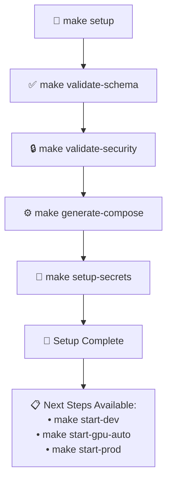
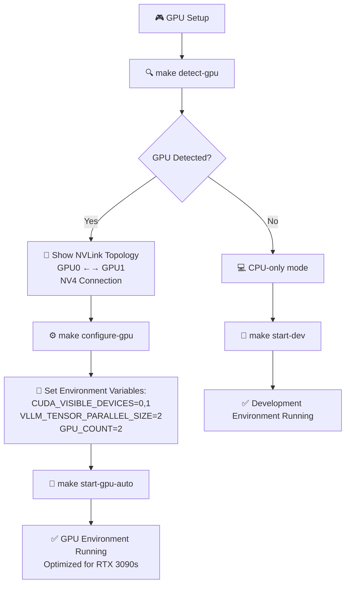
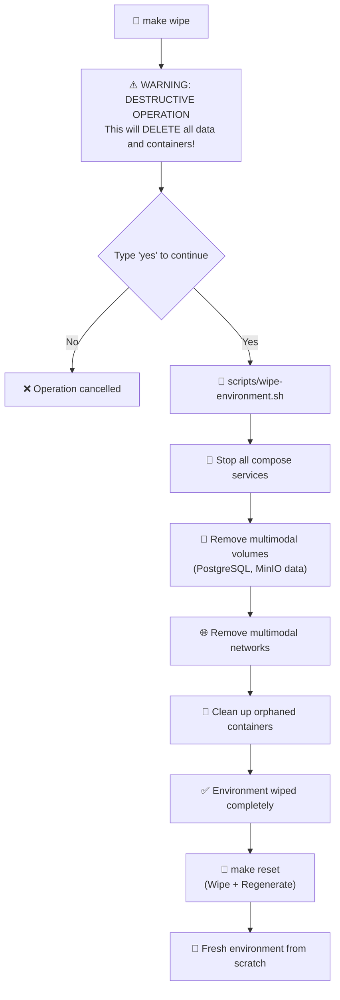
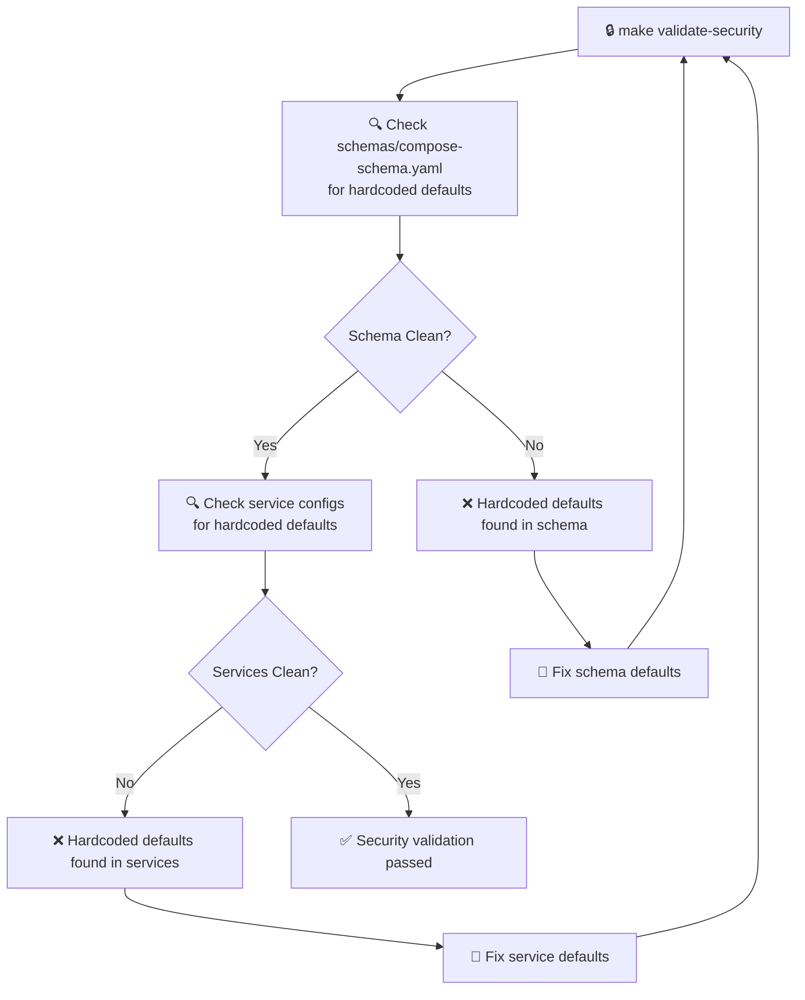
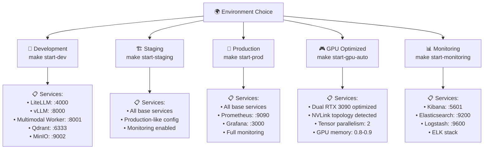

# Enhanced Workflow Diagram - LLM Multimodal Stack (Post PR 130 + Enhancements)

## 🎯 Overview

This diagram shows the complete workflow for the enhanced LLM Multimodal Stack, including the unified schema system from PR 130 and the new GPU optimization, environment wipe, and security hardening features.

## 🏗️ Enhanced System Architecture

```mermaid
graph TB
    %% User Interface Layer
    subgraph UserInterface[User Interface Layer]
        Developer["👨‍💻 Developer"]
        Makefile["📋 Makefile Commands"]
        Scripts["🔧 Enhanced Scripts"]
    end

    %% Enhanced Command Layer
    subgraph CommandLayer[Enhanced Command Layer]
        CoreCommands["Core Commands<br/>make setup, start-dev, start-prod"]
        GPUCommands["🎮 GPU Commands<br/>make detect-gpu, configure-gpu<br/>make start-gpu-auto"]
        WipeCommands["🧹 Wipe Commands<br/>make wipe, make reset"]
        SecurityCommands["🔒 Security Commands<br/>make validate-security"]
    end

    %% Unified Schema System (PR 130)
    subgraph SchemaSystem[Unified Schema System]
        Schema["📄 schemas/compose-schema.yaml<br/>Single Source of Truth (844 lines)"]
        Generator["⚙️ scripts/compose-generator.py<br/>Schema Processor"]
        GeneratedFiles["📁 Generated Compose Files<br/>compose.yml, compose.development.yml<br/>compose.staging.yml, compose.production.yml<br/>compose.gpu.yml, compose.elk.yml"]
    end

    %% Environment Templates
    subgraph EnvTemplates[Environment Templates]
        EnvTemplates["📄 env-templates/*.env.j2<br/>Jinja2 Templates"]
        CoreTemplate["core.env.j2"]
        VLLMTemplate["vllm.env.j2"]
        MasterTemplate["master.env.j2"]
        ServiceTemplates["Service-specific templates"]
    end

    %% Enhanced GPU System
    subgraph GPUSystem[Enhanced GPU System]
        GPUDetection["🔍 scripts/configure-gpu.sh<br/>GPU Detection & Configuration"]
        NVLinkDetection["🔗 NVLink Topology Detection"]
        RTX3090Config["🎮 RTX 3090 Optimization<br/>Tensor Parallelism: 2<br/>GPU Memory: 0.8-0.9"]
        CUDAConfig["⚡ CUDA Configuration<br/>CUDA_VISIBLE_DEVICES=0,1<br/>VLLM_TENSOR_PARALLEL_SIZE=2"]
    end

    %% Environment Wipe System
    subgraph WipeSystem[Environment Wipe System]
        WipeScript["🧹 scripts/wipe-environment.sh<br/>Comprehensive Reset"]
        ContainerWipe["🗑️ Container Cleanup"]
        VolumeWipe["💾 Volume Cleanup<br/>PostgreSQL, MinIO data"]
        NetworkWipe["🌐 Network Cleanup"]
        SecretsRegen["🔐 Secrets Regeneration"]
    end

    %% Security System
    subgraph SecuritySystem[Security System]
        SecurityValidation["🔒 Security Validation<br/>No hardcoded defaults"]
        SecretsManagement["🔐 Secrets Management<br/>setup_secrets.py"]
        SchemaValidation["✅ Schema Validation<br/>syntax and structure"]
    end

    %% Service Categories
    subgraph CoreServices[Core Services]
        Postgres[("🐘 PostgreSQL<br/>Database")]
        Redis[("🔴 Redis<br/>Cache")]
        Qdrant[("🔍 Qdrant<br/>Vector DB")]
        Minio[("📦 MinIO<br/>Object Storage")]
    end

    subgraph InferenceServices[Inference Services]
        VLLM["🚀 vLLM<br/>Model Server<br/>:8000"]
        LiteLLM["⚡ LiteLLM<br/>API Gateway<br/>:4000"]
    end

    subgraph MultimodalServices[Multimodal Services]
        MultimodalWorker["🤖 Multimodal Worker<br/>:8001"]
        RetrievalProxy["🔍 Retrieval Proxy<br/>:8002"]
        AIAgents["🧠 AI Agents<br/>:8003"]
        MemorySystem["🧠 Memory System<br/>:8004"]
        SearchEngine["🔍 Search Engine<br/>:8005"]
        UserManagement["👤 User Management<br/>:8006"]
    end

    subgraph UIServices[UI & Workflow Services]
        OpenWebUI["🌐 OpenWebUI<br/>:3030"]
        N8N["⚡ n8n<br/>:5678"]
        N8NMonitoring["📊 n8n Monitoring<br/>:5679"]
    end

    subgraph MonitoringServices[Monitoring Services]
        Prometheus["📊 Prometheus<br/>:9090"]
        Grafana["📈 Grafana<br/>:3000"]
        Elasticsearch["🔍 Elasticsearch<br/>:9200"]
        Kibana["📊 Kibana<br/>:5601"]
        Logstash["📝 Logstash<br/>:9600"]
    end

    %% Enhanced Workflow Connections
    Developer --> Makefile
    Makefile --> CoreCommands
    Makefile --> GPUCommands
    Makefile --> WipeCommands
    Makefile --> SecurityCommands

    %% Schema System Flow
    CoreCommands --> Schema
    Schema --> Generator
    Generator --> GeneratedFiles
    GeneratedFiles --> CoreServices
    GeneratedFiles --> InferenceServices
    GeneratedFiles --> MultimodalServices
    GeneratedFiles --> UIServices
    GeneratedFiles --> MonitoringServices

    %% GPU Enhancement Flow
    GPUCommands --> GPUDetection
    GPUDetection --> NVLinkDetection
    NVLinkDetection --> RTX3090Config
    RTX3090Config --> CUDAConfig
    CUDAConfig --> GeneratedFiles

    %% Wipe Enhancement Flow
    WipeCommands --> WipeScript
    WipeScript --> ContainerWipe
    WipeScript --> VolumeWipe
    WipeScript --> NetworkWipe
    WipeScript --> SecretsRegen

    %% Security Enhancement Flow
    SecurityCommands --> SecurityValidation
    SecurityValidation --> Schema
    SecurityValidation --> EnvTemplates
    SecretsManagement --> EnvTemplates

    %% Environment Template Flow
    EnvTemplates --> CoreTemplate
    EnvTemplates --> VLLMTemplate
    EnvTemplates --> MasterTemplate
    EnvTemplates --> ServiceTemplates

    %% Service Dependencies
    InferenceServices --> CoreServices
    MultimodalServices --> CoreServices
    MultimodalServices --> InferenceServices
    UIServices --> MultimodalServices
    MonitoringServices --> CoreServices

    %% Styling
    classDef enhanced fill:#e1f5fe,stroke:#01579b,stroke-width:2px
    classDef gpu fill:#f3e5f5,stroke:#4a148c,stroke-width:2px
    classDef wipe fill:#fff3e0,stroke:#e65100,stroke-width:2px
    classDef security fill:#e8f5e8,stroke:#1b5e20,stroke-width:2px
    classDef core fill:#fce4ec,stroke:#880e4f,stroke-width:2px

    class GPUCommands,GPUDetection,NVLinkDetection,RTX3090Config,CUDAConfig gpu
    class WipeCommands,WipeScript,ContainerWipe,VolumeWipe,NetworkWipe,SecretsRegen wipe
    class SecurityCommands,SecurityValidation,SecuritySystem security
    class CoreServices,InferenceServices,MultimodalServices,UIServices,MonitoringServices core
    class CoreCommands,Schema,Generator,GeneratedFiles,EnvTemplates enhanced
```

## 🚀 Enhanced Workflow Processes

### 1. Complete Setup Workflow



### 2. Enhanced GPU Workflow



### 3. Environment Wipe Workflow



### 4. Security Validation Workflow



### 5. Environment Management Workflow



## 🔄 Enhanced Command Matrix

### Core Function Matrix

| Command | Schema Validation | Security Validation | Generate Compose | Setup Secrets | Start Services | GPU Detection | GPU Configuration | Environment Wipe | Complete Reset |
|---------|:-----------------:|:------------------:|:----------------:|:-------------:|:--------------:|:-------------:|:----------------:|:----------------:|:---------------:|
| `make setup` | ✅ | ✅ | ✅ | ✅ | ❌ | ❌ | ❌ | ❌ | ❌ |
| `make start-dev` | ❌ | ❌ | ✅ | ✅ | ✅ (dev) | ❌ | ❌ | ❌ | ❌ |
| `make start-staging` | ❌ | ❌ | ✅ | ✅ | ✅ (staging) | ❌ | ❌ | ❌ | ❌ |
| `make start-prod` | ❌ | ❌ | ✅ | ✅ | ✅ (prod) | ❌ | ❌ | ❌ | ❌ |
| `make start-gpu` | ❌ | ❌ | ✅ | ✅ | ✅ (gpu) | ❌ | ❌ | ❌ | ❌ |
| `make start-monitoring` | ❌ | ❌ | ✅ | ✅ | ✅ (monitoring) | ❌ | ❌ | ❌ | ❌ |
| `make detect-gpu` | ❌ | ❌ | ❌ | ❌ | ❌ | ✅ | ❌ | ❌ | ❌ |
| `make configure-gpu` | ❌ | ❌ | ❌ | ❌ | ❌ | ❌ | ✅ | ❌ | ❌ |
| `make start-gpu-auto` | ❌ | ❌ | ✅ | ✅ | ✅ (gpu) | ✅ | ✅ | ❌ | ❌ |
| `make wipe` | ❌ | ❌ | ❌ | ❌ | ❌ | ❌ | ❌ | ✅ | ❌ |
| `make reset` | ✅ | ✅ | ✅ | ✅ | ❌ | ❌ | ❌ | ✅ | ✅ |
| `make validate-schema` | ✅ | ❌ | ❌ | ❌ | ❌ | ❌ | ❌ | ❌ | ❌ |
| `make validate-security` | ❌ | ✅ | ❌ | ❌ | ❌ | ❌ | ❌ | ❌ | ❌ |
| `make generate-compose` | ❌ | ❌ | ✅ | ❌ | ❌ | ❌ | ❌ | ❌ | ❌ |
| `make setup-secrets` | ❌ | ❌ | ❌ | ✅ | ❌ | ❌ | ❌ | ❌ | ❌ |

### Service Matrix

**Core Infrastructure:** PostgreSQL, Redis, Qdrant, MinIO  
**Inference:** vLLM, LiteLLM  
**AI Services:** Multimodal Worker, Retrieval Proxy, AI Agents, Memory System, Search Engine, User Management  
**UI/Workflow:** OpenWebUI, n8n, n8n Monitoring  
**Monitoring:** Prometheus, Grafana, Elasticsearch, Kibana, Logstash, Filebeat

| Command | PostgreSQL | Redis | Qdrant | MinIO | vLLM | LiteLLM | Multimodal Worker | Retrieval Proxy | AI Agents | Memory System | Search Engine | User Management | OpenWebUI | n8n | n8n Monitoring | Nginx | Elasticsearch | Kibana | Logstash | Filebeat |
|---------|:----------:|:-----:|:------:|:-----:|:----:|:-------:|:----------------:|:---------------:|:---------:|:-------------:|:-------------:|:---------------:|:---------:|:---:|:-------------:|:-----:|:-------------:|:-----:|:-------:|:--------:|
| `make start-dev` | ✅ | ✅ | ✅ | ✅ | ✅ | ✅ | ✅ | ✅ | ❌ | ❌ | ❌ | ❌ | ❌ | ❌ | ❌ | ❌ | ❌ | ❌ | ❌ | ❌ |
| `make start-staging` | ✅ | ✅ | ✅ | ✅ | ✅ | ✅ | ✅ | ✅ | ⏳ | ⏳ | ⏳ | ⏳ | ⏳ | ⏳ | ⏳ | ⏳ | ❌ | ❌ | ❌ | ❌ |
| `make start-prod` | ✅ | ✅ | ✅ | ✅ | ✅ | ✅ | ✅ | ✅ | ⏳ | ⏳ | ⏳ | ⏳ | ⏳ | ⏳ | ⏳ | ⏳ | ❌ | ❌ | ❌ | ❌ |
| `make start-gpu` | ✅ | ✅ | ✅ | ✅ | ✅ | ✅ | ✅ | ✅ | ❌ | ❌ | ❌ | ❌ | ❌ | ❌ | ❌ | ❌ | ❌ | ❌ | ❌ | ❌ |
| `make start-gpu-auto` | ✅ | ✅ | ✅ | ✅ | ✅ | ✅ | ✅ | ✅ | ❌ | ❌ | ❌ | ❌ | ❌ | ❌ | ❌ | ❌ | ❌ | ❌ | ❌ | ❌ |
| `make start-monitoring` | ✅ | ✅ | ✅ | ✅ | ✅ | ✅ | ✅ | ✅ | ❌ | ❌ | ❌ | ❌ | ✅ | ✅ | ❌ | ❌ | ✅ | ✅ | ✅ | ✅ |
| `make setup` | ❌ | ❌ | ❌ | ❌ | ❌ | ❌ | ❌ | ❌ | ❌ | ❌ | ❌ | ❌ | ❌ | ❌ | ❌ | ❌ | ❌ | ❌ | ❌ | ❌ |
| `make detect-gpu` | ❌ | ❌ | ❌ | ❌ | ❌ | ❌ | ❌ | ❌ | ❌ | ❌ | ❌ | ❌ | ❌ | ❌ | ❌ | ❌ | ❌ | ❌ | ❌ | ❌ |
| `make configure-gpu` | ❌ | ❌ | ❌ | ❌ | ❌ | ❌ | ❌ | ❌ | ❌ | ❌ | ❌ | ❌ | ❌ | ❌ | ❌ | ❌ | ❌ | ❌ | ❌ | ❌ |
| `make wipe` | ❌ | ❌ | ❌ | ❌ | ❌ | ❌ | ❌ | ❌ | ❌ | ❌ | ❌ | ❌ | ❌ | ❌ | ❌ | ❌ | ❌ | ❌ | ❌ | ❌ |
| `make reset` | ❌ | ❌ | ❌ | ❌ | ❌ | ❌ | ❌ | ❌ | ❌ | ❌ | ❌ | ❌ | ❌ | ❌ | ❌ | ❌ | ❌ | ❌ | ❌ | ❌ |

**Service Tiers:**
- **Development (`start-dev`, `start-gpu`)**: Core infrastructure + inference services only (minimal footprint - 8 services)
- **Staging (`start-staging`)**: Same as dev/GPU with staging optimizations (8 services) ⏳ *Additional services pending Dockerfile creation*
- **Production (`start-prod`)**: Same as dev/GPU with production optimizations (8 services) ⏳ *Additional services pending Dockerfile creation*
- **Monitoring (`start-monitoring`)**: Core services + ELK stack for log analysis (14 services)

**Legend:** ✅ Active | ❌ Not included | ⏳ Pending (Dockerfiles needed)

### Service Categories

| Category | Services | Purpose |
|----------|----------|---------|
| **Core Services** | PostgreSQL, Redis, Qdrant, MinIO | Database, cache, vector storage, object storage |
| **Inference Services** | vLLM, LiteLLM | Model serving and API gateway |
| **Multimodal Services** | Multimodal Worker, Retrieval Proxy, AI Agents, Memory System, Search Engine, User Management | Core application functionality |
| **UI & Workflow** | OpenWebUI, n8n, n8n Monitoring | User interfaces and workflow automation |
| **Monitoring** | Prometheus, Grafana | Metrics and dashboards |
| **Logging** | Elasticsearch, Kibana, Logstash | Centralized logging and analysis |

### Function Legend

| Function | Description |
|----------|-------------|
| **Schema Validation** | Validates `schemas/compose-schema.yaml` syntax and structure |
| **Security Validation** | Checks for hardcoded defaults in schema and service configs |
| **Generate Compose** | Generates all Docker Compose files from unified schema |
| **Setup Secrets** | Creates environment files and generates secure secrets |
| **Start Services** | Starts the specified environment (dev/staging/prod/gpu/monitoring) |
| **GPU Detection** | Detects GPU hardware and NVLink topology |
| **GPU Configuration** | Configures optimal GPU settings and environment variables |
| **Environment Wipe** | Removes all containers, volumes, and networks |
| **Complete Reset** | Wipes environment and regenerates everything from scratch |

## 🎯 **Command Relationships & Overlaps**

### **No Overlap - Each Command Has Unique Purpose**
- ✅ **`detect-gpu`**: Only detects GPU (doesn't configure or start)
- ✅ **`configure-gpu`**: Only configures GPU (doesn't detect or start)
- ✅ **`start-gpu`**: Only starts GPU environment (doesn't detect or configure)
- ✅ **`start-gpu-auto`**: Complete workflow (detect + configure + start)

### **Dependency Chains**
```
make start-gpu-auto
├── detect-gpu (runs first)
├── configure-gpu (runs second)
└── start-gpu (runs third)

make reset
├── wipe (runs first)
└── setup (runs second)

make setup
├── validate-schema
├── validate-security
├── generate-compose
└── setup-secrets
```

### **Recommended Usage Patterns**

#### **For GPU Development:**
```bash
# Option 1: Complete automated workflow
make start-gpu-auto

# Option 2: Step-by-step control
make detect-gpu          # Check what GPUs are available
make configure-gpu       # Configure optimal settings
make start-gpu          # Start the environment
```

#### **For Environment Reset:**
```bash
# Option 1: Nuclear reset (recommended)
make reset              # Wipes everything + regenerates

# Option 2: Just wipe (manual setup after)
make wipe               # Only wipes, you setup manually after
```

#### **For Development:**
```bash
# Option 1: Complete setup from scratch
make setup              # Validates + generates + configures
make start-dev          # Start development environment

# Option 2: Quick development (if already set up)
make start-dev          # Just start (auto-generates if needed)
```

## 🎯 Key Enhancements Over Previous System

### ✅ **What's New**
1. **GPU Auto-Detection**: Automatic RTX 3090 and NVLink topology detection
2. **Comprehensive Wipe**: Complete environment reset including database volumes
3. **Security Hardening**: Validation and removal of hardcoded defaults
4. **Enhanced Makefile**: Professional command interface with new targets
5. **Unified Schema**: Single source of truth for all configurations

### 🔄 **What's Improved**
1. **Schema-Driven**: All compose files generated from unified schema
2. **Template-Based**: Jinja2 environment templates for consistency
3. **Professional Commands**: Clean, intuitive Makefile targets
4. **Comprehensive Documentation**: Complete workflow and configuration guides

---

**Diagram Version**: 2.0 (Post PR 130 + Enhancements)  
**Last Updated**: October 1, 2024  
**Compatible With**: Enhanced LLM Multimodal Stack
