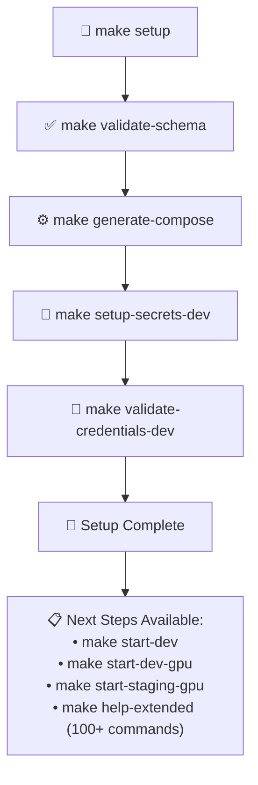
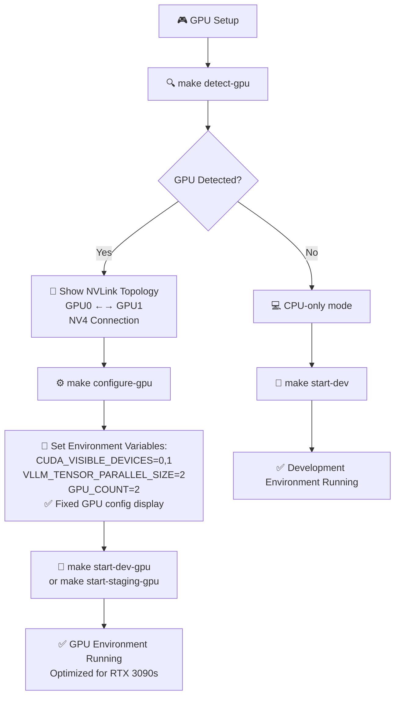
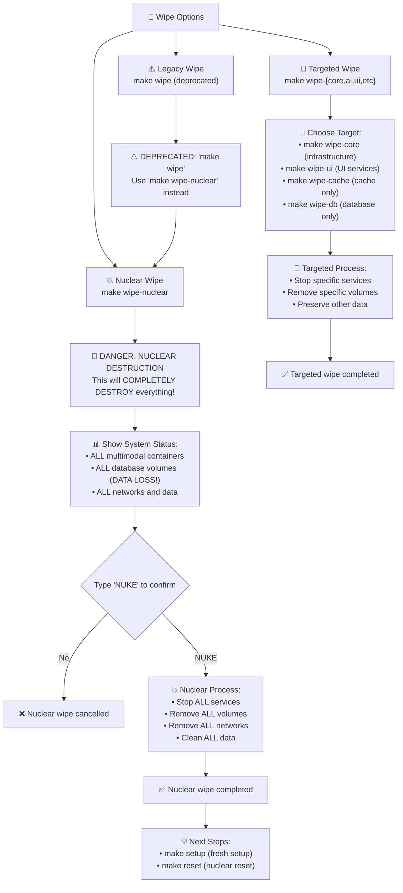
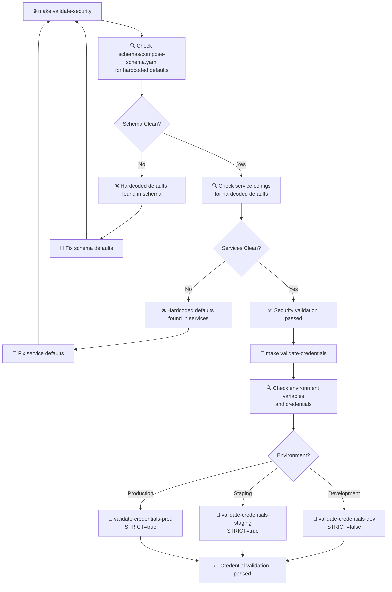
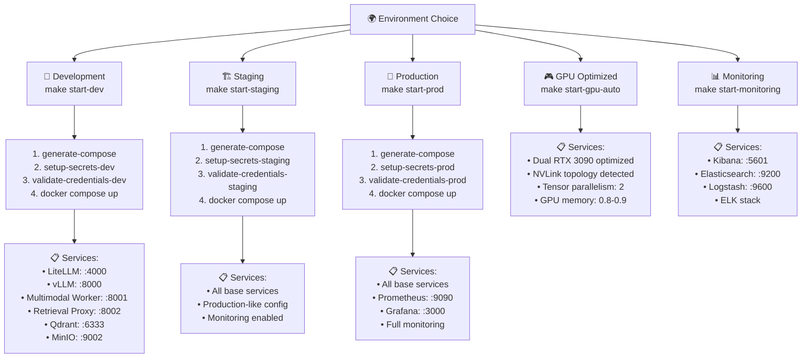
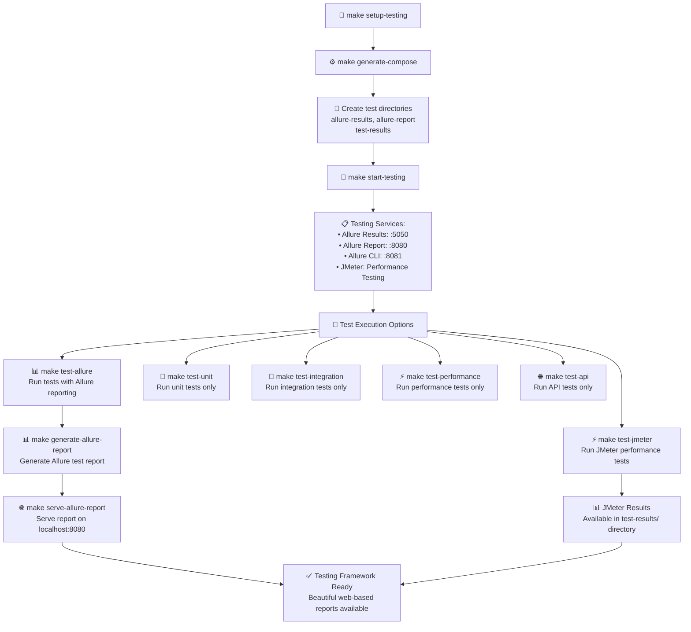
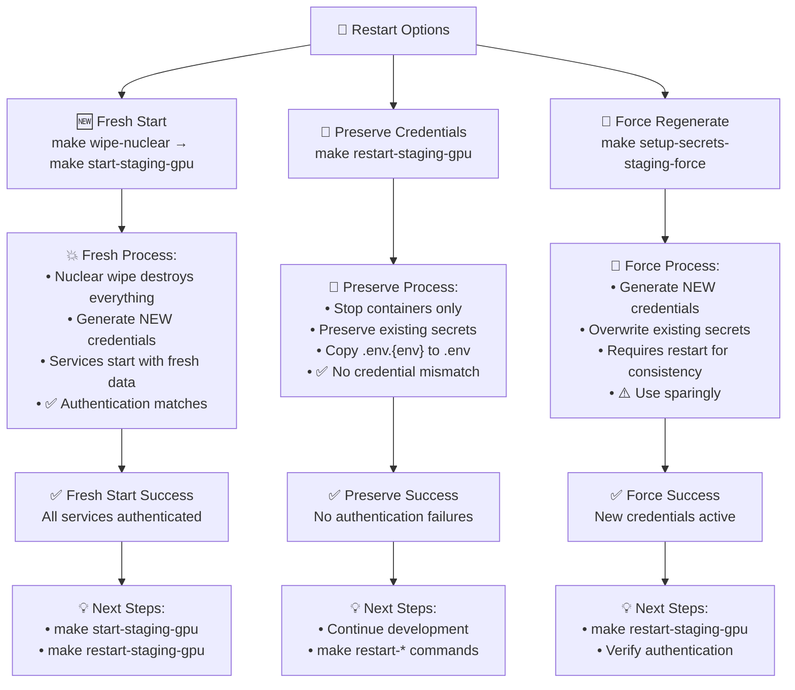
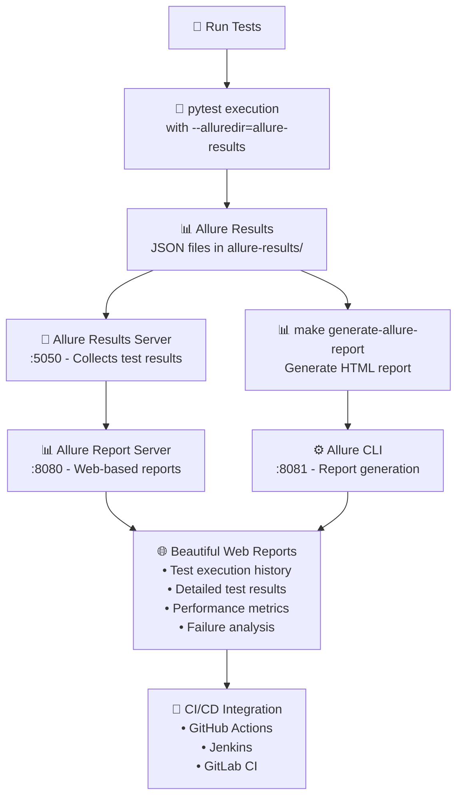

# Enhanced Workflow Diagram - LLM Multimodal Stack

## 🎯 Overview

This diagram shows the complete workflow for the enhanced LLM Multimodal Stack, including the unified schema system from PR 130 and all major enhancements: GPU optimization, stack-based architecture, network management, granular wipe/reset operations, data retention policies, and multi-tier backup system.

**Current Status**: Streamlined Makefile with essential commands by default and all extended functionality preserved. Nuclear wipe mode with comprehensive destruction and targeted wipe options for granular control.

## 🏗️ Enhanced System Architecture

```mermaid
graph TB
    %% User Interface Layer
    subgraph UserInterface[User Interface Layer]
        Developer["👨‍💻 Developer"]
        Makefile["📋 Makefile Commands"]
        Scripts["🔧 Enhanced Scripts"]
    end

    %% Enhanced Command Layer
    subgraph CommandLayer[Enhanced Command Layer]
        EssentialCommands["📋 Essential Commands<br/>make setup, start-dev, start-staging<br/>make start-dev-gpu, start-staging-gpu<br/>make stop, stop-all, wipe, reset, status, logs<br/>make restart-{dev,staging,prod} (preserves credentials)"]
        GPUCommands["🎮 GPU Commands<br/>make detect-gpu, configure-gpu<br/>make start-gpu-auto"]
        ExtendedCommands["🔧 Extended Commands<br/>make help-extended (100+ commands)<br/>Stack, Network, Wipe, Testing<br/>Backup, Retention, Security"]
        NuclearWipe["💥 Nuclear Wipe<br/>make wipe-nuclear (type 'NUKE' to confirm)<br/>Complete environment destruction<br/>make wipe (deprecated alias)"]
        TargetedWipe["🎯 Targeted Wipe<br/>make wipe-{core,inference,ai,ui,testing,monitoring}<br/>make wipe-{db,cache,models,logs}<br/>Granular control for specific issues"]
        StackCommands["🏗️ Stack Commands<br/>make start-{core,inference,ai,ui,testing,monitoring}<br/>make stop-{core,inference,ai,ui,testing,monitoring}<br/>make stop-all, stop-dev, stop-staging, stop-prod<br/>make restart-{core,inference,ai,ui,testing,monitoring}"]
        NetworkCommands["🌐 Network Commands<br/>make check-network-conflicts<br/>make validate-networks, check-network-health<br/>make cleanup-networks"]
        RetentionCommands["📊 Retention Commands<br/>make retention-{status,cleanup,test}<br/>make retention-cleanup-service<br/>make retention-schedule"]
        BackupCommands["💾 Backup Commands<br/>make backup-{status,full,list,verify}<br/>make backup-service, backup-schedule<br/>make backup-restore"]
        SecurityCommands["🔒 Security Commands<br/>make validate-security"]
        CredentialCommands["🔐 Credential Commands<br/>make validate-credentials<br/>make validate-credentials-dev/staging/prod<br/>make setup-secrets-{env}-force (regenerate)<br/>Credential preservation on restart"]
        TestingCommands["🧪 Testing Commands<br/>make start-testing, test-allure<br/>make test-jmeter, test-unit/integration"]
    end

    %% Unified Schema System (PR 130)
    subgraph SchemaSystem[Unified Schema System]
        Schema["📄 schemas/compose-schema.yaml<br/>Single Source of Truth (844 lines)"]
        Generator["⚙️ scripts/compose-generator.py<br/>Schema Processor"]
        GeneratedFiles["📁 Generated Compose Files<br/>compose.yml, compose.development.yml<br/>compose.staging.yml, compose.production.yml<br/>compose.gpu.yml, compose.testing.yml<br/>compose.elk.yml"]
    end

    %% Environment Templates
    subgraph EnvTemplates[Environment Templates]
        EnvTemplates["📄 env-templates/*.env.j2<br/>Jinja2 Templates"]
        CoreTemplate["core.env.j2"]
        VLLMTemplate["vllm.env.j2"]
        MasterTemplate["master.env.j2"]
        ServiceTemplates["Service-specific templates"]
    end

    %% Enhanced GPU System
    subgraph GPUSystem[Enhanced GPU System]
        GPUDetection["🔍 scripts/configure-gpu.sh<br/>GPU Detection & Configuration"]
        NVLinkDetection["🔗 NVLink Topology Detection"]
        RTX3090Config["🎮 RTX 3090 Optimization<br/>Tensor Parallelism: 2<br/>GPU Memory: 0.8-0.9"]
        CUDAConfig["⚡ CUDA Configuration<br/>CUDA_VISIBLE_DEVICES=0,1<br/>VLLM_TENSOR_PARALLEL_SIZE=2"]
    end

    %% Stack-Based Architecture System
    subgraph StackSystem[Stack-Based Architecture System]
        CoreStack["🏗️ Core Stack<br/>postgres, redis, qdrant, minio<br/>multimodal-core-net (172.30.0.0/24)"]
        InferenceStack["⚡ Inference Stack<br/>vllm, litellm<br/>multimodal-inference-net (172.31.0.0/24)"]
        AIStack["🤖 AI Stack<br/>multimodal-worker, retrieval-proxy<br/>ai-agents, memory-system, search-engine<br/>multimodal-ai-net (172.32.0.0/24)"]
        UIStack["🖥️ UI Stack<br/>openwebui, n8n, n8n-monitoring, nginx<br/>multimodal-ui-net (172.33.0.0/24)"]
        TestingStack["🧪 Testing Stack<br/>allure-results, allure-report, allure-cli, jmeter<br/>multimodal-testing-net (172.34.0.0/24)"]
        MonitoringStack["📊 Monitoring Stack<br/>prometheus, grafana, elasticsearch, kibana<br/>multimodal-monitoring-net (172.35.0.0/24)"]
    end

    %% Network Management System
    subgraph NetworkSystem[Network Management System]
        NetworkConflictDetection["🔍 scripts/check-network-conflicts.sh<br/>Subnet Overlap Detection"]
        NetworkValidation["✅ scripts/validate-networks.sh<br/>Network Health & Connectivity"]
        NetworkCleanup["🧹 Network Cleanup<br/>Orphaned Network Removal"]
        IPAM["🌐 IP Address Management<br/>Subnet Allocation & Conflict Prevention"]
    end

    %% Data Management System
    subgraph DataSystem[Data Management System]
        RetentionPolicies["📊 configs/retention-policies.yaml<br/>Environment & Service-Specific Policies"]
        RetentionManagement["🧹 scripts/manage-retention.sh<br/>Automated Cleanup & Scheduling"]
        BackupStrategies["💾 configs/backup-strategies.yaml<br/>Multi-Tier Backup Strategies"]
        BackupManagement["💾 scripts/manage-backups.sh<br/>Comprehensive Backup Operations"]
        CronScheduling["⏰ scripts/setup-retention-cron.sh<br/>scripts/setup-backup-cron.sh<br/>Automated Scheduling"]
    end

    %% Environment Wipe System
    subgraph WipeSystem[Environment Wipe System]
        WipeScript["🧹 scripts/wipe-environment.sh<br/>Comprehensive Reset"]
        ContainerWipe["🗑️ Container Cleanup"]
        VolumeWipe["💾 Volume Cleanup<br/>PostgreSQL, MinIO data"]
        NetworkWipe["🌐 Network Cleanup"]
        SecretsRegen["🔐 Secrets Regeneration"]
    end

    %% Security System
    subgraph SecuritySystem[Security System]
        SecurityValidation["🔒 Security Validation<br/>No hardcoded defaults"]
        SecretsManagement["🔐 Secrets Management<br/>setup_secrets.py"]
        SchemaValidation["✅ Schema Validation<br/>syntax and structure"]
    end

    %% Service Categories
    subgraph CoreServices[Core Services]
        Postgres[("🐘 PostgreSQL<br/>Database")]
        Redis[("🔴 Redis<br/>Cache")]
        Qdrant[("🔍 Qdrant<br/>Vector DB")]
        Minio[("📦 MinIO<br/>Object Storage")]
    end

    subgraph InferenceServices[Inference Services]
        VLLM["🚀 vLLM<br/>Model Server<br/>:8000"]
        LiteLLM["⚡ LiteLLM<br/>API Gateway<br/>:4000"]
    end

    subgraph MultimodalServices[Multimodal Services]
        MultimodalWorker["🤖 Multimodal Worker<br/>:8001"]
        RetrievalProxy["🔍 Retrieval Proxy<br/>:8002"]
        AIAgents["🧠 AI Agents<br/>:8003"]
        MemorySystem["🧠 Memory System<br/>:8004"]
        SearchEngine["🔍 Search Engine<br/>:8005"]
        UserManagement["👤 User Management<br/>:8006"]
    end

    subgraph UIServices[UI & Workflow Services]
        OpenWebUI["🌐 OpenWebUI<br/>:3030"]
        N8N["⚡ n8n<br/>:5678"]
        N8NMonitoring["📊 n8n Monitoring<br/>:5679"]
    end

    subgraph MonitoringServices[Monitoring Services]
        Prometheus["📊 Prometheus<br/>:9090"]
        Grafana["📈 Grafana<br/>:3000"]
        Elasticsearch["🔍 Elasticsearch<br/>:9200"]
        Kibana["📊 Kibana<br/>:5601"]
        Logstash["📝 Logstash<br/>:9600"]
    end

    subgraph TestingServices[Testing Services]
        AllureResults["🧪 Allure Results<br/>:5050"]
        AllureReport["📊 Allure Report<br/>:8080"]
        AllureCLI["⚙️ Allure CLI<br/>:8081"]
        JMeter["⚡ JMeter<br/>Performance Testing"]
    end

    %% Enhanced Workflow Connections
    Developer --> Makefile
    Makefile --> EssentialCommands
    Makefile --> GPUCommands
    Makefile --> ExtendedCommands
    Makefile --> NuclearWipe
    ExtendedCommands --> TargetedWipe
    ExtendedCommands --> StackCommands
    ExtendedCommands --> NetworkCommands
    ExtendedCommands --> RetentionCommands
    ExtendedCommands --> BackupCommands
    ExtendedCommands --> SecurityCommands
    ExtendedCommands --> CredentialCommands
    ExtendedCommands --> TestingCommands

    %% Schema System Flow
    EssentialCommands --> Schema
    ExtendedCommands --> Schema
    Schema --> Generator
    Generator --> GeneratedFiles
    GeneratedFiles --> CoreServices
    GeneratedFiles --> InferenceServices
    GeneratedFiles --> MultimodalServices
    GeneratedFiles --> UIServices
    GeneratedFiles --> MonitoringServices
    GeneratedFiles --> TestingServices

    %% GPU Enhancement Flow
    GPUCommands --> GPUDetection
    GPUDetection --> NVLinkDetection
    NVLinkDetection --> RTX3090Config
    RTX3090Config --> CUDAConfig
    CUDAConfig --> GeneratedFiles

    %% Wipe Enhancement Flow
    NuclearWipe --> WipeScript
    TargetedWipe --> WipeScript
    WipeScript --> ContainerWipe
    WipeScript --> VolumeWipe
    WipeScript --> NetworkWipe
    WipeScript --> SecretsRegen

    %% Security Enhancement Flow
    SecurityCommands --> SecurityValidation
    SecurityValidation --> Schema
    SecurityValidation --> EnvTemplates
    SecretsManagement --> EnvTemplates
    
    %% Credential Validation Flow
    CredentialCommands --> SecurityValidation
    CredentialCommands --> EnvTemplates

    %% Stack System Flow
    StackCommands --> CoreStack
    StackCommands --> InferenceStack
    StackCommands --> AIStack
    StackCommands --> UIStack
    StackCommands --> TestingStack
    StackCommands --> MonitoringStack

    %% Network System Flow
    NetworkCommands --> NetworkConflictDetection
    NetworkCommands --> NetworkValidation
    NetworkCommands --> NetworkCleanup
    NetworkConflictDetection --> IPAM
    NetworkValidation --> IPAM

    %% Data Management Flow
    RetentionCommands --> RetentionPolicies
    RetentionCommands --> RetentionManagement
    BackupCommands --> BackupStrategies
    BackupCommands --> BackupManagement
    RetentionManagement --> CronScheduling
    BackupManagement --> CronScheduling

    %% Testing Enhancement Flow
    TestingCommands --> GeneratedFiles
    TestingCommands --> TestingServices

    %% Environment Template Flow
    EnvTemplates --> CoreTemplate
    EnvTemplates --> VLLMTemplate
    EnvTemplates --> MasterTemplate
    EnvTemplates --> ServiceTemplates

    %% Service Dependencies
    InferenceServices --> CoreServices
    MultimodalServices --> CoreServices
    MultimodalServices --> InferenceServices
    UIServices --> MultimodalServices
    MonitoringServices --> CoreServices
    TestingServices --> CoreServices

    %% Styling
    classDef enhanced fill:#e1f5fe,stroke:#01579b,stroke-width:2px
    classDef gpu fill:#f3e5f5,stroke:#4a148c,stroke-width:2px
    classDef wipe fill:#fff3e0,stroke:#e65100,stroke-width:2px
    classDef security fill:#e8f5e8,stroke:#1b5e20,stroke-width:2px
    classDef testing fill:#fff8e1,stroke:#f57f17,stroke-width:2px
    classDef core fill:#fce4ec,stroke:#880e4f,stroke-width:2px
    classDef essential fill:#e8f5e8,stroke:#2e7d32,stroke-width:3px

    class GPUCommands,GPUDetection,NVLinkDetection,RTX3090Config,CUDAConfig gpu
    class NuclearWipe,TargetedWipe,WipeScript,ContainerWipe,VolumeWipe,NetworkWipe,SecretsRegen wipe
    class SecurityCommands,SecurityValidation,SecuritySystem,CredentialCommands security
    class TestingCommands,TestingServices testing
    class CoreServices,InferenceServices,MultimodalServices,UIServices,MonitoringServices core
    class EssentialCommands,Schema,Generator,GeneratedFiles,EnvTemplates enhanced
    class EssentialCommands essential
```

## 🚀 Enhanced Workflow Processes

### 1. Complete Setup Workflow



### 2. Enhanced GPU Workflow



### 3. Environment Wipe Workflow



### 4. Security & Credential Validation Workflow



### 5. Environment Management Workflow



### 6. Testing Framework Workflow



### 7. Credential Preservation Workflow



### 8. Allure Test Reporting Workflow



## 🔄 Enhanced Command Matrix

### Core Function Matrix (Essential Commands)

| Command | Schema Validation | Credential Validation | Generate Compose | Setup Secrets | Start Services | GPU Detection | GPU Configuration | Interactive Wipe | Complete Reset | Essential Commands | Extended Commands |
|---------|:-----------------:|:--------------------:|:----------------:|:-------------:|:--------------:|:-------------:|:----------------:|:----------------:|:---------------:|:-----------------:|:----------------:|
| `make setup` | ✅ | ✅ (dev) | ✅ | ✅ (dev) | ❌ | ❌ | ❌ | ❌ | ❌ | ✅ | ❌ |
| `make start-dev` | ❌ | ✅ (dev) | ✅ | ✅ (dev) | ✅ (dev) | ❌ | ❌ | ❌ | ❌ | ✅ | ❌ |
| `make start-staging` | ❌ | ✅ (staging) | ✅ | ✅ (staging) | ✅ (staging) | ❌ | ❌ | ❌ | ❌ | ✅ | ❌ |
| `make start-dev-gpu` | ❌ | ✅ (dev) | ✅ | ✅ (dev) | ✅ (dev+gpu) | ✅ | ✅ | ❌ | ❌ | ✅ | ❌ |
| `make start-staging-gpu` | ❌ | ✅ (staging) | ✅ | ✅ (staging) | ✅ (staging+gpu) | ✅ | ✅ | ❌ | ❌ | ✅ | ❌ |
| `make restart-dev` | ❌ | ❌ | ❌ | ❌ | ✅ (dev) | ❌ | ❌ | ❌ | ❌ | ✅ | ❌ |
| `make restart-staging` | ❌ | ❌ | ❌ | ❌ | ✅ (staging) | ❌ | ❌ | ❌ | ❌ | ✅ | ❌ |
| `make restart-dev-gpu` | ❌ | ❌ | ❌ | ❌ | ✅ (dev+gpu) | ❌ | ❌ | ❌ | ❌ | ✅ | ❌ |
| `make restart-staging-gpu` | ❌ | ❌ | ❌ | ❌ | ✅ (staging+gpu) | ❌ | ❌ | ❌ | ❌ | ✅ | ❌ |
| `make detect-gpu` | ❌ | ❌ | ❌ | ❌ | ❌ | ✅ | ❌ | ❌ | ❌ | ✅ | ❌ |
| `make configure-gpu` | ❌ | ❌ | ❌ | ❌ | ❌ | ❌ | ✅ | ❌ | ❌ | ✅ | ❌ |
| `make wipe` | ❌ | ❌ | ❌ | ❌ | ❌ | ❌ | ❌ | ✅ (interactive) | ❌ | ✅ | ❌ |
| `make reset` | ✅ | ✅ (dev) | ✅ | ✅ (dev) | ❌ | ❌ | ❌ | ✅ | ✅ | ✅ | ❌ |
| `make stop` | ❌ | ❌ | ❌ | ❌ | ❌ | ❌ | ❌ | ❌ | ❌ | ✅ | ❌ |
| `make stop-all` | ❌ | ❌ | ❌ | ❌ | ❌ | ❌ | ❌ | ❌ | ❌ | ✅ | ❌ |
| `make status` | ❌ | ❌ | ❌ | ❌ | ❌ | ❌ | ❌ | ❌ | ❌ | ✅ | ❌ |
| `make logs` | ❌ | ❌ | ❌ | ❌ | ❌ | ❌ | ❌ | ❌ | ❌ | ✅ | ❌ |
| `make help` | ❌ | ❌ | ❌ | ❌ | ❌ | ❌ | ❌ | ❌ | ❌ | ✅ | ❌ |
| `make help-extended` | ❌ | ❌ | ❌ | ❌ | ❌ | ❌ | ❌ | ❌ | ❌ | ❌ | ✅ |

**Essential Commands (16 total)**: Focused on daily development tasks with streamlined interface including comprehensive stop commands and nuclear wipe  
**Extended Commands (100+ total)**: All advanced functionality preserved including targeted wipe options via `make help-extended`

### Extended Commands Categories

**Stack Management**: `make start-{core,inference,ai,ui,testing,monitoring}`, `make stop-*`, `make stop-all`, `make restart-*`  
**Network Management**: `make check-network-conflicts`, `make validate-networks`, `make cleanup-networks`  
**Nuclear Wipe**: `make wipe-nuclear` (complete destruction - type 'NUKE')  
**Granular Wipe**: `make wipe-{core,inference,ai,ui,testing,monitoring}`, `make wipe-{db,cache,models,logs}`  
**Legacy Wipe**: `make wipe` (deprecated - use `make wipe-nuclear`)  
**Data Management**: `make retention-{status,cleanup,test}`, `make backup-{status,full,list,verify}`  
**Security & Validation**: `make validate-security`, `make validate-credentials-{dev,staging,prod}`  
**Testing Framework**: `make start-testing`, `make test-{allure,jmeter,unit,integration,api}`  
**Schema & Compose**: `make generate-compose`, `make validate-schema`, `make setup-secrets-{dev,staging,prod}`

### Command Access Patterns

```bash
# Essential Commands (Default)
make help              # Shows 16 essential commands
make setup             # Complete setup
make start-dev-gpu     # GPU development
make stop-all          # Stop ALL services from ALL compose files
make wipe-nuclear      # Nuclear wipe (complete destruction)

# Extended Commands (On Demand)
make help-extended     # Shows all 100+ commands
make start-core        # Stack management
make test-allure       # Testing framework
make backup-full       # Data management
```

### Service Matrix

| Stack | Services | Network | Dependencies | Management Commands |
|-------|----------|---------|--------------|-------------------|
| **Core** | PostgreSQL, Redis, Qdrant, MinIO | multimodal-core-net (172.30.0.0/24) | None | `make start-core`, `make stop-core`, `make restart-core` |
| **Inference** | vLLM, LiteLLM | multimodal-inference-net (172.31.0.0/24) | Core | `make start-inference`, `make stop-inference`, `make restart-inference` |
| **AI** | Multimodal Worker, Retrieval Proxy, AI Agents, Memory System, Search Engine, User Management | multimodal-ai-net (172.32.0.0/24) | Core, Inference | `make start-ai`, `make stop-ai`, `make restart-ai` |
| **UI** | OpenWebUI, n8n, n8n Monitoring, nginx | multimodal-ui-net (172.33.0.0/24) | Core, AI | `make start-ui`, `make stop-ui`, `make restart-ui` |
| **Testing** | Allure Results, Allure Report, Allure CLI, JMeter | multimodal-testing-net (172.34.0.0/24) | Core | `make start-testing`, `make stop-testing`, `make restart-testing` |
| **Monitoring** | Prometheus, Grafana, Elasticsearch, Kibana, Logstash, Filebeat | multimodal-monitoring-net (172.35.0.0/24) | Core | `make start-monitoring`, `make stop-monitoring`, `make restart-monitoring` |

| Command | PostgreSQL | Redis | Qdrant | MinIO | vLLM | LiteLLM | Multimodal Worker | Retrieval Proxy | AI Agents | Memory System | Search Engine | User Management | OpenWebUI | n8n | n8n Monitoring | Nginx | Elasticsearch | Kibana | Logstash | Filebeat | Allure Results | Allure Report | Allure CLI | JMeter |
|---------|:----------:|:-----:|:------:|:-----:|:----:|:-------:|:----------------:|:---------------:|:---------:|:-------------:|:-------------:|:---------------:|:---------:|:---:|:-------------:|:-----:|:-------------:|:-----:|:-------:|:--------:|:-------------:|:-------------:|:----------:|:------:|
| `make start-dev` | ✅ | ✅ | ✅ | ✅ | ✅ | ✅ | ✅ | ✅ | ❌ | ❌ | ❌ | ❌ | ❌ | ❌ | ❌ | ❌ | ❌ | ❌ | ❌ | ❌ | ❌ | ❌ | ❌ | ❌ |
| `make start-staging` | ✅ | ✅ | ✅ | ✅ | ✅ | ✅ | ✅ | ✅ | ✅ | ✅ | ✅ | ✅ | ✅ | ✅ | ✅ | ✅ | ❌ | ❌ | ❌ | ❌ | ❌ | ❌ | ❌ | ❌ |
| `make start-prod` | ✅ | ✅ | ✅ | ✅ | ✅ | ✅ | ✅ | ✅ | ✅ | ✅ | ✅ | ✅ | ✅ | ✅ | ✅ | ✅ | ❌ | ❌ | ❌ | ❌ | ❌ | ❌ | ❌ | ❌ |
| `make start-gpu` | ✅ | ✅ | ✅ | ✅ | ✅ | ✅ | ✅ | ✅ | ❌ | ❌ | ❌ | ❌ | ❌ | ❌ | ❌ | ❌ | ❌ | ❌ | ❌ | ❌ | ❌ | ❌ | ❌ | ❌ |
| `make start-gpu-auto` | ✅ | ✅ | ✅ | ✅ | ✅ | ✅ | ✅ | ✅ | ❌ | ❌ | ❌ | ❌ | ❌ | ❌ | ❌ | ❌ | ❌ | ❌ | ❌ | ❌ | ❌ | ❌ | ❌ | ❌ |
| `make start-monitoring` | ✅ | ✅ | ✅ | ✅ | ✅ | ✅ | ✅ | ✅ | ❌ | ❌ | ❌ | ❌ | ✅ | ✅ | ❌ | ❌ | ✅ | ✅ | ✅ | ✅ | ❌ | ❌ | ❌ | ❌ |
| `make start-testing` | ✅ | ✅ | ✅ | ✅ | ✅ | ✅ | ✅ | ✅ | ❌ | ❌ | ❌ | ❌ | ❌ | ❌ | ❌ | ❌ | ❌ | ❌ | ❌ | ❌ | ✅ | ✅ | ✅ | ✅ |
| `make setup` | ❌ | ❌ | ❌ | ❌ | ❌ | ❌ | ❌ | ❌ | ❌ | ❌ | ❌ | ❌ | ❌ | ❌ | ❌ | ❌ | ❌ | ❌ | ❌ | ❌ | ❌ | ❌ | ❌ | ❌ |
| `make detect-gpu` | ❌ | ❌ | ❌ | ❌ | ❌ | ❌ | ❌ | ❌ | ❌ | ❌ | ❌ | ❌ | ❌ | ❌ | ❌ | ❌ | ❌ | ❌ | ❌ | ❌ | ❌ | ❌ | ❌ | ❌ |
| `make configure-gpu` | ❌ | ❌ | ❌ | ❌ | ❌ | ❌ | ❌ | ❌ | ❌ | ❌ | ❌ | ❌ | ❌ | ❌ | ❌ | ❌ | ❌ | ❌ | ❌ | ❌ | ❌ | ❌ | ❌ | ❌ |
| `make wipe` | ❌ | ❌ | ❌ | ❌ | ❌ | ❌ | ❌ | ❌ | ❌ | ❌ | ❌ | ❌ | ❌ | ❌ | ❌ | ❌ | ❌ | ❌ | ❌ | ❌ | ❌ | ❌ | ❌ | ❌ |
| `make reset` | ❌ | ❌ | ❌ | ❌ | ❌ | ❌ | ❌ | ❌ | ❌ | ❌ | ❌ | ❌ | ❌ | ❌ | ❌ | ❌ | ❌ | ❌ | ❌ | ❌ | ❌ | ❌ | ❌ | ❌ |

**Service Tiers:**
- **Development (`start-dev`, `start-gpu`)**: Core infrastructure + inference services only (minimal footprint - 8 services)
- **Staging (`start-staging`)**: All AI services + UI/workflow + nginx (full testing environment - 16 services)
- **Production (`start-prod`)**: Full stack with nginx reverse proxy and optimizations (production deployment - 16 services)
- **Testing (`start-testing`)**: Core services + Allure + JMeter for comprehensive testing (12 services)
- **Monitoring (`start-monitoring`)**: Core services + ELK stack for log analysis (14 services)

**Legend:** ✅ Active | ❌ Not included

### Service Categories

| Category | Services | Purpose |
|----------|----------|---------|
| **Core Services** | PostgreSQL, Redis, Qdrant, MinIO | Database, cache, vector storage, object storage |
| **Inference Services** | vLLM, LiteLLM | Model serving and API gateway |
| **Multimodal Services** | Multimodal Worker, Retrieval Proxy, AI Agents, Memory System, Search Engine, User Management | Core application functionality |
| **UI & Workflow** | OpenWebUI, n8n, n8n Monitoring | User interfaces and workflow automation |
| **Testing Services** | Allure Results, Allure Report, Allure CLI, JMeter | Test execution, reporting, and performance testing |
| **Monitoring** | Prometheus, Grafana | Metrics and dashboards |
| **Logging** | Elasticsearch, Kibana, Logstash | Centralized logging and analysis |

### Function Legend

| Function | Description |
|----------|-------------|
| **Schema Validation** | Validates `schemas/compose-schema.yaml` syntax and structure |
| **Security Validation** | Checks for hardcoded defaults in schema and service configs |
| **Credential Validation** | Validates environment credentials exist and are properly configured |
| **Generate Compose** | Generates all Docker Compose files from unified schema |
| **Setup Secrets** | Creates environment files and generates secure secrets |
| **Start Services** | Starts the specified environment (dev/staging/prod/gpu/monitoring/testing) |
| **GPU Detection** | Detects GPU hardware and NVLink topology |
| **GPU Configuration** | Configures optimal GPU settings and environment variables |
| **Environment Wipe** | Removes all containers, volumes, and networks |
| **Complete Reset** | Wipes environment and regenerates everything from scratch |
| **Testing Setup** | Sets up testing environment with Allure and JMeter containers |
| **Test Execution** | Runs various test suites (unit, integration, performance, API) with reporting |

## 🎯 **Command Relationships & Overlaps**

### **No Overlap - Each Command Has Unique Purpose**
- ✅ **`detect-gpu`**: Only detects GPU (doesn't configure or start)
- ✅ **`configure-gpu`**: Only configures GPU (doesn't detect or start)
- ✅ **`start-gpu`**: Only starts GPU environment (doesn't detect or configure)
- ✅ **`start-gpu-auto`**: Complete workflow (detect + configure + start)

### **Dependency Chains**
```
make start-gpu-auto
├── detect-gpu (runs first)
├── configure-gpu (runs second)
└── start-gpu (runs third)

make reset
├── wipe (runs first)
└── setup (runs second)

make setup
├── validate-schema
├── validate-security
├── generate-compose
├── setup-secrets-dev
└── validate-credentials-dev

make start-dev
├── generate-compose
├── setup-secrets-dev
├── validate-credentials-dev
└── docker compose up -d

make start-staging
├── generate-compose
├── setup-secrets-staging
├── validate-credentials-staging
└── docker compose up -d (staging profile)

make start-prod
├── generate-compose
├── setup-secrets-prod
├── validate-credentials-prod
└── docker compose up -d (production profile)

make start-testing
├── setup-testing
└── docker compose up -d (testing profile)

make test-allure
├── setup-testing
└── pytest with Allure reporting

make test-jmeter
├── setup-testing
└── JMeter performance tests
```

### **Recommended Usage Patterns**

#### **For GPU Development:**
```bash
# Option 1: Essential commands (streamlined)
make start-dev-gpu       # Development with GPU
make start-staging-gpu   # Staging with GPU

# Option 2: Step-by-step control
make detect-gpu          # Check what GPUs are available
make configure-gpu       # Configure optimal settings
make start-dev           # Start the environment
```

#### **For Environment Reset:**
```bash
# Option 1: Nuclear wipe (recommended for complete reset)
make wipe-nuclear       # Nuclear confirmation (type 'NUKE')

# Option 2: Detailed preview wipe
./scripts/wipe-environment-fixed.sh preview  # Detailed preview
./scripts/wipe-environment-fixed.sh wipe     # Script with confirmation

# Option 3: Nuclear reset (wipe + setup)
make reset              # Wipes everything + regenerates

# Option 4: Targeted wipes (preserve other data)
make wipe-ui           # Fix UI/n8n issues only
make wipe-core         # Reset infrastructure only
make wipe-cache        # Clear cache only
```

#### **For Development:**
```bash
# Option 1: Essential commands (streamlined)
make help               # See essential commands
make setup              # Complete setup from scratch
make start-dev          # Start development environment

# Option 2: GPU development
make start-dev-gpu      # Development with GPU support

# Option 3: Quick development (if already set up)
make start-dev          # Just start (auto-generates if needed)
```

#### **For Testing (Extended Commands):**
```bash
# Access extended commands
make help-extended      # See all 100+ commands including testing

# Option 1: Complete testing environment
make start-testing      # Start testing environment with Allure and JMeter

# Option 2: Run specific test suites
make test-allure        # Run tests with Allure reporting
make test-jmeter        # Run JMeter performance tests
make test-unit          # Run unit tests only
make test-integration   # Run integration tests only
make test-performance   # Run performance tests only
make test-api           # Run API tests only

# Option 3: Generate and serve reports
make generate-allure-report  # Generate Allure HTML report
make serve-allure-report     # Serve report on localhost:8080
```

## 🎯 Key Enhancements Over Previous System

### ✅ **What's New**
1. **Streamlined Makefile**: Essential commands by default, extended commands on demand
2. **Nuclear Wipe System**: Complete environment destruction with "NUKE" confirmation
3. **Targeted Wipe Options**: Granular control with stack-specific and data-type wipes
4. **GPU Auto-Detection**: Automatic RTX 3090 and NVLink topology detection
5. **Comprehensive Wipe**: Complete environment reset including database volumes
6. **Security Hardening**: Validation and removal of hardcoded defaults
7. **Credential Validation**: Environment-specific credential validation with strict/non-strict modes
8. **Testing Framework**: Complete Allure and JMeter integration with beautiful web reports
9. **Two-Tier Help System**: Essential commands by default, extended commands via `make help-extended`
10. **Unified Schema**: Single source of truth for all configurations

### 🔄 **What's Improved**
1. **User Experience**: Clean, focused essential commands for daily use
2. **Command Discovery**: Two-tier help system (essential vs extended)
3. **Wipe Functionality**: Nuclear wipe with comprehensive destruction and targeted options
4. **Schema-Driven**: All compose files generated from unified schema
5. **Template-Based**: Jinja2 environment templates for consistency
6. **Professional Commands**: Clean, intuitive Makefile targets with credential validation
7. **Environment-Specific Setup**: Separate secret and credential setup for dev/staging/prod
8. **Testing Integration**: Seamless Allure and JMeter integration with existing test suite
9. **Comprehensive Documentation**: Complete workflow and configuration guides

### 🔐 **Credential Validation System**
- **Development**: Non-strict validation (`STRICT=false`) - allows empty/default values
- **Staging**: Strict validation (`STRICT=true`) - requires all credentials
- **Production**: Strict validation (`STRICT=true`) - requires all credentials
- **Custom**: Configurable validation via `make validate-credentials ENV=<env> STRICT=<true/false>`

---

**Diagram Version**: 5.0 (Nuclear Wipe System + Targeted Wipe Options + Essential/Extended Commands)  
**Last Updated**: January 2025  
**Compatible With**: Enhanced LLM Multimodal Stack  
**Essential Commands**: 16 (streamlined for daily use)  
**Extended Commands**: 100+ (accessible via `make help-extended`)  
**Total Stacks**: 6 (core, inference, ai, ui, testing, monitoring)  
**Total Networks**: 6 (isolated stack networks + external)  
**Total Management Systems**: 5 (stack, network, retention, backup, testing)  
**Wipe Modes**: 4 (nuclear, targeted, detailed preview, legacy deprecated)  
**Targeted Wipe Options**: 12+ (stack-specific and data-type specific)
