# Enhanced Workflow Diagram - LLM Multimodal Stack

## 🎯 Overview

This diagram shows the complete workflow for the enhanced LLM Multimodal Stack, including the unified schema system from PR 130 and all major enhancements: GPU optimization, stack-based architecture, network management, granular wipe/reset operations, data retention policies, and multi-tier backup system.

## 🏗️ Enhanced System Architecture

```mermaid
graph TB
    %% User Interface Layer
    subgraph UserInterface[User Interface Layer]
        Developer["👨‍💻 Developer"]
        Makefile["📋 Makefile Commands"]
        Scripts["🔧 Enhanced Scripts"]
    end

    %% Enhanced Command Layer
    subgraph CommandLayer[Enhanced Command Layer]
        CoreCommands["Core Commands<br/>make setup, start-dev, start-prod"]
        GPUCommands["🎮 GPU Commands<br/>make detect-gpu, configure-gpu<br/>make start-gpu-auto"]
        StackCommands["🏗️ Stack Commands<br/>make start-{core,inference,ai,ui,testing,monitoring}<br/>make stop-{core,inference,ai,ui,testing,monitoring}<br/>make restart-{core,inference,ai,ui,testing,monitoring}"]
        NetworkCommands["🌐 Network Commands<br/>make check-network-conflicts<br/>make validate-networks, check-network-health<br/>make cleanup-networks"]
        WipeCommands["🧹 Wipe Commands<br/>make wipe-{core,inference,ai,ui,testing,monitoring}<br/>make wipe-{db,cache,models,logs,test-results}<br/>make wipe-{dev,staging,prod,testing}"]
        RetentionCommands["📊 Retention Commands<br/>make retention-{status,cleanup,test}<br/>make retention-cleanup-service<br/>make retention-schedule"]
        BackupCommands["💾 Backup Commands<br/>make backup-{status,full,list,verify}<br/>make backup-service, backup-schedule<br/>make backup-restore"]
        SecurityCommands["🔒 Security Commands<br/>make validate-security"]
        CredentialCommands["🔐 Credential Commands<br/>make validate-credentials<br/>make validate-credentials-dev/staging/prod"]
        TestingCommands["🧪 Testing Commands<br/>make start-testing, test-allure<br/>make test-jmeter, test-unit/integration"]
    end

    %% Unified Schema System (PR 130)
    subgraph SchemaSystem[Unified Schema System]
        Schema["📄 schemas/compose-schema.yaml<br/>Single Source of Truth (844 lines)"]
        Generator["⚙️ scripts/compose-generator.py<br/>Schema Processor"]
        GeneratedFiles["📁 Generated Compose Files<br/>compose.yml, compose.development.yml<br/>compose.staging.yml, compose.production.yml<br/>compose.gpu.yml, compose.testing.yml<br/>compose.elk.yml"]
    end

    %% Environment Templates
    subgraph EnvTemplates[Environment Templates]
        EnvTemplates["📄 env-templates/*.env.j2<br/>Jinja2 Templates"]
        CoreTemplate["core.env.j2"]
        VLLMTemplate["vllm.env.j2"]
        MasterTemplate["master.env.j2"]
        ServiceTemplates["Service-specific templates"]
    end

    %% Enhanced GPU System
    subgraph GPUSystem[Enhanced GPU System]
        GPUDetection["🔍 scripts/configure-gpu.sh<br/>GPU Detection & Configuration"]
        NVLinkDetection["🔗 NVLink Topology Detection"]
        RTX3090Config["🎮 RTX 3090 Optimization<br/>Tensor Parallelism: 2<br/>GPU Memory: 0.8-0.9"]
        CUDAConfig["⚡ CUDA Configuration<br/>CUDA_VISIBLE_DEVICES=0,1<br/>VLLM_TENSOR_PARALLEL_SIZE=2"]
    end

    %% Stack-Based Architecture System
    subgraph StackSystem[Stack-Based Architecture System]
        CoreStack["🏗️ Core Stack<br/>postgres, redis, qdrant, minio<br/>multimodal-core-net (172.30.0.0/24)"]
        InferenceStack["⚡ Inference Stack<br/>vllm, litellm<br/>multimodal-inference-net (172.31.0.0/24)"]
        AIStack["🤖 AI Stack<br/>multimodal-worker, retrieval-proxy<br/>ai-agents, memory-system, search-engine<br/>multimodal-ai-net (172.32.0.0/24)"]
        UIStack["🖥️ UI Stack<br/>openwebui, n8n, n8n-monitoring, nginx<br/>multimodal-ui-net (172.33.0.0/24)"]
        TestingStack["🧪 Testing Stack<br/>allure-results, allure-report, allure-cli, jmeter<br/>multimodal-testing-net (172.34.0.0/24)"]
        MonitoringStack["📊 Monitoring Stack<br/>prometheus, grafana, elasticsearch, kibana<br/>multimodal-monitoring-net (172.35.0.0/24)"]
    end

    %% Network Management System
    subgraph NetworkSystem[Network Management System]
        NetworkConflictDetection["🔍 scripts/check-network-conflicts.sh<br/>Subnet Overlap Detection"]
        NetworkValidation["✅ scripts/validate-networks.sh<br/>Network Health & Connectivity"]
        NetworkCleanup["🧹 Network Cleanup<br/>Orphaned Network Removal"]
        IPAM["🌐 IP Address Management<br/>Subnet Allocation & Conflict Prevention"]
    end

    %% Data Management System
    subgraph DataSystem[Data Management System]
        RetentionPolicies["📊 configs/retention-policies.yaml<br/>Environment & Service-Specific Policies"]
        RetentionManagement["🧹 scripts/manage-retention.sh<br/>Automated Cleanup & Scheduling"]
        BackupStrategies["💾 configs/backup-strategies.yaml<br/>Multi-Tier Backup Strategies"]
        BackupManagement["💾 scripts/manage-backups.sh<br/>Comprehensive Backup Operations"]
        CronScheduling["⏰ scripts/setup-retention-cron.sh<br/>scripts/setup-backup-cron.sh<br/>Automated Scheduling"]
    end

    %% Environment Wipe System
    subgraph WipeSystem[Environment Wipe System]
        WipeScript["🧹 scripts/wipe-environment.sh<br/>Comprehensive Reset"]
        ContainerWipe["🗑️ Container Cleanup"]
        VolumeWipe["💾 Volume Cleanup<br/>PostgreSQL, MinIO data"]
        NetworkWipe["🌐 Network Cleanup"]
        SecretsRegen["🔐 Secrets Regeneration"]
    end

    %% Security System
    subgraph SecuritySystem[Security System]
        SecurityValidation["🔒 Security Validation<br/>No hardcoded defaults"]
        SecretsManagement["🔐 Secrets Management<br/>setup_secrets.py"]
        SchemaValidation["✅ Schema Validation<br/>syntax and structure"]
    end

    %% Service Categories
    subgraph CoreServices[Core Services]
        Postgres[("🐘 PostgreSQL<br/>Database")]
        Redis[("🔴 Redis<br/>Cache")]
        Qdrant[("🔍 Qdrant<br/>Vector DB")]
        Minio[("📦 MinIO<br/>Object Storage")]
    end

    subgraph InferenceServices[Inference Services]
        VLLM["🚀 vLLM<br/>Model Server<br/>:8000"]
        LiteLLM["⚡ LiteLLM<br/>API Gateway<br/>:4000"]
    end

    subgraph MultimodalServices[Multimodal Services]
        MultimodalWorker["🤖 Multimodal Worker<br/>:8001"]
        RetrievalProxy["🔍 Retrieval Proxy<br/>:8002"]
        AIAgents["🧠 AI Agents<br/>:8003"]
        MemorySystem["🧠 Memory System<br/>:8004"]
        SearchEngine["🔍 Search Engine<br/>:8005"]
        UserManagement["👤 User Management<br/>:8006"]
    end

    subgraph UIServices[UI & Workflow Services]
        OpenWebUI["🌐 OpenWebUI<br/>:3030"]
        N8N["⚡ n8n<br/>:5678"]
        N8NMonitoring["📊 n8n Monitoring<br/>:5679"]
    end

    subgraph MonitoringServices[Monitoring Services]
        Prometheus["📊 Prometheus<br/>:9090"]
        Grafana["📈 Grafana<br/>:3000"]
        Elasticsearch["🔍 Elasticsearch<br/>:9200"]
        Kibana["📊 Kibana<br/>:5601"]
        Logstash["📝 Logstash<br/>:9600"]
    end

    subgraph TestingServices[Testing Services]
        AllureResults["🧪 Allure Results<br/>:5050"]
        AllureReport["📊 Allure Report<br/>:8080"]
        AllureCLI["⚙️ Allure CLI<br/>:8081"]
        JMeter["⚡ JMeter<br/>Performance Testing"]
    end

    %% Enhanced Workflow Connections
    Developer --> Makefile
    Makefile --> CoreCommands
    Makefile --> GPUCommands
    Makefile --> StackCommands
    Makefile --> NetworkCommands
    Makefile --> WipeCommands
    Makefile --> RetentionCommands
    Makefile --> BackupCommands
    Makefile --> SecurityCommands
    Makefile --> CredentialCommands
    Makefile --> TestingCommands

    %% Schema System Flow
    CoreCommands --> Schema
    Schema --> Generator
    Generator --> GeneratedFiles
    GeneratedFiles --> CoreServices
    GeneratedFiles --> InferenceServices
    GeneratedFiles --> MultimodalServices
    GeneratedFiles --> UIServices
    GeneratedFiles --> MonitoringServices
    GeneratedFiles --> TestingServices

    %% GPU Enhancement Flow
    GPUCommands --> GPUDetection
    GPUDetection --> NVLinkDetection
    NVLinkDetection --> RTX3090Config
    RTX3090Config --> CUDAConfig
    CUDAConfig --> GeneratedFiles

    %% Wipe Enhancement Flow
    WipeCommands --> WipeScript
    WipeScript --> ContainerWipe
    WipeScript --> VolumeWipe
    WipeScript --> NetworkWipe
    WipeScript --> SecretsRegen

    %% Security Enhancement Flow
    SecurityCommands --> SecurityValidation
    SecurityValidation --> Schema
    SecurityValidation --> EnvTemplates
    SecretsManagement --> EnvTemplates
    
    %% Credential Validation Flow
    CredentialCommands --> SecurityValidation
    CredentialCommands --> EnvTemplates

    %% Stack System Flow
    StackCommands --> CoreStack
    StackCommands --> InferenceStack
    StackCommands --> AIStack
    StackCommands --> UIStack
    StackCommands --> TestingStack
    StackCommands --> MonitoringStack

    %% Network System Flow
    NetworkCommands --> NetworkConflictDetection
    NetworkCommands --> NetworkValidation
    NetworkCommands --> NetworkCleanup
    NetworkConflictDetection --> IPAM
    NetworkValidation --> IPAM

    %% Data Management Flow
    RetentionCommands --> RetentionPolicies
    RetentionCommands --> RetentionManagement
    BackupCommands --> BackupStrategies
    BackupCommands --> BackupManagement
    RetentionManagement --> CronScheduling
    BackupManagement --> CronScheduling

    %% Testing Enhancement Flow
    TestingCommands --> GeneratedFiles
    TestingCommands --> TestingServices

    %% Environment Template Flow
    EnvTemplates --> CoreTemplate
    EnvTemplates --> VLLMTemplate
    EnvTemplates --> MasterTemplate
    EnvTemplates --> ServiceTemplates

    %% Service Dependencies
    InferenceServices --> CoreServices
    MultimodalServices --> CoreServices
    MultimodalServices --> InferenceServices
    UIServices --> MultimodalServices
    MonitoringServices --> CoreServices
    TestingServices --> CoreServices

    %% Styling
    classDef enhanced fill:#e1f5fe,stroke:#01579b,stroke-width:2px
    classDef gpu fill:#f3e5f5,stroke:#4a148c,stroke-width:2px
    classDef wipe fill:#fff3e0,stroke:#e65100,stroke-width:2px
    classDef security fill:#e8f5e8,stroke:#1b5e20,stroke-width:2px
    classDef testing fill:#fff8e1,stroke:#f57f17,stroke-width:2px
    classDef core fill:#fce4ec,stroke:#880e4f,stroke-width:2px

    class GPUCommands,GPUDetection,NVLinkDetection,RTX3090Config,CUDAConfig gpu
    class WipeCommands,WipeScript,ContainerWipe,VolumeWipe,NetworkWipe,SecretsRegen wipe
    class SecurityCommands,SecurityValidation,SecuritySystem,CredentialCommands security
    class TestingCommands,TestingServices testing
    class CoreServices,InferenceServices,MultimodalServices,UIServices,MonitoringServices core
    class CoreCommands,Schema,Generator,GeneratedFiles,EnvTemplates enhanced
```

## 🚀 Enhanced Workflow Processes

### 1. Complete Setup Workflow

```mermaid
flowchart TD
    Start["🚀 make setup"] --> ValidateSchema["✅ make validate-schema"]
    ValidateSchema --> ValidateSecurity["🔒 make validate-security"]
    ValidateSecurity --> GenerateCompose["⚙️ make generate-compose"]
    GenerateCompose --> SetupSecrets["🔐 make setup-secrets-dev"]
    SetupSecrets --> ValidateCredentials["🔐 make validate-credentials-dev"]
    ValidateCredentials --> Complete["🎉 Setup Complete"]
    
    Complete --> NextSteps["📋 Next Steps Available:<br/>• make start-dev<br/>• make start-gpu-auto<br/>• make start-prod"]
```



### 2. Enhanced GPU Workflow

```mermaid
flowchart TD
    GPUSetup["🎮 GPU Setup"] --> DetectGPU["🔍 make detect-gpu"]
    DetectGPU --> GPUFound{"GPU Detected?"}
    
    GPUFound -->|Yes| ShowTopology["🔗 Show NVLink Topology<br/>GPU0 ←→ GPU1<br/>NV4 Connection"]
    GPUFound -->|No| CPUOnly["💻 CPU-only mode"]
    
    ShowTopology --> ConfigureGPU["⚙️ make configure-gpu"]
    ConfigureGPU --> SetEnvVars["🔧 Set Environment Variables:<br/>CUDA_VISIBLE_DEVICES=0,1<br/>VLLM_TENSOR_PARALLEL_SIZE=2<br/>GPU_COUNT=2"]
    
    SetEnvVars --> StartGPU["🚀 make start-gpu-auto"]
    StartGPU --> GPURunning["✅ GPU Environment Running<br/>Optimized for RTX 3090s"]
    
    CPUOnly --> StartDev["🚀 make start-dev"]
    StartDev --> DevRunning["✅ Development Environment Running"]
```



### 3. Environment Wipe Workflow

```mermaid
flowchart TD
    WipeRequest["🧹 make wipe"] --> Warning["⚠️ WARNING: DESTRUCTIVE OPERATION<br/>This will DELETE all data and containers!"]
    Warning --> Confirmation{"Type 'yes' to continue"}
    
    Confirmation -->|No| Cancel["❌ Operation cancelled"]
    Confirmation -->|Yes| WipeScript["🧹 scripts/wipe-environment.sh"]
    
    WipeScript --> StopContainers["🛑 Stop all compose services"]
    StopContainers --> RemoveVolumes["💾 Remove multimodal volumes<br/>(PostgreSQL, MinIO data)"]
    RemoveVolumes --> RemoveNetworks["🌐 Remove multimodal networks"]
    RemoveNetworks --> CleanupOrphans["🧹 Clean up orphaned containers"]
    CleanupOrphans --> WipeComplete["✅ Environment wiped completely"]
    
    WipeComplete --> ResetOption["🔄 make reset<br/>(Wipe + Regenerate)"]
    ResetOption --> FreshSetup["🎉 Fresh environment from scratch"]
```



### 4. Security & Credential Validation Workflow

```mermaid
flowchart TD
    SecurityCheck["🔒 make validate-security"] --> CheckSchema["🔍 Check schemas/compose-schema.yaml<br/>for hardcoded defaults"]
    CheckSchema --> SchemaClean{"Schema Clean?"}
    
    SchemaClean -->|No| SchemaFail["❌ Hardcoded defaults found in schema"]
    SchemaClean -->|Yes| CheckServices["🔍 Check service configs<br/>for hardcoded defaults"]
    
    CheckServices --> ServicesClean{"Services Clean?"}
    ServicesClean -->|No| ServicesFail["❌ Hardcoded defaults found in services"]
    ServicesClean -->|Yes| SecurityPass["✅ Security validation passed"]
    
    SchemaFail --> FixSchema["🔧 Fix schema defaults"]
    ServicesFail --> FixServices["🔧 Fix service defaults"]
    FixSchema --> SecurityCheck
    FixServices --> SecurityCheck
    
    SecurityPass --> CredentialValidation["🔐 make validate-credentials"]
    CredentialValidation --> CheckEnvVars["🔍 Check environment variables<br/>and credentials"]
    CheckEnvVars --> EnvChoice{"Environment?"}
    
    EnvChoice -->|Development| DevValidation["🔐 validate-credentials-dev<br/>STRICT=false"]
    EnvChoice -->|Staging| StagingValidation["🔐 validate-credentials-staging<br/>STRICT=true"]
    EnvChoice -->|Production| ProdValidation["🔐 validate-credentials-prod<br/>STRICT=true"]
    
    DevValidation --> CredPass["✅ Credential validation passed"]
    StagingValidation --> CredPass
    ProdValidation --> CredPass
```



### 5. Environment Management Workflow

```mermaid
flowchart TD
    EnvChoice["🌍 Environment Choice"] --> Dev["🔧 Development<br/>make start-dev"]
    EnvChoice --> Staging["🏗️ Staging<br/>make start-staging"]
    EnvChoice --> Prod["🚀 Production<br/>make start-prod"]
    EnvChoice --> GPU["🎮 GPU Optimized<br/>make start-gpu-auto"]
    EnvChoice --> Monitoring["📊 Monitoring<br/>make start-monitoring"]
    
    Dev --> DevPipeline["1. generate-compose<br/>2. setup-secrets-dev<br/>3. validate-credentials-dev<br/>4. docker compose up"]
    DevPipeline --> DevServices["📋 Services:<br/>• LiteLLM: :4000<br/>• vLLM: :8000<br/>• Multimodal Worker: :8001<br/>• Retrieval Proxy: :8002<br/>• Qdrant: :6333<br/>• MinIO: :9002"]
    
    Staging --> StagingPipeline["1. generate-compose<br/>2. setup-secrets-staging<br/>3. validate-credentials-staging<br/>4. docker compose up"]
    StagingPipeline --> StagingServices["📋 Services:<br/>• All base services<br/>• Production-like config<br/>• Monitoring enabled"]
    
    Prod --> ProdPipeline["1. generate-compose<br/>2. setup-secrets-prod<br/>3. validate-credentials-prod<br/>4. docker compose up"]
    ProdPipeline --> ProdServices["📋 Services:<br/>• All base services<br/>• Prometheus: :9090<br/>• Grafana: :3000<br/>• Full monitoring"]
    
    GPU --> GPUServices["📋 Services:<br/>• Dual RTX 3090 optimized<br/>• NVLink topology detected<br/>• Tensor parallelism: 2<br/>• GPU memory: 0.8-0.9"]
    
    Monitoring --> MonitoringServices["📋 Services:<br/>• Kibana: :5601<br/>• Elasticsearch: :9200<br/>• Logstash: :9600<br/>• ELK stack"]
```



### 6. Testing Framework Workflow

```mermaid
flowchart TD
    TestingSetup["🧪 make setup-testing"] --> GenerateCompose["⚙️ make generate-compose"]
    GenerateCompose --> CreateDirs["📁 Create test directories<br/>allure-results, allure-report<br/>test-results"]
    CreateDirs --> StartTesting["🚀 make start-testing"]
    
    StartTesting --> TestingServices["📋 Testing Services:<br/>• Allure Results: :5050<br/>• Allure Report: :8080<br/>• Allure CLI: :8081<br/>• JMeter: Performance Testing"]
    
    TestingServices --> TestExecution["🧪 Test Execution Options"]
    
    TestExecution --> AllureTests["📊 make test-allure<br/>Run tests with Allure reporting"]
    TestExecution --> JMeterTests["⚡ make test-jmeter<br/>Run JMeter performance tests"]
    TestExecution --> UnitTests["🔬 make test-unit<br/>Run unit tests only"]
    TestExecution --> IntegrationTests["🔗 make test-integration<br/>Run integration tests only"]
    TestExecution --> PerformanceTests["⚡ make test-performance<br/>Run performance tests only"]
    TestExecution --> APITests["🌐 make test-api<br/>Run API tests only"]
    
    AllureTests --> GenerateReport["📊 make generate-allure-report<br/>Generate Allure test report"]
    GenerateReport --> ServeReport["🌐 make serve-allure-report<br/>Serve report on localhost:8080"]
    
    JMeterTests --> JMeterResults["📊 JMeter Results<br/>Available in test-results/ directory"]
    
    ServeReport --> TestingComplete["✅ Testing Framework Ready<br/>Beautiful web-based reports available"]
    JMeterResults --> TestingComplete
```



### 7. Allure Test Reporting Workflow

```mermaid
flowchart TD
    TestRun["🧪 Run Tests"] --> PytestExecution["🐍 pytest execution<br/>with --alluredir=allure-results"]
    PytestExecution --> AllureResults["📊 Allure Results<br/>JSON files in allure-results/"]
    
    AllureResults --> AllureResultsServer["🧪 Allure Results Server<br/>:5050 - Collects test results"]
    AllureResultsServer --> AllureReportServer["📊 Allure Report Server<br/>:8080 - Web-based reports"]
    
    AllureResults --> GenerateReport["📊 make generate-allure-report<br/>Generate HTML report"]
    GenerateReport --> AllureCLI["⚙️ Allure CLI<br/>:8081 - Report generation"]
    
    AllureReportServer --> WebReport["🌐 Beautiful Web Reports<br/>• Test execution history<br/>• Detailed test results<br/>• Performance metrics<br/>• Failure analysis"]
    
    AllureCLI --> WebReport
    
    WebReport --> CI_CD["🔄 CI/CD Integration<br/>• GitHub Actions<br/>• Jenkins<br/>• GitLab CI"]
```



## 🔄 Enhanced Command Matrix

### Core Function Matrix

| Command | Schema Validation | Security Validation | Credential Validation | Generate Compose | Setup Secrets | Start Services | GPU Detection | GPU Configuration | Environment Wipe | Complete Reset | Testing Setup | Test Execution | Stack Management | Network Management | Data Retention | Backup Management |
|---------|:-----------------:|:------------------:|:--------------------:|:----------------:|:-------------:|:--------------:|:-------------:|:----------------:|:----------------:|:---------------:|:-------------:|:-------------:|:---------------:|:-----------------:|:---------------:|:----------------:|
| `make setup` | ✅ | ✅ | ✅ (dev) | ✅ | ✅ (dev) | ❌ | ❌ | ❌ | ❌ | ❌ | ❌ | ❌ | ❌ | ❌ | ❌ | ❌ |
| `make start-dev` | ❌ | ❌ | ✅ (dev) | ✅ | ✅ (dev) | ✅ (dev) | ❌ | ❌ | ❌ | ❌ | ❌ | ❌ | ❌ | ❌ | ❌ | ❌ |
| `make start-staging` | ❌ | ❌ | ✅ (staging) | ✅ | ✅ (staging) | ✅ (staging) | ❌ | ❌ | ❌ | ❌ | ❌ | ❌ | ❌ | ❌ | ❌ | ❌ |
| `make start-prod` | ❌ | ❌ | ✅ (prod) | ✅ | ✅ (prod) | ✅ (prod) | ❌ | ❌ | ❌ | ❌ | ❌ | ❌ | ❌ | ❌ | ❌ | ❌ |
| `make start-{core,inference,ai,ui,testing,monitoring}` | ❌ | ❌ | ❌ | ✅ | ❌ | ✅ (stack) | ❌ | ❌ | ❌ | ❌ | ❌ | ❌ | ✅ | ❌ | ❌ | ❌ |
| `make stop-{core,inference,ai,ui,testing,monitoring}` | ❌ | ❌ | ❌ | ❌ | ❌ | ❌ | ❌ | ❌ | ❌ | ❌ | ❌ | ❌ | ✅ | ❌ | ❌ | ❌ |
| `make restart-{core,inference,ai,ui,testing,monitoring}` | ❌ | ❌ | ❌ | ✅ | ❌ | ✅ (stack) | ❌ | ❌ | ❌ | ❌ | ❌ | ❌ | ✅ | ❌ | ❌ | ❌ |
| `make check-network-conflicts` | ❌ | ❌ | ❌ | ❌ | ❌ | ❌ | ❌ | ❌ | ❌ | ❌ | ❌ | ❌ | ❌ | ✅ | ❌ | ❌ |
| `make validate-networks` | ❌ | ❌ | ❌ | ❌ | ❌ | ❌ | ❌ | ❌ | ❌ | ❌ | ❌ | ❌ | ❌ | ✅ | ❌ | ❌ |
| `make wipe-{core,inference,ai,ui,testing,monitoring}` | ❌ | ❌ | ❌ | ❌ | ❌ | ❌ | ❌ | ❌ | ✅ (stack) | ❌ | ❌ | ❌ | ❌ | ❌ | ❌ | ❌ |
| `make wipe-{db,cache,models,logs,test-results}` | ❌ | ❌ | ❌ | ❌ | ❌ | ❌ | ❌ | ❌ | ✅ (data) | ❌ | ❌ | ❌ | ❌ | ❌ | ❌ | ❌ |
| `make retention-status` | ❌ | ❌ | ❌ | ❌ | ❌ | ❌ | ❌ | ❌ | ❌ | ❌ | ❌ | ❌ | ❌ | ❌ | ✅ | ❌ |
| `make retention-cleanup` | ❌ | ❌ | ❌ | ❌ | ❌ | ❌ | ❌ | ❌ | ❌ | ❌ | ❌ | ❌ | ❌ | ❌ | ✅ | ❌ |
| `make backup-status` | ❌ | ❌ | ❌ | ❌ | ❌ | ❌ | ❌ | ❌ | ❌ | ❌ | ❌ | ❌ | ❌ | ❌ | ❌ | ✅ |
| `make backup-full` | ❌ | ❌ | ❌ | ❌ | ❌ | ❌ | ❌ | ❌ | ❌ | ❌ | ❌ | ❌ | ❌ | ❌ | ❌ | ✅ |
| `make backup-service` | ❌ | ❌ | ❌ | ❌ | ❌ | ❌ | ❌ | ❌ | ❌ | ❌ | ❌ | ❌ | ❌ | ❌ | ❌ | ✅ |
| `make detect-gpu` | ❌ | ❌ | ❌ | ❌ | ❌ | ❌ | ✅ | ❌ | ❌ | ❌ | ❌ | ❌ | ❌ | ❌ | ❌ | ❌ |
| `make configure-gpu` | ❌ | ❌ | ❌ | ❌ | ❌ | ❌ | ❌ | ✅ | ❌ | ❌ | ❌ | ❌ | ❌ | ❌ | ❌ | ❌ |
| `make start-gpu-auto` | ❌ | ❌ | ❌ | ✅ | ✅ (dev) | ✅ (gpu) | ✅ | ✅ | ❌ | ❌ | ❌ | ❌ | ❌ | ❌ | ❌ | ❌ |
| `make wipe` | ❌ | ❌ | ❌ | ❌ | ❌ | ❌ | ❌ | ❌ | ✅ | ❌ | ❌ | ❌ | ❌ | ❌ | ❌ | ❌ |
| `make reset` | ✅ | ✅ | ✅ (dev) | ✅ | ✅ (dev) | ❌ | ❌ | ❌ | ✅ | ✅ | ❌ | ❌ | ❌ | ❌ | ❌ | ❌ |
| `make validate-schema` | ✅ | ❌ | ❌ | ❌ | ❌ | ❌ | ❌ | ❌ | ❌ | ❌ | ❌ | ❌ | ❌ | ❌ | ❌ | ❌ |
| `make validate-security` | ❌ | ✅ | ❌ | ❌ | ❌ | ❌ | ❌ | ❌ | ❌ | ❌ | ❌ | ❌ | ❌ | ❌ | ❌ | ❌ |
| `make validate-credentials` | ❌ | ❌ | ✅ (custom) | ❌ | ❌ | ❌ | ❌ | ❌ | ❌ | ❌ | ❌ | ❌ | ❌ | ❌ | ❌ | ❌ |
| `make validate-credentials-dev` | ❌ | ❌ | ✅ (dev) | ❌ | ❌ | ❌ | ❌ | ❌ | ❌ | ❌ | ❌ | ❌ | ❌ | ❌ | ❌ | ❌ |
| `make validate-credentials-staging` | ❌ | ❌ | ✅ (staging) | ❌ | ❌ | ❌ | ❌ | ❌ | ❌ | ❌ | ❌ | ❌ | ❌ | ❌ | ❌ | ❌ |
| `make validate-credentials-prod` | ❌ | ❌ | ✅ (prod) | ❌ | ❌ | ❌ | ❌ | ❌ | ❌ | ❌ | ❌ | ❌ | ❌ | ❌ | ❌ | ❌ |
| `make generate-compose` | ❌ | ❌ | ❌ | ✅ | ❌ | ❌ | ❌ | ❌ | ❌ | ❌ | ❌ | ❌ | ❌ | ❌ | ❌ | ❌ |
| `make setup-secrets` | ❌ | ❌ | ❌ | ❌ | ✅ (dev) | ❌ | ❌ | ❌ | ❌ | ❌ | ❌ | ❌ | ❌ | ❌ | ❌ | ❌ |
| `make setup-secrets-dev` | ❌ | ❌ | ❌ | ❌ | ✅ (dev) | ❌ | ❌ | ❌ | ❌ | ❌ | ❌ | ❌ | ❌ | ❌ | ❌ | ❌ |
| `make setup-secrets-staging` | ❌ | ❌ | ❌ | ❌ | ✅ (staging) | ❌ | ❌ | ❌ | ❌ | ❌ | ❌ | ❌ | ❌ | ❌ | ❌ | ❌ |
| `make setup-secrets-prod` | ❌ | ❌ | ❌ | ❌ | ✅ (prod) | ❌ | ❌ | ❌ | ❌ | ❌ | ❌ | ❌ | ❌ | ❌ | ❌ | ❌ |
| `make setup-testing` | ❌ | ❌ | ❌ | ✅ | ❌ | ❌ | ❌ | ❌ | ❌ | ❌ | ✅ | ❌ | ❌ | ❌ | ❌ | ❌ |
| `make test-allure` | ❌ | ❌ | ❌ | ❌ | ❌ | ❌ | ❌ | ❌ | ❌ | ❌ | ✅ | ✅ (allure) | ❌ | ❌ | ❌ | ❌ |
| `make test-jmeter` | ❌ | ❌ | ❌ | ❌ | ❌ | ❌ | ❌ | ❌ | ❌ | ❌ | ✅ | ✅ (jmeter) | ❌ | ❌ | ❌ | ❌ |
| `make test-unit` | ❌ | ❌ | ❌ | ❌ | ❌ | ❌ | ❌ | ❌ | ❌ | ❌ | ✅ | ✅ (unit) | ❌ | ❌ | ❌ | ❌ |
| `make test-integration` | ❌ | ❌ | ❌ | ❌ | ❌ | ❌ | ❌ | ❌ | ❌ | ❌ | ✅ | ✅ (integration) | ❌ | ❌ | ❌ | ❌ |
| `make test-performance` | ❌ | ❌ | ❌ | ❌ | ❌ | ❌ | ❌ | ❌ | ❌ | ❌ | ✅ | ✅ (performance) | ❌ | ❌ | ❌ | ❌ |
| `make test-api` | ❌ | ❌ | ❌ | ❌ | ❌ | ❌ | ❌ | ❌ | ❌ | ❌ | ✅ | ✅ (api) | ❌ | ❌ | ❌ | ❌ |
| `make generate-allure-report` | ❌ | ❌ | ❌ | ❌ | ❌ | ❌ | ❌ | ❌ | ❌ | ❌ | ❌ | ❌ | ❌ | ❌ | ❌ | ❌ |
| `make serve-allure-report` | ❌ | ❌ | ❌ | ❌ | ❌ | ❌ | ❌ | ❌ | ❌ | ❌ | ❌ | ❌ | ❌ | ❌ | ❌ | ❌ |

### Service Matrix

| Stack | Services | Network | Dependencies | Management Commands |
|-------|----------|---------|--------------|-------------------|
| **Core** | PostgreSQL, Redis, Qdrant, MinIO | multimodal-core-net (172.30.0.0/24) | None | `make start-core`, `make stop-core`, `make restart-core` |
| **Inference** | vLLM, LiteLLM | multimodal-inference-net (172.31.0.0/24) | Core | `make start-inference`, `make stop-inference`, `make restart-inference` |
| **AI** | Multimodal Worker, Retrieval Proxy, AI Agents, Memory System, Search Engine, User Management | multimodal-ai-net (172.32.0.0/24) | Core, Inference | `make start-ai`, `make stop-ai`, `make restart-ai` |
| **UI** | OpenWebUI, n8n, n8n Monitoring, nginx | multimodal-ui-net (172.33.0.0/24) | Core, AI | `make start-ui`, `make stop-ui`, `make restart-ui` |
| **Testing** | Allure Results, Allure Report, Allure CLI, JMeter | multimodal-testing-net (172.34.0.0/24) | Core | `make start-testing`, `make stop-testing`, `make restart-testing` |
| **Monitoring** | Prometheus, Grafana, Elasticsearch, Kibana, Logstash, Filebeat | multimodal-monitoring-net (172.35.0.0/24) | Core | `make start-monitoring`, `make stop-monitoring`, `make restart-monitoring` |

| Command | PostgreSQL | Redis | Qdrant | MinIO | vLLM | LiteLLM | Multimodal Worker | Retrieval Proxy | AI Agents | Memory System | Search Engine | User Management | OpenWebUI | n8n | n8n Monitoring | Nginx | Elasticsearch | Kibana | Logstash | Filebeat | Allure Results | Allure Report | Allure CLI | JMeter |
|---------|:----------:|:-----:|:------:|:-----:|:----:|:-------:|:----------------:|:---------------:|:---------:|:-------------:|:-------------:|:---------------:|:---------:|:---:|:-------------:|:-----:|:-------------:|:-----:|:-------:|:--------:|:-------------:|:-------------:|:----------:|:------:|
| `make start-dev` | ✅ | ✅ | ✅ | ✅ | ✅ | ✅ | ✅ | ✅ | ❌ | ❌ | ❌ | ❌ | ❌ | ❌ | ❌ | ❌ | ❌ | ❌ | ❌ | ❌ | ❌ | ❌ | ❌ | ❌ |
| `make start-staging` | ✅ | ✅ | ✅ | ✅ | ✅ | ✅ | ✅ | ✅ | ✅ | ✅ | ✅ | ✅ | ✅ | ✅ | ✅ | ✅ | ❌ | ❌ | ❌ | ❌ | ❌ | ❌ | ❌ | ❌ |
| `make start-prod` | ✅ | ✅ | ✅ | ✅ | ✅ | ✅ | ✅ | ✅ | ✅ | ✅ | ✅ | ✅ | ✅ | ✅ | ✅ | ✅ | ❌ | ❌ | ❌ | ❌ | ❌ | ❌ | ❌ | ❌ |
| `make start-gpu` | ✅ | ✅ | ✅ | ✅ | ✅ | ✅ | ✅ | ✅ | ❌ | ❌ | ❌ | ❌ | ❌ | ❌ | ❌ | ❌ | ❌ | ❌ | ❌ | ❌ | ❌ | ❌ | ❌ | ❌ |
| `make start-gpu-auto` | ✅ | ✅ | ✅ | ✅ | ✅ | ✅ | ✅ | ✅ | ❌ | ❌ | ❌ | ❌ | ❌ | ❌ | ❌ | ❌ | ❌ | ❌ | ❌ | ❌ | ❌ | ❌ | ❌ | ❌ |
| `make start-monitoring` | ✅ | ✅ | ✅ | ✅ | ✅ | ✅ | ✅ | ✅ | ❌ | ❌ | ❌ | ❌ | ✅ | ✅ | ❌ | ❌ | ✅ | ✅ | ✅ | ✅ | ❌ | ❌ | ❌ | ❌ |
| `make start-testing` | ✅ | ✅ | ✅ | ✅ | ✅ | ✅ | ✅ | ✅ | ❌ | ❌ | ❌ | ❌ | ❌ | ❌ | ❌ | ❌ | ❌ | ❌ | ❌ | ❌ | ✅ | ✅ | ✅ | ✅ |
| `make setup` | ❌ | ❌ | ❌ | ❌ | ❌ | ❌ | ❌ | ❌ | ❌ | ❌ | ❌ | ❌ | ❌ | ❌ | ❌ | ❌ | ❌ | ❌ | ❌ | ❌ | ❌ | ❌ | ❌ | ❌ |
| `make detect-gpu` | ❌ | ❌ | ❌ | ❌ | ❌ | ❌ | ❌ | ❌ | ❌ | ❌ | ❌ | ❌ | ❌ | ❌ | ❌ | ❌ | ❌ | ❌ | ❌ | ❌ | ❌ | ❌ | ❌ | ❌ |
| `make configure-gpu` | ❌ | ❌ | ❌ | ❌ | ❌ | ❌ | ❌ | ❌ | ❌ | ❌ | ❌ | ❌ | ❌ | ❌ | ❌ | ❌ | ❌ | ❌ | ❌ | ❌ | ❌ | ❌ | ❌ | ❌ |
| `make wipe` | ❌ | ❌ | ❌ | ❌ | ❌ | ❌ | ❌ | ❌ | ❌ | ❌ | ❌ | ❌ | ❌ | ❌ | ❌ | ❌ | ❌ | ❌ | ❌ | ❌ | ❌ | ❌ | ❌ | ❌ |
| `make reset` | ❌ | ❌ | ❌ | ❌ | ❌ | ❌ | ❌ | ❌ | ❌ | ❌ | ❌ | ❌ | ❌ | ❌ | ❌ | ❌ | ❌ | ❌ | ❌ | ❌ | ❌ | ❌ | ❌ | ❌ |

**Service Tiers:**
- **Development (`start-dev`, `start-gpu`)**: Core infrastructure + inference services only (minimal footprint - 8 services)
- **Staging (`start-staging`)**: All AI services + UI/workflow + nginx (full testing environment - 16 services)
- **Production (`start-prod`)**: Full stack with nginx reverse proxy and optimizations (production deployment - 16 services)
- **Testing (`start-testing`)**: Core services + Allure + JMeter for comprehensive testing (12 services)
- **Monitoring (`start-monitoring`)**: Core services + ELK stack for log analysis (14 services)

**Legend:** ✅ Active | ❌ Not included

### Service Categories

| Category | Services | Purpose |
|----------|----------|---------|
| **Core Services** | PostgreSQL, Redis, Qdrant, MinIO | Database, cache, vector storage, object storage |
| **Inference Services** | vLLM, LiteLLM | Model serving and API gateway |
| **Multimodal Services** | Multimodal Worker, Retrieval Proxy, AI Agents, Memory System, Search Engine, User Management | Core application functionality |
| **UI & Workflow** | OpenWebUI, n8n, n8n Monitoring | User interfaces and workflow automation |
| **Testing Services** | Allure Results, Allure Report, Allure CLI, JMeter | Test execution, reporting, and performance testing |
| **Monitoring** | Prometheus, Grafana | Metrics and dashboards |
| **Logging** | Elasticsearch, Kibana, Logstash | Centralized logging and analysis |

### Function Legend

| Function | Description |
|----------|-------------|
| **Schema Validation** | Validates `schemas/compose-schema.yaml` syntax and structure |
| **Security Validation** | Checks for hardcoded defaults in schema and service configs |
| **Credential Validation** | Validates environment credentials exist and are properly configured |
| **Generate Compose** | Generates all Docker Compose files from unified schema |
| **Setup Secrets** | Creates environment files and generates secure secrets |
| **Start Services** | Starts the specified environment (dev/staging/prod/gpu/monitoring/testing) |
| **GPU Detection** | Detects GPU hardware and NVLink topology |
| **GPU Configuration** | Configures optimal GPU settings and environment variables |
| **Environment Wipe** | Removes all containers, volumes, and networks |
| **Complete Reset** | Wipes environment and regenerates everything from scratch |
| **Testing Setup** | Sets up testing environment with Allure and JMeter containers |
| **Test Execution** | Runs various test suites (unit, integration, performance, API) with reporting |

## 🎯 **Command Relationships & Overlaps**

### **No Overlap - Each Command Has Unique Purpose**
- ✅ **`detect-gpu`**: Only detects GPU (doesn't configure or start)
- ✅ **`configure-gpu`**: Only configures GPU (doesn't detect or start)
- ✅ **`start-gpu`**: Only starts GPU environment (doesn't detect or configure)
- ✅ **`start-gpu-auto`**: Complete workflow (detect + configure + start)

### **Dependency Chains**
```
make start-gpu-auto
├── detect-gpu (runs first)
├── configure-gpu (runs second)
└── start-gpu (runs third)

make reset
├── wipe (runs first)
└── setup (runs second)

make setup
├── validate-schema
├── validate-security
├── generate-compose
├── setup-secrets-dev
└── validate-credentials-dev

make start-dev
├── generate-compose
├── setup-secrets-dev
├── validate-credentials-dev
└── docker compose up -d

make start-staging
├── generate-compose
├── setup-secrets-staging
├── validate-credentials-staging
└── docker compose up -d (staging profile)

make start-prod
├── generate-compose
├── setup-secrets-prod
├── validate-credentials-prod
└── docker compose up -d (production profile)

make start-testing
├── setup-testing
└── docker compose up -d (testing profile)

make test-allure
├── setup-testing
└── pytest with Allure reporting

make test-jmeter
├── setup-testing
└── JMeter performance tests
```

### **Recommended Usage Patterns**

#### **For GPU Development:**
```bash
# Option 1: Complete automated workflow
make start-gpu-auto

# Option 2: Step-by-step control
make detect-gpu          # Check what GPUs are available
make configure-gpu       # Configure optimal settings
make start-gpu          # Start the environment
```

#### **For Environment Reset:**
```bash
# Option 1: Nuclear reset (recommended)
make reset              # Wipes everything + regenerates

# Option 2: Just wipe (manual setup after)
make wipe               # Only wipes, you setup manually after
```

#### **For Development:**
```bash
# Option 1: Complete setup from scratch
make setup              # Validates + generates + configures
make start-dev          # Start development environment

# Option 2: Quick development (if already set up)
make start-dev          # Just start (auto-generates if needed)
```

#### **For Testing:**
```bash
# Option 1: Complete testing environment
make start-testing      # Start testing environment with Allure and JMeter

# Option 2: Run specific test suites
make test-allure        # Run tests with Allure reporting
make test-jmeter        # Run JMeter performance tests
make test-unit          # Run unit tests only
make test-integration   # Run integration tests only
make test-performance   # Run performance tests only
make test-api           # Run API tests only

# Option 3: Generate and serve reports
make generate-allure-report  # Generate Allure HTML report
make serve-allure-report     # Serve report on localhost:8080
```

## 🎯 Key Enhancements Over Previous System

### ✅ **What's New**
1. **GPU Auto-Detection**: Automatic RTX 3090 and NVLink topology detection
2. **Comprehensive Wipe**: Complete environment reset including database volumes
3. **Security Hardening**: Validation and removal of hardcoded defaults
4. **Credential Validation**: Environment-specific credential validation with strict/non-strict modes
5. **Testing Framework**: Complete Allure and JMeter integration with beautiful web reports
6. **Enhanced Makefile**: Professional command interface with new targets
7. **Unified Schema**: Single source of truth for all configurations

### 🔄 **What's Improved**
1. **Schema-Driven**: All compose files generated from unified schema
2. **Template-Based**: Jinja2 environment templates for consistency
3. **Professional Commands**: Clean, intuitive Makefile targets with credential validation
4. **Environment-Specific Setup**: Separate secret and credential setup for dev/staging/prod
5. **Testing Integration**: Seamless Allure and JMeter integration with existing test suite
6. **Comprehensive Documentation**: Complete workflow and configuration guides

### 🔐 **Credential Validation System**
- **Development**: Non-strict validation (`STRICT=false`) - allows empty/default values
- **Staging**: Strict validation (`STRICT=true`) - requires all credentials
- **Production**: Strict validation (`STRICT=true`) - requires all credentials
- **Custom**: Configurable validation via `make validate-credentials ENV=<env> STRICT=<true/false>`

---

**Diagram Version**: 3.0 (Post PR 130 + Major Enhancements: Stack Architecture, Network Management, Data Retention, Multi-Tier Backup)  
**Last Updated**: October 1, 2025  
**Compatible With**: Enhanced LLM Multimodal Stack  
**Total Commands**: 100+  
**Total Stacks**: 6 (core, inference, ai, ui, testing, monitoring)  
**Total Networks**: 6 (isolated stack networks + external)  
**Total Management Systems**: 5 (stack, network, retention, backup, testing)
