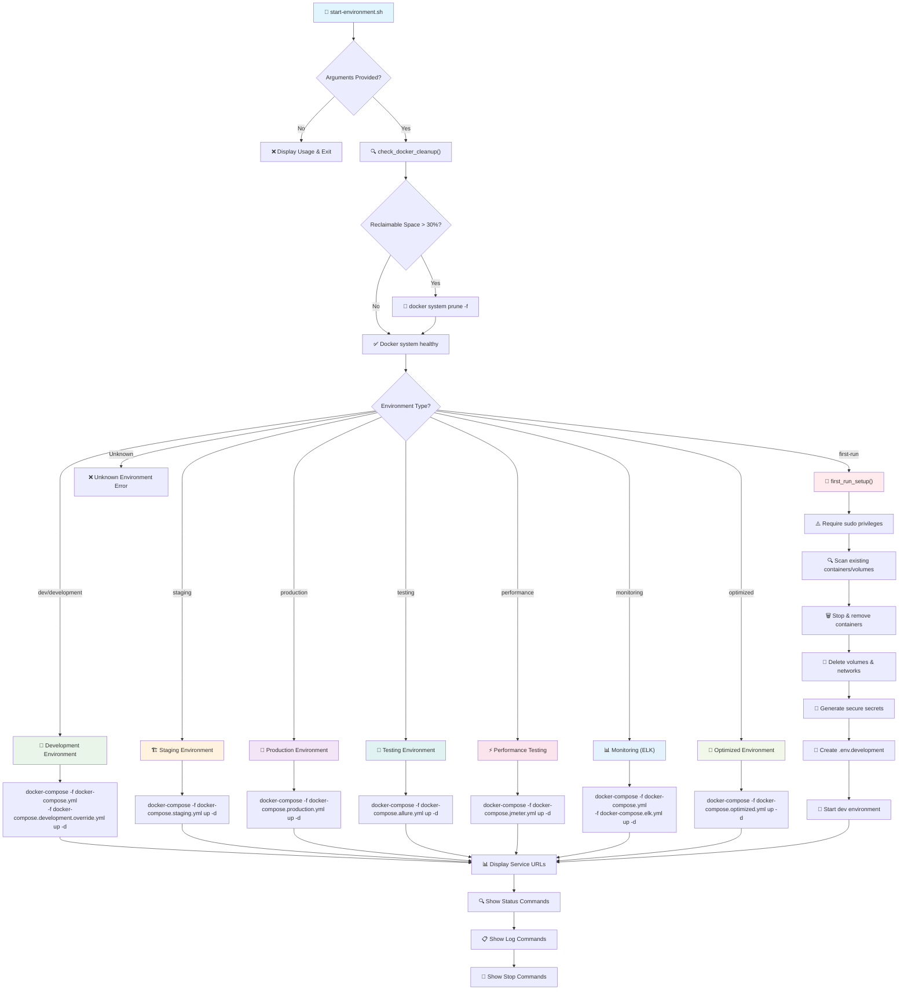

# Phase-1-Testing Branch Analysis Report

## Section 1: High-Level Summary

The `start-environment.sh` script serves as the central orchestration tool for launching different environments of the LLM Multimodal Stack. It provides a unified interface for managing development, staging, production, testing, performance, monitoring, and optimized deployments. The script implements environment-specific Docker Compose configurations with proper secrets management, health checks, and resource allocation.

The system supports 8 distinct environments with varying service configurations, resource requirements, and deployment strategies. Each environment uses different Docker Compose files and override configurations to tailor the stack for specific use cases, from lightweight development setups to high-performance production deployments with monitoring and testing capabilities.

## Section 2: Workflow Diagram (Mermaid)



## Section 3: Environment Execution Matrix

| Configuration Dimension | Development | Staging | Production | Testing | Performance | Monitoring | Optimized |
|------------------------|-------------|---------|------------|---------|-------------|------------|-----------|
| **Base Compose Files** | docker-compose.yml + development.override.yml | docker-compose.staging.yml | docker-compose.production.yml | docker-compose.allure.yml | docker-compose.jmeter.yml | docker-compose.yml + elk.yml | docker-compose.optimized.yml |
| **Core Services** | ✅ All base services | ✅ All base services | ✅ All base services | ❌ Only Allure services | ❌ Only JMeter services | ✅ All base + ELK | ✅ All base services |
| **PostgreSQL** | Standard config | 2G memory limit | 4G memory limit | ❌ Not included | ❌ Not included | Standard config | Optimized config |
| **Redis** | Standard config | 512M memory limit | 1G memory limit | ❌ Not included | ❌ Not included | Standard config | Optimized config |
| **vLLM** | GPU required | GPU required | GPU required | ❌ Not included | ❌ Not included | GPU required | GPU required |
| **Multimodal Worker** | Single instance | 2 replicas | 3 replicas | ❌ Not included | ❌ Not included | Single instance | 3 replicas |
| **Retrieval Proxy** | Single instance | 2 replicas | 3 replicas | ❌ Not included | ❌ Not included | Single instance | 2 replicas |
| **LiteLLM** | Single instance | Single instance | 2 replicas | ❌ Not included | ❌ Not included | Single instance | Single instance |
| **OpenWebUI** | Standard config | Standard config | Enhanced config | ❌ Not included | ❌ Not included | Standard config | ❌ Not included |
| **n8n** | Standard config | Standard config | Standard config | ❌ Not included | ❌ Not included | Standard config | ❌ Not included |
| **Nginx** | Standard config | ❌ Not included | Production config | ❌ Not included | ❌ Not included | Standard config | Optimized config |
| **Monitoring** | ❌ None | ❌ None | Prometheus + Grafana | ❌ None | ❌ None | ELK Stack | ❌ None |
| **Testing Tools** | ❌ None | ❌ None | ❌ None | Allure Reports | JMeter Load Tests | ❌ None | ❌ None |
| **Environment Files** | .env.development | .env.staging | .env.production | ❌ None | ❌ None | .env.monitoring | .env.optimized |
| **Secrets Management** | setup_secrets.py | setup_secrets.py | setup_secrets.py | ❌ None | ❌ None | setup_secrets.py | setup_secrets.py |
| **GPU Requirements** | 1 GPU | 1 GPU | 1 GPU | ❌ None | ❌ None | 1 GPU | 1 GPU |
| **Memory Requirements** | ~8GB | ~12GB | ~20GB | ~2GB | ~4GB | ~16GB | ~24GB |
| **Network Configuration** | multimodal-net | multimodal-net | multimodal-net | test-network | multimodal-net | multimodal-net | multimodal-net |
| **Volume Persistence** | Standard volumes | Standard volumes | Production volumes | Test volumes | Standard volumes | Standard volumes | Optimized volumes |
| **Health Checks** | Standard intervals | Standard intervals | Standard intervals | Fast intervals | Standard intervals | Standard intervals | Standard intervals |
| **Restart Policy** | unless-stopped | unless-stopped | unless-stopped | unless-stopped | unless-stopped | unless-stopped | unless-stopped |

### Key Discrepancies Identified:

1. **Missing Environment Files**: Testing and Performance environments lack `.env` files
2. **Inconsistent Service Coverage**: Testing and Performance environments only include specific services
3. **Resource Allocation Mismatch**: Staging has lower resources than Development in some areas
4. **Network Isolation**: Testing uses separate `test-network` while others use `multimodal-net`
5. **Secrets Management Gap**: Testing and Performance environments don't use secrets manager
6. **Monitoring Inconsistency**: Only Production and Monitoring environments have monitoring tools
7. **GPU Dependency**: All environments except Testing and Performance require GPU

## Section 4: Dev Path Trace & Blockers

### Dev Deployment Path:
1. **Script Execution**: `./start-environment.sh dev`
2. **Docker Cleanup**: Check reclaimable space, prune if >30%
3. **Compose Command**: `docker-compose -f docker-compose.yml -f docker-compose.development.override.yml up -d`
4. **Service Startup**: All base services with development overrides
5. **Health Checks**: Wait for service health before proceeding

### Necessary Preconditions:
- **Docker & Docker Compose**: Must be installed and running
- **NVIDIA Container Toolkit**: Required for GPU services (vLLM, multimodal-worker)
- **Environment File**: `.env.development` must exist (generated by setup_secrets.py)
- **Network**: `multimodal-net` network must be available
- **Volumes**: Docker volumes for persistent data
- **Ports**: Ports 3030, 4000, 8000-8006, 5432, 6379, 6333, 9000, 9002, 5678 must be available
- **Models Directory**: `./models` directory must exist for vLLM
- **Config Files**: `./configs/litellm_simple.yaml` must exist

### Likely Hard Blockers:
1. **Missing .env.development**: Script fails if environment file doesn't exist
2. **GPU Unavailable**: vLLM and multimodal-worker fail without GPU
3. **Port Conflicts**: Services fail to start if ports are already in use
4. **Insufficient Memory**: Services may fail with OOM errors
5. **Missing Dependencies**: Docker images may fail to pull
6. **Network Issues**: Services can't communicate if network setup fails
7. **Volume Permissions**: Data persistence may fail due to permission issues
8. **Missing Config Files**: LiteLLM fails without configuration file

### Repro Checklist:
1. Ensure Docker and Docker Compose are installed and running
2. Check GPU availability: `nvidia-smi`
3. Verify port availability: `netstat -tulpn | grep -E "(3030|4000|8000|5432|6379|6333|9000|9002|5678)"`
4. Check available memory: `free -h` (minimum 8GB recommended)
5. Verify network: `docker network ls | grep multimodal-net`
6. Check for existing containers: `docker ps -a | grep multimodal`
7. Verify environment file: `ls -la .env.development`
8. Check config files: `ls -la configs/litellm_simple.yaml`
9. Verify models directory: `ls -la models/`
10. Test Docker access: `docker run hello-world`

## Section 5: Called Files & Commands

### Files Sourced/Called by Script:
| File Path | Purpose | Environment |
|-----------|---------|-------------|
| `setup_secrets.py` | Generate secure secrets | first-run, dev, staging, production, monitoring, optimized |
| `.env.development` | Development environment variables | dev, first-run |
| `.env.staging` | Staging environment variables | staging |
| `.env.production` | Production environment variables | production |
| `.env.monitoring` | Monitoring environment variables | monitoring |
| `.env.optimized` | Optimized environment variables | optimized |
| `docker-compose.yml` | Base service definitions | dev, monitoring |
| `docker-compose.development.override.yml` | Development overrides | dev, first-run |
| `docker-compose.staging.yml` | Staging configuration | staging |
| `docker-compose.production.yml` | Production configuration | production |
| `docker-compose.allure.yml` | Testing configuration | testing |
| `docker-compose.jmeter.yml` | Performance testing | performance |
| `docker-compose.elk.yml` | ELK monitoring stack | monitoring |
| `docker-compose.optimized.yml` | Optimized configuration | optimized |
| `configs/litellm_simple.yaml` | LiteLLM configuration | dev, staging, production, monitoring, optimized |
| `configs/litellm_config.yaml` | LiteLLM production config | production |
| `configs/litellm_optimized.yaml` | LiteLLM optimized config | optimized |
| `configs/nginx.conf` | Nginx configuration | production, optimized |
| `configs/nginx_optimized.conf` | Nginx optimized config | optimized |
| `sql/init.sql` | Database initialization | dev, staging, production, monitoring, optimized |

### External Commands Relied Upon:
| Command | Purpose | Where Used | Expected Location |
|---------|---------|------------|-------------------|
| `docker` | Container management | All environments | `/usr/bin/docker` |
| `docker-compose` | Multi-container orchestration | All environments | `/usr/bin/docker-compose` |
| `python3` | Python interpreter | setup_secrets.py | `/usr/bin/python3` |
| `nvidia-smi` | GPU monitoring | GPU services | `/usr/bin/nvidia-smi` |
| `curl` | HTTP client | Health checks | `/usr/bin/curl` |
| `wget` | HTTP client | Health checks | `/usr/bin/wget` |
| `pg_isready` | PostgreSQL health check | PostgreSQL health checks | Inside postgres container |
| `redis-cli` | Redis client | Redis health checks | Inside redis container |
| `pidof` | Process ID finder | Qdrant health checks | Inside qdrant container |

## Section 6: Risks & Edge Cases

### Brittle Assumptions:
1. **GPU Availability**: Script assumes GPU is always available for vLLM and multimodal-worker
2. **Port Availability**: No port conflict detection before starting services
3. **Memory Requirements**: No memory check before starting resource-intensive services
4. **Network Dependencies**: Assumes `multimodal-net` network exists or can be created
5. **File Dependencies**: Assumes all config files and directories exist
6. **Docker Permissions**: Assumes user has Docker permissions without verification

### Ordering Hazards:
1. **Service Dependencies**: Complex dependency chain may cause startup failures
2. **Health Check Timing**: Services may fail if health checks timeout too early
3. **Volume Mounting**: Services may start before volumes are properly mounted
4. **Network Creation**: Services may start before network is created
5. **Secret Generation**: Services may start before secrets are generated

### Race Conditions:
1. **Concurrent Service Startup**: Multiple services starting simultaneously may conflict
2. **Health Check Race**: Health checks may run before services are fully ready
3. **Volume Race**: Multiple services trying to mount the same volume
4. **Network Race**: Services trying to connect before network is ready
5. **Secret Race**: Services trying to read secrets before they're written

### Profile Drift:
1. **Environment Inconsistency**: Different environments use different service configurations
2. **Resource Drift**: Resource limits vary significantly between environments
3. **Network Drift**: Testing environment uses different network configuration
4. **Volume Drift**: Different volume configurations across environments
5. **Health Check Drift**: Different health check intervals and timeouts

### Environment Variable Drift:
1. **Missing Variables**: Some environments lack required environment variables
2. **Inconsistent Defaults**: Different default values across environments
3. **Unused Variables**: Variables defined but never consumed
4. **Secret Mismatch**: Secrets may not match between environments
5. **Port Conflicts**: Different port assignments across environments

### Duplicated Configuration:
1. **Health Check Templates**: Repeated health check configurations across files
2. **Volume Definitions**: Similar volume configurations in multiple files
3. **Network Configurations**: Network settings duplicated across environments
4. **Environment Variables**: Common variables repeated in multiple places
5. **Service Dependencies**: Dependency chains repeated across environments

## Section 7: Code Updates for Streamlined Startup

Based on the analysis, here are the recommended code updates to streamline environment startup:

### 1. Enhanced Environment Validation
```bash
# Add to start-environment.sh
validate_environment() {
    echo "🔍 Validating environment prerequisites..."
    
    # Check Docker
    if ! command -v docker &> /dev/null; then
        echo "❌ Docker is not installed or not in PATH"
        exit 1
    fi
    
    # Check Docker Compose
    if ! command -v docker-compose &> /dev/null; then
        echo "❌ Docker Compose is not installed or not in PATH"
        exit 1
    fi
    
    # Check GPU for GPU-required environments
    if [[ "$ENVIRONMENT" =~ ^(dev|staging|production|monitoring|optimized)$ ]]; then
        if ! command -v nvidia-smi &> /dev/null; then
            echo "❌ NVIDIA GPU not available for $ENVIRONMENT environment"
            exit 1
        fi
    fi
    
    # Check available memory
    local available_memory=$(free -m | awk 'NR==2{printf "%.0f", $7}')
    local required_memory=8192  # 8GB minimum
    
    if [ "$available_memory" -lt "$required_memory" ]; then
        echo "⚠️  Warning: Available memory ($available_memory MB) is below recommended minimum ($required_memory MB)"
    fi
    
    # Check port availability
    check_ports() {
        local ports=("3030" "4000" "8000" "8001" "8002" "8003" "8004" "8005" "8006" "5432" "6379" "6333" "9000" "9002" "5678")
        for port in "${ports[@]}"; do
            if netstat -tuln | grep -q ":$port "; then
                echo "⚠️  Warning: Port $port is already in use"
            fi
        done
    }
    
    check_ports
    echo "✅ Environment validation complete"
}
```

### 2. Unified Environment File Management
```bash
# Add to start-environment.sh
setup_environment_file() {
    local env_type=$1
    local env_file=".env.$env_type"
    
    if [ ! -f "$env_file" ]; then
        echo "🔐 Generating environment file: $env_file"
        if [ -f "setup_secrets.py" ]; then
            python3 setup_secrets.py
        else
            echo "❌ setup_secrets.py not found. Cannot generate environment file."
            exit 1
        fi
    else
        echo "✅ Environment file exists: $env_file"
    fi
}
```

### 3. Improved Service Health Monitoring
```bash
# Add to start-environment.sh
wait_for_services() {
    local compose_files=$1
    echo "⏳ Waiting for services to be healthy..."
    
    # Wait for critical services
    local critical_services=("postgres" "redis" "qdrant" "minio")
    
    for service in "${critical_services[@]}"; do
        echo "   Waiting for $service..."
        docker-compose $compose_files exec -T $service sh -c "until pg_isready -U postgres || redis-cli ping || pidof qdrant || curl -f http://localhost:9000/minio/health/live; do sleep 2; done" 2>/dev/null || true
    done
    
    echo "✅ Critical services are healthy"
}
```

### 4. Enhanced Error Handling
```bash
# Add to start-environment.sh
handle_startup_error() {
    local exit_code=$1
    local environment=$2
    
    if [ $exit_code -ne 0 ]; then
        echo "❌ Failed to start $environment environment"
        echo "🔍 Troubleshooting steps:"
        echo "   1. Check Docker status: docker info"
        echo "   2. Check available resources: free -h && df -h"
        echo "   3. Check port conflicts: netstat -tulpn | grep -E '(3030|4000|8000|5432|6379|6333|9000|9002|5678)'"
        echo "   4. Check logs: docker-compose logs"
        echo "   5. Clean up: docker-compose down --remove-orphans"
        exit $exit_code
    fi
}
```

### 5. Streamlined Environment Startup
```bash
# Update main case statement in start-environment.sh
case $ENVIRONMENT in
    "dev"|"development")
        echo "🔧 Starting Development Environment..."
        validate_environment
        setup_environment_file "development"
        docker-compose -f docker-compose.yml -f docker-compose.development.override.yml up -d
        handle_startup_error $? "development"
        wait_for_services "-f docker-compose.yml -f docker-compose.development.override.yml"
        echo "✅ Development environment started!"
        ;;
    # ... other environments with similar pattern
esac
```

These updates will provide:
- **Better Error Handling**: Clear error messages and troubleshooting steps
- **Environment Validation**: Prerequisite checks before startup
- **Unified Secrets Management**: Consistent environment file handling
- **Health Monitoring**: Better service health tracking
- **Resource Validation**: Memory and port availability checks
- **Streamlined Startup**: Consistent startup patterns across environments

The analysis reveals a complex but well-structured environment management system with room for improvement in error handling, validation, and consistency across different deployment scenarios.

