# Schema-Driven Environment Configuration Guide

## Overview

The LLM Multimodal Stack now uses a **schema-driven approach** for environment configuration management. This approach centralizes all environment definitions in a single YAML schema file (`configs/environment_schema.yaml`) and uses the existing `SimpleSecretsManager` to generate secure, consistent configurations across all environments.

## Why Schema-Driven?

### Problems with Previous Approach
- **Hardcoded Values**: Environment variables were hardcoded in scripts, making them difficult to maintain
- **Inconsistency**: Different environments had different variable sets and configurations
- **Duplication**: Same variables were defined multiple times across different files
- **Maintenance Overhead**: Changes required updates in multiple places
- **Validation Issues**: No centralized validation of environment configurations

### Benefits of Schema-Driven Approach
- **Single Source of Truth**: All environment definitions in one schema file
- **Consistency**: All environments use the same variable definitions and validation rules
- **Maintainability**: Changes to environment configurations only require schema updates
- **Type Safety**: Variables have defined types and validation rules
- **Documentation**: Each variable has descriptions and requirements
- **Extensibility**: Easy to add new environments or variables
- **Secrets Management**: Integrated with the existing secure secrets generation system

## Schema Structure

The environment schema (`configs/environment_schema.yaml`) defines:

### 1. Environment Definitions
Each environment has:
- **Description**: Human-readable description of the environment's purpose
- **GPU Required**: Whether the environment needs GPU resources
- **Memory Minimum**: Minimum memory requirements in GB
- **Services**: List of services that run in this environment
- **Variables**: Complete set of environment variables with types and descriptions

### 2. Variable Types
Variables can be:
- **string**: Text values
- **integer**: Numeric values
- **float**: Decimal values
- **boolean**: True/false values
- **secret**: Secure values generated by the secrets manager

### 3. Secret Types
Secrets are categorized by type with specific generation rules:
- **database_password**: Database passwords (32 chars, 90-day rotation)
- **storage_password**: Storage service passwords (32 chars, 90-day rotation)
- **api_key**: API keys and tokens (64 chars, 180-day rotation)
- **jwt_secret**: JWT signing secrets (64 chars, 30-day rotation)
- **webui_secret**: Web UI secrets (32 chars, 90-day rotation)
- **service_password**: Service-specific passwords (32 chars, 90-day rotation)
- **encryption_key**: Encryption keys (32 chars, 365-day rotation)

## Available Environments

### 1. Development
- **Purpose**: Local development with debugging enabled
- **GPU**: Required (dual RTX 3090 with NVLink optimization)
- **Memory**: 24GB minimum
- **Services**: All base services
- **Debug**: Enabled
- **Log Level**: DEBUG
- **GPU Memory Utilization**: 0.8 (80%)
- **Tensor Parallelism**: 2 GPUs

### 2. Staging
- **Purpose**: Pre-production testing
- **GPU**: Required (dual RTX 3090 with NVLink optimization)
- **Memory**: 12GB minimum
- **Services**: All base services
- **Debug**: Disabled
- **Log Level**: INFO
- **GPU Memory Utilization**: 0.85 (85%)
- **Tensor Parallelism**: 2 GPUs

### 3. Production
- **Purpose**: Production deployment with full monitoring
- **GPU**: Required (dual RTX 3090 with NVLink optimization)
- **Memory**: 20GB minimum
- **Services**: All base services + Prometheus + Grafana
- **Debug**: Disabled
- **Log Level**: WARNING
- **GPU Memory Utilization**: 0.9 (90%)
- **Tensor Parallelism**: 2 GPUs

### 4. Testing
- **Purpose**: Automated testing with Allure reports
- **GPU**: Not required
- **Memory**: 2GB minimum
- **Services**: Allure reporting services only
- **Debug**: Enabled
- **Log Level**: DEBUG

### 5. Performance
- **Purpose**: Load testing with JMeter
- **GPU**: Not required
- **Memory**: 4GB minimum
- **Services**: JMeter testing services only
- **Debug**: Disabled
- **Log Level**: INFO

### 6. Monitoring
- **Purpose**: Centralized logging and monitoring
- **GPU**: Required (dual RTX 3090 with NVLink optimization)
- **Memory**: 16GB minimum
- **Services**: All base services + ELK stack
- **Debug**: Disabled
- **Log Level**: INFO
- **GPU Memory Utilization**: 0.8 (80%)
- **Tensor Parallelism**: 2 GPUs

### 7. Optimized
- **Purpose**: High-performance optimized deployment
- **GPU**: Required (dual RTX 3090 with NVLink optimization)
- **Memory**: 24GB minimum
- **Services**: All base services with optimizations
- **Debug**: Disabled
- **Log Level**: WARNING
- **GPU Memory Utilization**: 0.9 (90%)
- **Tensor Parallelism**: 2 GPUs

## GPU Configuration

### Multi-GPU Support
The system now supports dual RTX 3090 GPUs with NVLink optimization:

#### GPU Variables
- **CUDA_VISIBLE_DEVICES**: "0,1" (both GPUs)
- **NVIDIA_VISIBLE_DEVICES**: "0,1" (both GPUs)
- **VLLM_TENSOR_PARALLEL_SIZE**: "2" (tensor parallelism across both GPUs)
- **VLLM_PIPELINE_PARALLEL_SIZE**: "1" (single pipeline stage)
- **CUDA_DEVICE_ORDER**: "PCI_BUS_ID" (optimal NVLink usage)
- **GPU_COUNT**: "2" (Docker container GPU allocation)

#### GPU Configuration Script
```bash
# Auto-detect and configure GPU setup
./scripts/configure-gpu.sh

# Force multi-GPU configuration
./scripts/configure-gpu.sh multi

# Force single GPU configuration
./scripts/configure-gpu.sh single

# CPU-only for CI/CD
./scripts/configure-gpu.sh cpu
```

#### Docker Compose Overrides
- **Multi-GPU**: `docker-compose.multi-gpu.yml` - Dual GPU optimization
- **Single GPU**: `docker-compose.single-gpu.yml` - Single GPU fallback
- **CPU-only**: `docker-compose.test.yml` - CI/CD compatibility

## Usage

### 1. Generate All Environments
```bash
# Generate all environment configurations from schema
./scripts/setup-environments.sh
```

### 2. Generate Specific Environment
```bash
# Generate secrets and environment files for specific environment
python3 setup_secrets.py
```

### 3. Start Environment
```bash
# Start any environment (will auto-generate if missing)
./start-environment.sh development
./start-environment.sh production
./start-environment.sh testing
```

### 4. Validate Configuration
```bash
# Validate all environment configurations
./scripts/validate-environment.sh
```

## Workflow Diagram (Mermaid)

```mermaid
flowchart TD
    A["🚀 start-environment.sh"] --> B{Arguments Provided?}
    B -->|No| C["❌ Display Usage & Exit"]
    B -->|Yes| D["🔍 validate_environment()"]
    
    D --> D1["🔍 Check Docker & Docker Compose"]
    D1 --> D2["🎮 Check GPU for GPU-required environments"]
    D2 --> D3["💾 Check available memory"]
    D3 --> D4["🔌 Check port availability"]
    D4 --> D5["🔗 Check NVLink topology (if dual GPU)"]
    D5 --> E["🔍 check_docker_cleanup()"]
    
    E --> F{Reclaimable Space > 30%?}
    F -->|Yes| G["🧹 docker system prune -f"]
    F -->|No| H["✅ Docker system healthy"]
    G --> H
    
    H --> I{Environment Type?}
    
    I -->|first-run| J["🚨 first_run_setup()"]
    I -->|dev/development| K["🔧 Development Environment"]
    I -->|staging| L["🏗️ Staging Environment"]
    I -->|production| M["🚀 Production Environment"]
    I -->|testing| N["🧪 Testing Environment"]
    I -->|performance| O["⚡ Performance Testing"]
    I -->|monitoring| P["📊 Monitoring (ELK)"]
    I -->|optimized| Q["🎯 Optimized Environment"]
    I -->|Unknown| R["❌ Unknown Environment Error"]
    
    J --> J1["⚠️ Require sudo privileges"]
    J1 --> J2["🔍 Scan existing containers/volumes"]
    J2 --> J3["🗑️ Stop & remove containers"]
    J3 --> J4["💾 Delete volumes & networks"]
    J4 --> J5["🔐 Generate secure secrets"]
    J5 --> J6["📄 Create .env.development"]
    J6 --> J7["🚀 Start dev environment"]
    
    K --> K1["🔧 setup_environment_file('development')"]
    K1 --> K2["docker-compose -f docker-compose.yml<br/>-f docker-compose.development.override.yml<br/>-f docker-compose.multi-gpu.yml up -d"]
    K2 --> K3["⏳ wait_for_services()"]
    K3 --> K4["✅ Development environment started!"]
    
    L --> L1["🔧 setup_environment_file('staging')"]
    L1 --> L2["docker-compose -f docker-compose.staging.yml<br/>-f docker-compose.multi-gpu.yml up -d"]
    L2 --> L3["⏳ wait_for_services()"]
    L3 --> L4["✅ Staging environment started!"]
    
    M --> M1["🔧 setup_environment_file('production')"]
    M1 --> M2["docker-compose -f docker-compose.production.yml<br/>-f docker-compose.multi-gpu.yml up -d"]
    M2 --> M3["⏳ wait_for_services()"]
    M3 --> M4["✅ Production environment started!"]
    
    N --> N1["docker-compose -f docker-compose.allure.yml up -d"]
    O --> O1["docker-compose -f docker-compose.jmeter.yml up -d"]
    P --> P1["🔧 setup_environment_file('monitoring')"]
    P1 --> P2["docker-compose -f docker-compose.yml<br/>-f docker-compose.elk.yml<br/>-f docker-compose.multi-gpu.yml up -d"]
    P2 --> P3["⏳ wait_for_services()"]
    P3 --> P4["✅ Monitoring environment started!"]
    
    Q --> Q1["🔧 setup_environment_file('optimized')"]
    Q1 --> Q2["docker-compose -f docker-compose.optimized.yml<br/>-f docker-compose.multi-gpu.yml up -d"]
    Q2 --> Q3["⏳ wait_for_services()"]
    Q3 --> Q4["✅ Optimized environment started!"]
    
    K4 --> S["📊 Display Service URLs"]
    L4 --> S
    M4 --> S
    N1 --> S
    O1 --> S
    P4 --> S
    Q4 --> S
    J7 --> S
    
    S --> T["🔍 Show Status Commands"]
    T --> U["📋 Show Log Commands"]
    U --> V["🛑 Show Stop Commands"]
    
    style A fill:#e1f5fe
    style D fill:#fff3e0
    style D2 fill:#e8f5e8
    style D5 fill:#f3e5f5
    style J fill:#ffebee
    style K fill:#e8f5e8
    style L fill:#fff3e0
    style M fill:#f3e5f5
    style N fill:#e0f2f1
    style O fill:#fce4ec
    style P fill:#e3f2fd
    style Q fill:#f1f8e9
```



## Environment Execution Matrix

| Configuration Dimension | Development | Staging | Production | Testing | Performance | Monitoring | Optimized |
|------------------------|-------------|---------|------------|---------|-------------|------------|-----------|
| **Base Compose Files** | docker-compose.yml + development.override.yml + multi-gpu.yml | docker-compose.staging.yml + multi-gpu.yml | docker-compose.production.yml + multi-gpu.yml | docker-compose.allure.yml | docker-compose.jmeter.yml | docker-compose.yml + elk.yml + multi-gpu.yml | docker-compose.optimized.yml + multi-gpu.yml |
| **Core Services** | ✅ All base services | ✅ All base services | ✅ All base services | ❌ Only Allure services | ❌ Only JMeter services | ✅ All base + ELK | ✅ All base services |
| **PostgreSQL** | Standard config | 2G memory limit | 4G memory limit | ❌ Not included | ❌ Not included | Standard config | Optimized config |
| **Redis** | Standard config | 512M memory limit | 1G memory limit | ❌ Not included | ❌ Not included | Standard config | Optimized config |
| **vLLM** | Dual GPU (RTX 3090) | Dual GPU (RTX 3090) | Dual GPU (RTX 3090) | ❌ Not included | ❌ Not included | Dual GPU (RTX 3090) | Dual GPU (RTX 3090) |
| **Multimodal Worker** | Dual GPU instance | 2 replicas (dual GPU) | 3 replicas (dual GPU) | ❌ Not included | ❌ Not included | Dual GPU instance | 3 replicas (dual GPU) |
| **Retrieval Proxy** | Single instance | 2 replicas | 3 replicas | ❌ Not included | ❌ Not included | Single instance | 2 replicas |
| **LiteLLM** | Single instance | Single instance | 2 replicas | ❌ Not included | ❌ Not included | Single instance | Single instance |
| **OpenWebUI** | Standard config | Standard config | Enhanced config | ❌ Not included | ❌ Not included | Standard config | ❌ Not included |
| **n8n** | Standard config | Standard config | Standard config | ❌ Not included | ❌ Not included | Standard config | ❌ Not included |
| **Nginx** | Standard config | ❌ Not included | Production config | ❌ Not included | ❌ Not included | Standard config | Optimized config |
| **Monitoring** | ❌ None | ❌ None | Prometheus + Grafana | ❌ None | ❌ None | ELK Stack | ❌ None |
| **Testing Tools** | ❌ None | ❌ None | ❌ None | Allure Reports | JMeter Load Tests | ❌ None | ❌ None |
| **Environment Files** | .env.development | .env.staging | .env.production | ❌ None | ❌ None | .env.monitoring | .env.optimized |
| **Secrets Management** | setup_secrets.py | setup_secrets.py | setup_secrets.py | ❌ None | ❌ None | setup_secrets.py | setup_secrets.py |
| **GPU Configuration** | Dual RTX 3090 + NVLink | Dual RTX 3090 + NVLink | Dual RTX 3090 + NVLink | ❌ None | ❌ None | Dual RTX 3090 + NVLink | Dual RTX 3090 + NVLink |
| **GPU Memory Utilization** | 0.8 (80%) | 0.85 (85%) | 0.9 (90%) | ❌ N/A | ❌ N/A | 0.8 (80%) | 0.9 (90%) |
| **Tensor Parallelism** | 2 GPUs | 2 GPUs | 2 GPUs | ❌ N/A | ❌ N/A | 2 GPUs | 2 GPUs |
| **Memory Requirements** | ~24GB | ~12GB | ~20GB | ~2GB | ~4GB | ~16GB | ~24GB |
| **Network Configuration** | multimodal-net | multimodal-net | multimodal-net | test-network | multimodal-net | multimodal-net | multimodal-net |
| **Volume Persistence** | Standard volumes | Standard volumes | Production volumes | Test volumes | Standard volumes | Standard volumes | Optimized volumes |
| **Health Checks** | Standard intervals | Standard intervals | Standard intervals | Fast intervals | Standard intervals | Standard intervals | Standard intervals |
| **Restart Policy** | unless-stopped | unless-stopped | unless-stopped | unless-stopped | unless-stopped | unless-stopped | unless-stopped |
| **GPU Fallback** | single-gpu.yml | single-gpu.yml | single-gpu.yml | ❌ N/A | ❌ N/A | single-gpu.yml | single-gpu.yml |


## File Generation

The schema-driven approach generates:

### Environment Files
- `.env.development` - Development environment variables
- `.env.staging` - Staging environment variables
- `.env.production` - Production environment variables
- `.env.testing` - Testing environment variables
- `.env.performance` - Performance environment variables
- `.env.monitoring` - Monitoring environment variables
- `.env.optimized` - Optimized environment variables

### Secrets Files
- `secrets/.env.development.json` - Secure secrets for development
- `secrets/.env.staging.json` - Secure secrets for staging
- `secrets/.env.production.json` - Secure secrets for production
- `secrets/.env.testing.json` - Secure secrets for testing
- `secrets/.env.performance.json` - Secure secrets for performance
- `secrets/.env.monitoring.json` - Secure secrets for monitoring
- `secrets/.env.optimized.json` - Secure secrets for optimized

### Kubernetes Secrets
- `k8s-secrets-development.yaml` - Kubernetes secrets for development
- `k8s-secrets-staging.yaml` - Kubernetes secrets for staging
- `k8s-secrets-production.yaml` - Kubernetes secrets for production
- `k8s-secrets-testing.yaml` - Kubernetes secrets for testing
- `k8s-secrets-performance.yaml` - Kubernetes secrets for performance
- `k8s-secrets-monitoring.yaml` - Kubernetes secrets for monitoring
- `k8s-secrets-optimized.yaml` - Kubernetes secrets for optimized

### Docker Compose Overrides
- `docker-compose.development.override.yml` - Development overrides
- `docker-compose.staging.override.yml` - Staging overrides (if needed)
- `docker-compose.production.override.yml` - Production overrides (if needed)
- `docker-compose.testing.override.yml` - Testing overrides (if needed)
- `docker-compose.performance.override.yml` - Performance overrides (if needed)
- `docker-compose.monitoring.override.yml` - Monitoring overrides (if needed)
- `docker-compose.optimized.override.yml` - Optimized overrides (if needed)
- `docker-compose.multi-gpu.yml` - Multi-GPU optimization override
- `docker-compose.single-gpu.yml` - Single GPU fallback override

## Customization

### Adding New Environment
1. Add environment definition to `configs/environment_schema.yaml`
2. Define required services and variables
3. Run `./scripts/setup-environments.sh` to generate files
4. Update `start-environment.sh` to handle the new environment

### Adding New Variables
1. Add variable definition to appropriate environment in schema
2. Specify type, description, and default value
3. For secrets, specify secret type and generation parameters
4. Regenerate environment files

### Modifying Existing Variables
1. Update variable definition in schema
2. Regenerate environment files
3. Update any dependent configurations

## Security Features

### Secret Generation
- **Cryptographically Secure**: Uses Python's `secrets` module
- **Configurable Length**: Different secret types have appropriate lengths
- **Rotation Policies**: Automatic secret rotation based on type
- **Secure Storage**: Secrets stored with restricted permissions (600)

### Environment Isolation
- **Separate Secrets**: Each environment has its own secret set
- **No Cross-Contamination**: Secrets are environment-specific
- **Secure Transmission**: Secrets are base64 encoded for Kubernetes

### Validation
- **Schema Validation**: All configurations validated against schema
- **Type Checking**: Variables validated for correct types
- **Required Fields**: Missing required variables cause validation failures

## Migration from Previous Approach

### What Changed
1. **Removed Hardcoded Files**: No more hardcoded `.env.testing` and `.env.performance`
2. **Schema-Driven Generation**: All environment files now generated from schema
3. **Enhanced Secrets Manager**: Now uses schema for secret generation
4. **Improved Validation**: Better validation and error handling

### Migration Steps
1. **Backup Existing Files**: Backup any custom environment files
2. **Update Schema**: Modify `configs/environment_schema.yaml` for any customizations
3. **Generate New Files**: Run `./scripts/setup-environments.sh`
4. **Validate**: Run `./scripts/validate-environment.sh`
5. **Test**: Start environments to ensure they work correctly

## Best Practices

### Schema Maintenance
1. **Keep Schema Updated**: Always update schema when adding new variables
2. **Use Descriptive Names**: Variable names should be self-explanatory
3. **Add Documentation**: Include descriptions for all variables
4. **Version Control**: Keep schema file in version control

### Environment Management
1. **Use Appropriate Environment**: Choose the right environment for your use case
2. **Validate Before Deployment**: Always run validation before starting environments
3. **Monitor Resources**: Ensure sufficient resources for chosen environment
4. **Regular Updates**: Keep environment configurations up to date

### Security
1. **Never Commit Secrets**: Environment files with secrets should not be committed
2. **Use Secure Generation**: Always use the secrets manager for secret generation
3. **Regular Rotation**: Implement regular secret rotation
4. **Access Control**: Restrict access to secrets and environment files

## Troubleshooting

### Common Issues
1. **Schema Not Found**: Ensure `configs/environment_schema.yaml` exists
2. **Missing Dependencies**: Install PyYAML if not available
3. **Permission Issues**: Ensure proper permissions on generated files
4. **Validation Failures**: Check schema syntax and variable definitions

### Debug Steps
1. **Check Schema**: Validate schema file syntax
2. **Run Validation**: Use validation script to identify issues
3. **Check Logs**: Review secrets manager logs for errors
4. **Verify Files**: Ensure all required files are generated

## Conclusion

The schema-driven approach provides a robust, maintainable, and secure way to manage environment configurations. By centralizing all environment definitions in a single schema file and leveraging the existing secrets management system, we ensure consistency, security, and ease of maintenance across all deployment environments.

This approach eliminates the issues with hardcoded configurations while maintaining the flexibility and power of the existing secrets management system. All environments are now generated from a single source of truth, ensuring consistency and reducing maintenance overhead.

