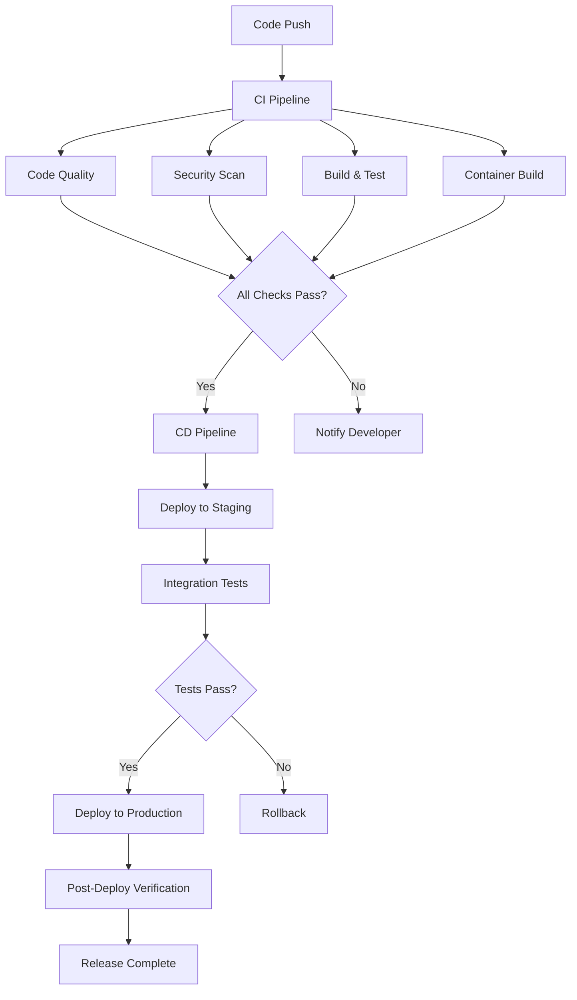

# 🔧 DevOps & Project Management Overview

This document provides an overview of the comprehensive DevOps workflow and project management system implemented for the Multimodal LLM Stack.

## 🚀 Quick Start

### For Developers
```bash
# 1. Fork and clone the repository
git clone https://github.com/your-username/llm-multimodal-stack.git
cd llm-multimodal-stack

# 2. Create feature branch
git checkout develop
git checkout -b feature/your-feature-name

# 3. Make changes and commit using conventional commits
git add .
git commit -m "✨ feat: add new feature description"

# 4. Push and create PR
git push origin feature/your-feature-name
```

### For Project Managers
1. 📊 **View Project Board**: Check GitHub Projects for current status
2. 🏷️ **Create Issues**: Use issue templates for consistent reporting
3. 📈 **Track Metrics**: Monitor automated metrics and reports
4. 🚀 **Plan Releases**: Use milestone planning and roadmaps

## 🏗️ DevOps Architecture

### CI/CD Pipeline Overview



### Workflow Components

#### 1. 🔄 Continuous Integration (`ci.yml`)
- **Code Quality**: Black, isort, flake8, mypy
- **Security**: Bandit, safety, secret scanning
- **Testing**: Unit, integration, performance tests
- **Docker**: Multi-arch container builds
- **Documentation**: Link checking, format validation

#### 2. 🚀 Continuous Deployment (`cd.yml`)
- **Container Registry**: GitHub Container Registry
- **Staging Deployment**: Automatic on develop branch
- **Production Deployment**: Automatic on release tags
- **Health Checks**: Comprehensive post-deployment verification

#### 3. 📦 Automated Releases (`release.yml`)
- **Semantic Versioning**: Conventional commits → version bumps
- **Changelog Generation**: Automatic release notes
- **Asset Management**: Docker images, source archives
- **Notification**: Team and user notifications

#### 4. 🔒 Security & Dependencies (`security.yml`)
- **Dependency Scanning**: Daily vulnerability checks
- **Container Security**: Trivy scanning
- **License Compliance**: Automated license audits
- **Secret Detection**: TruffleHog scanning
- **SAST**: CodeQL static analysis

#### 5. 📊 Project Automation (`project-automation.yml`)
- **Issue Management**: Auto-labeling, project assignment
- **PR Workflow**: Status updates, welcome messages
- **Metrics Collection**: Automated KPI tracking
- **Stale Management**: Cleanup inactive issues/PRs

## 🌳 Branching Strategy

We implement **Git Flow** with automation enhancements:

### Branch Structure
```
main (production)
├── develop (integration)
│   ├── feature/user-authentication
│   ├── feature/video-thumbnails
│   └── feature/api-v2
├── release/v1.1.0
└── hotfix/critical-bug-fix
```

### Branch Rules
- **`main`**: Protected, requires PR review, auto-deploys to production
- **`develop`**: Protected, requires status checks, auto-deploys to staging
- **`feature/*`**: From develop, merged back to develop
- **`hotfix/*`**: From main, merged to main and develop
- **`release/*`**: From develop, merged to main and develop

### Automated Workflows
- **Feature branches**: Run full CI pipeline
- **Develop merges**: Deploy to staging environment
- **Main merges**: Create release and deploy to production
- **Tag pushes**: Trigger release process

## 📊 Project Management

### GitHub Projects Integration
- **📋 Main Board**: Kanban view of all development work
- **🐛 Bug Triage**: Priority matrix for bug management
- **📚 Documentation**: Content tracking and planning
- **🗺️ Roadmap**: Quarterly planning and milestones

### Issue Templates
- **🐛 Bug Report**: Structured bug reporting with environment details
- **✨ Feature Request**: Feature planning with acceptance criteria
- **📋 Task/Chore**: Maintenance and technical debt tracking

### Automated Workflows
- **Issue Creation**: Auto-assignment to projects, auto-labeling
- **PR Events**: Status updates, linked issue management
- **Stale Management**: Automatic cleanup of inactive items
- **Metrics**: KPI tracking and reporting

## 🏷️ Labeling System

### Type Labels
- `bug` 🐛, `enhancement` ✨, `task` 📋, `documentation` 📚

### Priority Labels
- `priority/critical` 🚨, `priority/high` 🔴, `priority/medium` 🟡, `priority/low` 🟢

### Component Labels
- `component/api` 🔌, `component/worker` ⚙️, `component/proxy` 🔍, `component/docker` 🐳

### Status Labels
- `status/needs-triage` 🏷️, `status/blocked` 🚫, `status/wip` 🚧, `status/ready-for-review` 👀

## 📈 Metrics and KPIs

### Development Metrics
- **Velocity**: Story points per sprint
- **Lead Time**: Idea to production
- **Deployment Frequency**: Releases per week
- **Change Failure Rate**: % of deployments causing issues
- **Recovery Time**: Time to fix production issues

### Quality Metrics
- **Code Coverage**: % of code covered by tests
- **Bug Rate**: Bugs per feature/story point
- **Technical Debt**: Time spent on maintenance
- **Security Issues**: Vulnerabilities found and fixed

### Project Health
- **Issue Resolution Time**: Average time to close issues
- **PR Review Time**: Time from creation to merge
- **Contributor Activity**: Active contributors per month
- **Documentation Coverage**: % of features documented

## 🔐 Security & Compliance

### Security Scanning
- **Dependencies**: Daily vulnerability scans
- **Containers**: Multi-layer security analysis
- **Code**: Static analysis with CodeQL
- **Secrets**: Automated secret detection
- **Infrastructure**: Configuration security checks

### Compliance Features
- **License Tracking**: Automated license compliance
- **Audit Trails**: Complete change history
- **Access Control**: Role-based permissions
- **Data Protection**: Secure handling of sensitive data

## 🚀 Release Management

### Release Types
- **Major** (x.0.0): Breaking changes, new architecture
- **Minor** (x.y.0): New features, backward compatible
- **Patch** (x.y.z): Bug fixes, security updates
- **Pre-release** (x.y.z-rc.n): Release candidates

### Automated Release Process
1. **Commit Analysis**: Conventional commits determine release type
2. **Version Bumping**: Automatic semantic versioning
3. **Changelog**: Generated from commit messages
4. **Asset Creation**: Docker images, archives, documentation
5. **Deployment**: Staging → Production with verification
6. **Notification**: Team and user communications

### Release Criteria
- ✅ All tests passing
- ✅ Security scans clean
- ✅ Performance benchmarks met
- ✅ Documentation updated
- ✅ Rollback plan ready

## 📚 Documentation Strategy

### Documentation Types
1. **Code Documentation**: Inline comments, docstrings
2. **API Documentation**: OpenAPI specifications
3. **User Guides**: Feature usage and tutorials
4. **Developer Guides**: Architecture, contributing
5. **Operations**: Deployment, monitoring, troubleshooting

### Automated Documentation
- **API Docs**: Generated from code annotations
- **Changelog**: Generated from commit messages
- **Release Notes**: Automated from milestones
- **Metrics**: Automated reporting and dashboards

## 🛠️ Tools and Integrations

### Development Tools
- **GitHub**: Source control, project management
- **Docker**: Containerization and deployment
- **GitHub Actions**: CI/CD automation
- **GitHub Container Registry**: Image storage

### Monitoring and Observability
- **Prometheus**: Metrics collection
- **Grafana**: Visualization and dashboards
- **GitHub Insights**: Repository analytics
- **Custom Metrics**: Development KPIs

### Communication
- **GitHub Discussions**: Community engagement
- **Issue Comments**: Development discussions
- **PR Reviews**: Code collaboration
- **Automated Notifications**: Status updates

## 🎯 Best Practices

### Development
- ✅ Use conventional commits for automatic versioning
- ✅ Create small, focused pull requests
- ✅ Write comprehensive tests
- ✅ Document all public APIs
- ✅ Follow security guidelines

### Project Management
- ✅ Use issue templates for consistency
- ✅ Label issues appropriately
- ✅ Link related issues and PRs
- ✅ Update project boards regularly
- ✅ Plan releases with milestones

### Operations
- ✅ Monitor all deployments
- ✅ Maintain rollback capabilities
- ✅ Regular security updates
- ✅ Performance monitoring
- ✅ Disaster recovery planning

## 🎓 Getting Started

### For New Team Members
1. 📚 Read [Contributing Guide](.github/CONTRIBUTING.md)
2. 🔧 Set up development environment
3. 📋 Check project boards for available tasks
4. 💬 Join team discussions
5. 🚀 Make your first contribution

### For Contributors
1. 🍴 Fork the repository
2. 🌳 Create feature branch from develop
3. ✨ Make changes with tests
4. 📝 Use conventional commit messages
5. 🔀 Submit pull request with template

### For Maintainers
1. 👀 Review PRs promptly
2. 🏷️ Triage new issues
3. 📊 Monitor project metrics
4. 🚀 Manage releases
5. 🤝 Support contributors

## 📞 Support and Resources

### Documentation
- [🤝 Contributing Guide](.github/CONTRIBUTING.md)
- [📊 Project Management](.github/PROJECT_MANAGEMENT.md)
- [🔒 Security Policy](SECURITY.md)
- [📋 Changelog](CHANGELOG.md)

### Communication
- [💬 GitHub Discussions](https://github.com/your-org/llm-multimodal-stack/discussions)
- [🐛 Bug Reports](https://github.com/your-org/llm-multimodal-stack/issues/new?template=bug_report.yml)
- [✨ Feature Requests](https://github.com/your-org/llm-multimodal-stack/issues/new?template=feature_request.yml)

### Project Links
- [📊 Project Board](https://github.com/orgs/your-org/projects/1)
- [🎯 Milestones](https://github.com/your-org/llm-multimodal-stack/milestones)
- [🏷️ Releases](https://github.com/your-org/llm-multimodal-stack/releases)
- [📈 Insights](https://github.com/your-org/llm-multimodal-stack/pulse)

---

This DevOps system is designed to scale with the project and team. All workflows are automated where possible, but maintain human oversight for critical decisions. The system promotes transparency, quality, and efficient collaboration.

**Questions?** Check the [Contributing Guide](.github/CONTRIBUTING.md) or start a [Discussion](https://github.com/your-org/llm-multimodal-stack/discussions)! 🚀
