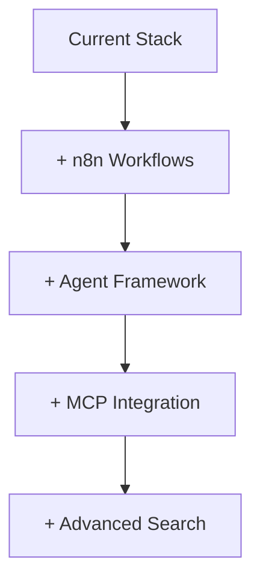
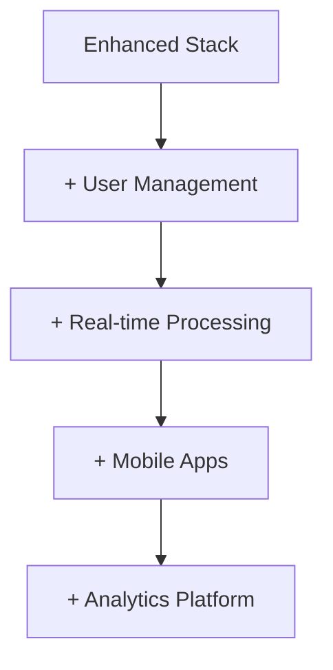
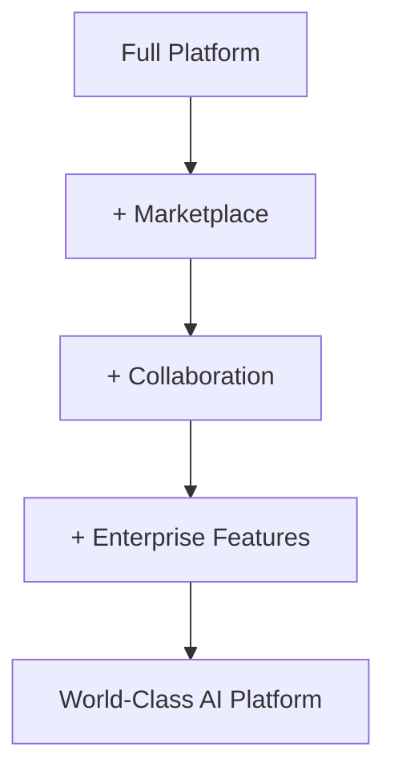

# 🚀 Future Improvements & Roadmap

**Vision**: Transform the Multimodal LLM Stack into the leading open-source AI development platform

## 🎯 Strategic Priorities

### 🔴 **Critical Priority (Next 30 Days)**

#### 1. **Workflow Management Platform** 
**Integration: n8n Visual Workflow Designer**

```yaml
# docker-compose.yml addition
n8n:
  image: n8nio/n8n:latest
  ports:
    - "5678:5678"
  environment:
    - N8N_BASIC_AUTH_ACTIVE=true
    - N8N_BASIC_AUTH_USER=admin
    - N8N_BASIC_AUTH_PASSWORD=${N8N_PASSWORD}
    - WEBHOOK_URL=http://localhost:5678
  volumes:
    - n8n_data:/home/node/.n8n
```

**Features:**
- 🎨 **Visual Workflow Designer**: Drag-and-drop automation
- 🔗 **API Integrations**: Connect to 200+ services
- ⏰ **Scheduled Workflows**: Automated processing pipelines
- 🎣 **Webhook Triggers**: Event-driven automation
- 📊 **Workflow Analytics**: Performance monitoring

**Use Cases:**
- Automated content processing (upload → transcribe → summarize → index)
- Social media monitoring (scrape → analyze sentiment → alert)
- Document workflows (PDF → extract text → generate embeddings → store)
- Multi-step AI pipelines (image → caption → translate → post)

#### 2. **Agent Framework Integration**
**LangChain + AutoGPT Integration**

```python
# New service: ai-agents
class AgentOrchestrator:
    def __init__(self):
        self.llm = vLLMClient()
        self.tools = [
            ImageAnalysisTool(),
            VideoProcessingTool(),
            WebSearchTool(),
            DatabaseTool()
        ]
    
    async def create_agent(self, goal: str, tools: List[str]):
        # Create autonomous agent with specific goal
        pass
```

**Capabilities:**
- 🤖 **Autonomous Agents**: Goal-oriented AI assistants
- 🛠️ **Tool Integration**: Use all multimodal stack capabilities
- 🧠 **Memory Management**: Persistent agent memory
- 👥 **Multi-Agent Collaboration**: Agents working together
- 🎯 **Goal Tracking**: Progress monitoring and reporting

#### 3. **MCP (Microsoft Copilot Protocol) Support**
**Enterprise Integration Platform**

```typescript
// MCP Server Implementation
interface MCPServer {
  tools: Tool[];
  resources: Resource[];
  prompts: Prompt[];
}

// Example tools
const multimodalTools = [
  {
    name: "analyze_image",
    description: "Analyze image content and generate captions",
    parameters: { image_url: "string" }
  },
  {
    name: "transcribe_video", 
    description: "Extract text from video content",
    parameters: { video_url: "string" }
  }
];
```

**Features:**
- 🔌 **MCP Protocol**: Full Microsoft Copilot integration
- 🛠️ **Tool Registry**: Expose all stack capabilities as tools
- 📚 **Resource Management**: Access to documents and data
- 🎯 **Prompt Templates**: Pre-built AI interaction patterns
- 🔐 **Enterprise Auth**: SSO and permission management

### 🟡 **High Priority (Next 60 Days)**

#### 4. **Advanced Search & Retrieval**
**Hybrid Search with Filtering**

```python
class AdvancedRetrieval:
    def hybrid_search(self, 
                     query: str,
                     filters: SearchFilters,
                     rerank: bool = True,
                     explain: bool = False):
        # Combine vector, keyword, and semantic search
        # Add result explanation and confidence scores
        pass
```

**Features:**
- 🔍 **Hybrid Search**: Vector + keyword + semantic
- 🎛️ **Advanced Filters**: Date, type, source, quality
- 📊 **Result Ranking**: ML-powered relevance scoring
- 💡 **Search Explanation**: Why results were selected
- 🎯 **Faceted Search**: Category-based browsing

#### 5. **User Management & Multi-Tenancy**
**Enterprise User System**

```yaml
# New services
auth-service:
  image: supabase/supabase:latest
  # or custom FastAPI auth service

user-management:
  build: ./services/user-management
  environment:
    - JWT_SECRET=${JWT_SECRET}
    - OAUTH_PROVIDERS=google,github,microsoft
```

**Features:**
- 👤 **User Authentication**: OAuth, SAML, local accounts
- 🏢 **Multi-Tenancy**: Isolated workspaces per organization
- 🔐 **Role-Based Access**: Admin, user, viewer permissions
- 📊 **Usage Analytics**: Per-user resource tracking
- 💳 **Billing Integration**: Usage-based pricing (if needed)

#### 6. **Real-Time Processing & WebSockets**
**Live Processing Updates**

```javascript
// WebSocket integration
const ws = new WebSocket('ws://localhost:8001/ws/process');

ws.onmessage = (event) => {
  const update = JSON.parse(event.data);
  updateProgressBar(update.progress);
  showProcessingStatus(update.status);
};
```

**Features:**
- ⚡ **Real-Time Updates**: Live processing progress
- 🔄 **Streaming Responses**: Continuous AI output
- 📡 **WebSocket API**: Bidirectional communication
- 📊 **Live Monitoring**: Real-time system metrics
- 🎮 **Interactive UI**: Responsive user experience

### 🟢 **Medium Priority (Next 90 Days)**

#### 7. **Content Management System**
**Advanced File & Data Management**

```python
class ContentManager:
    def batch_upload(self, files: List[File]):
        # Parallel processing with progress tracking
        pass
    
    def smart_organization(self, content: List[Content]):
        # AI-powered content categorization
        pass
```

**Features:**
- 📁 **Bulk Upload**: Drag-and-drop multiple files
- 🏷️ **Auto-Tagging**: AI-powered content categorization
- 🔍 **Smart Search**: Content discovery and recommendations
- 📊 **Analytics**: Content performance metrics
- 🗂️ **Organization**: Folders, collections, projects

#### 8. **Analytics & Insights Dashboard**
**Usage Intelligence Platform**

```python
class AnalyticsDashboard:
    def generate_insights(self):
        return {
            "usage_patterns": self.analyze_usage(),
            "performance_metrics": self.collect_metrics(),
            "user_behavior": self.analyze_behavior(),
            "cost_optimization": self.suggest_optimizations()
        }
```

**Features:**
- 📈 **Usage Analytics**: API calls, processing volume, user activity
- ⚡ **Performance Metrics**: Response times, throughput, error rates
- 💰 **Cost Analysis**: Resource usage and optimization suggestions
- 🎯 **User Insights**: Behavior patterns and feature adoption
- 🚨 **Alerting**: Automated notifications for issues

#### 9. **Mobile & Progressive Web App**
**Cross-Platform Access**

```typescript
// React Native / PWA implementation
interface MobileApp {
  features: [
    "voice_input",
    "camera_integration", 
    "offline_mode",
    "push_notifications"
  ];
}
```

**Features:**
- 📱 **Mobile App**: iOS and Android native experience
- 🎤 **Voice Interface**: Speech-to-text integration
- 📷 **Camera Integration**: Direct image capture and analysis
- 📴 **Offline Mode**: Basic functionality without internet
- 🔔 **Push Notifications**: Processing completion alerts

### 🟢 **Low Priority (Future Releases)**

#### 10. **Advanced Visualization**
**3D Embeddings & Interactive Graphs**

- 🌐 **3D Embedding Visualization**: Interactive vector space exploration
- 📊 **Knowledge Graphs**: Relationship visualization
- 🎨 **Interactive Dashboards**: Custom analytics views
- 🔮 **Predictive Analytics**: Trend analysis and forecasting

#### 11. **Collaborative Features**
**Team Workspace Platform**

- 👥 **Shared Workspaces**: Team collaboration on AI projects
- 💬 **Comments & Annotations**: Collaborative content review
- 📝 **Version Control**: Content and model versioning
- 🔄 **Workflow Sharing**: Template marketplace

#### 12. **AI Model Marketplace**
**Plug-and-Play Model Ecosystem**

- 🏪 **Model Store**: Browse and install AI models
- 🔄 **Auto-Updates**: Automatic model version management
- 🧪 **A/B Testing**: Compare model performance
- 📊 **Model Analytics**: Usage and performance metrics

## 🛠️ **Technical Roadmap**

### Architecture Evolution

#### Phase 1: Microservices Enhancement


#### Phase 2: Platform Expansion


#### Phase 3: Enterprise Platform


### Technology Integration Plan

#### **Workflow Management (n8n)**
```bash
# Implementation timeline: 2 weeks
1. Add n8n service to docker-compose
2. Create workflow templates
3. Integrate with existing APIs
4. Add authentication
5. Create documentation
```

#### **Agent Framework (LangChain)**
```bash
# Implementation timeline: 3 weeks
1. Add LangChain service
2. Create tool integrations
3. Implement memory persistence
4. Build agent templates
5. Add management interface
```

#### **MCP Integration**
```bash
# Implementation timeline: 2 weeks
1. Implement MCP protocol server
2. Create tool definitions
3. Add resource management
4. Test with Microsoft Copilot
5. Document integration
```

## 📊 **Success Metrics & KPIs**

### Technical Metrics
- **Performance**: <200ms API response times
- **Reliability**: 99.9% uptime
- **Scalability**: Support 1000+ concurrent users
- **Security**: Zero high-severity vulnerabilities

### User Experience Metrics
- **Onboarding**: <5 minutes to first success
- **Adoption**: 80% feature utilization
- **Satisfaction**: 4.5/5 user rating
- **Retention**: 90% monthly active users

### Business Metrics
- **Growth**: 100% month-over-month user growth
- **Engagement**: 10+ workflows per user per month
- **Integration**: 50+ third-party connectors
- **Community**: 1000+ GitHub stars, active contributors

## 🎯 **Implementation Strategy**

### Development Approach
1. **MVP First**: Core functionality before advanced features
2. **User Feedback**: Continuous user testing and iteration
3. **Modular Design**: Features can be enabled/disabled
4. **Backward Compatibility**: Smooth upgrade path
5. **Documentation Driven**: Features documented before implementation

### Resource Allocation
- **40%** - Core platform stability and performance
- **30%** - New feature development
- **20%** - User experience and documentation
- **10%** - Community and ecosystem development

### Risk Mitigation
- **Feature Flags**: Gradual rollout of new capabilities
- **A/B Testing**: Compare feature effectiveness
- **Rollback Plans**: Quick recovery from issues
- **Community Feedback**: Early validation of features

---

This roadmap transforms the already-excellent foundation into a comprehensive AI development platform that rivals commercial offerings while remaining open-source and self-hosted. 🌟
