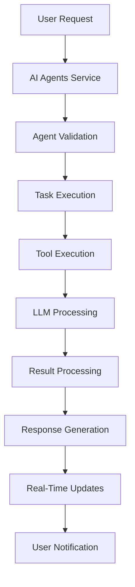
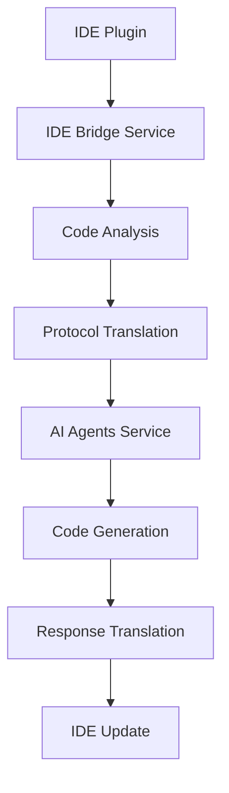
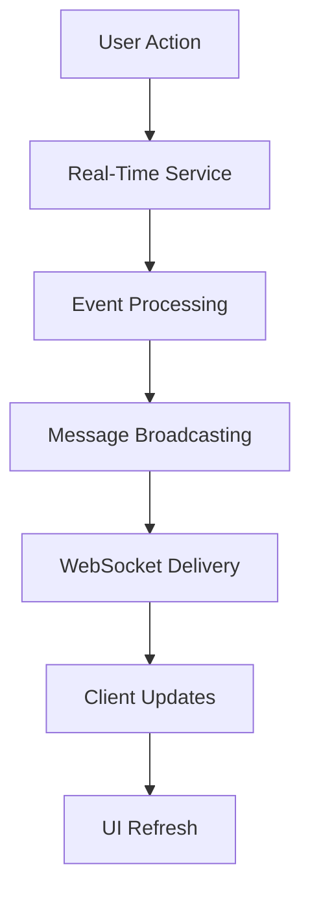

# System Architecture Overview

## Introduction

The Multimodal LLM Stack is a comprehensive platform designed to provide AI agent capabilities, IDE integration, workflow automation, and real-time collaboration. This document provides a high-level overview of the system architecture, components, and their interactions.

## Architecture Principles

### Microservices Architecture
- **Service Independence**: Each service can be developed, deployed, and scaled independently
- **Technology Diversity**: Services can use different technologies and frameworks
- **Fault Isolation**: Failures in one service don't affect others
- **Scalability**: Services can be scaled individually based on demand

### Event-Driven Design
- **Asynchronous Communication**: Services communicate through events and messages
- **Loose Coupling**: Services don't need direct knowledge of each other
- **Real-Time Updates**: Changes are propagated immediately across the system
- **Resilience**: System can handle temporary service unavailability

### API-First Approach
- **RESTful APIs**: Standard HTTP-based communication
- **WebSocket Support**: Real-time bidirectional communication
- **OpenAPI Specification**: Well-documented APIs for easy integration
- **Versioning**: API versioning for backward compatibility

## System Components

### Core Services

#### 1. AI Agents Service
**Purpose**: Manages AI agents, their execution, and lifecycle
**Technology**: FastAPI, Python, PostgreSQL, Redis
**Port**: 3000

**Key Responsibilities**:
- Agent creation, configuration, and management
- Task execution and monitoring
- Performance tracking and analytics
- Integration with LLM providers

**Key Features**:
- Multi-model support (GPT-4, Claude, etc.)
- Tool integration and execution
- Execution history and analytics
- Real-time status updates

#### 2. IDE Bridge Service
**Purpose**: Provides IDE integration and code analysis capabilities
**Technology**: FastAPI, Python, TypeScript
**Port**: 3004

**Key Responsibilities**:
- Code analysis and understanding
- IDE plugin development
- Language server protocol (LSP) support
- Model context protocol (MCP) support

**Key Features**:
- Code completion and suggestions
- Error detection and fixing
- Code generation and refactoring
- Real-time collaboration

#### 3. Protocol Integration Service
**Purpose**: Manages protocol translation and universal compatibility
**Technology**: FastAPI, Python
**Port**: 3005

**Key Responsibilities**:
- Protocol translation (LSP ↔ MCP ↔ REST)
- Universal IDE compatibility
- Protocol registry and management
- Message routing and transformation

**Key Features**:
- Multi-protocol support
- Real-time translation
- Protocol validation
- Compatibility testing

#### 4. Real-Time Collaboration Service
**Purpose**: Enables real-time communication and collaboration
**Technology**: FastAPI, WebSockets, Python
**Port**: 3006

**Key Responsibilities**:
- WebSocket connection management
- Real-time message broadcasting
- Workspace collaboration
- Live agent monitoring

**Key Features**:
- Multi-user collaboration
- Real-time updates
- Workspace management
- Event broadcasting

#### 5. n8n Monitoring Service
**Purpose**: Monitors and manages n8n workflows
**Technology**: FastAPI, Python
**Port**: 3007

**Key Responsibilities**:
- Workflow monitoring and management
- Performance tracking
- Error handling and alerting
- Integration with n8n

**Key Features**:
- Workflow execution monitoring
- Performance analytics
- Error tracking and alerting
- Template management

### Supporting Services

#### 6. n8n Workflow Engine
**Purpose**: Workflow automation and orchestration
**Technology**: Node.js, n8n
**Port**: 5678

**Key Responsibilities**:
- Workflow creation and execution
- Service integration
- Data transformation
- Automation orchestration

#### 7. PostgreSQL Database
**Purpose**: Primary data storage
**Technology**: PostgreSQL
**Port**: 5432

**Key Responsibilities**:
- Persistent data storage
- Transaction management
- Data consistency
- Backup and recovery

#### 8. Redis Cache
**Purpose**: Caching and session management
**Technology**: Redis
**Port**: 6379

**Key Responsibilities**:
- Session storage
- Cache management
- Message queuing
- Rate limiting

#### 9. MinIO Object Storage
**Purpose**: File and object storage
**Technology**: MinIO
**Port**: 9000

**Key Responsibilities**:
- File storage
- Object management
- Backup storage
- Media handling

## Data Flow Architecture

### 1. Agent Execution Flow

### 2. IDE Integration Flow

### 3. Real-Time Collaboration Flow

## Communication Patterns

### 1. Synchronous Communication
- **REST APIs**: Direct service-to-service communication
- **HTTP/HTTPS**: Standard web protocols
- **Request-Response**: Immediate feedback and results

### 2. Asynchronous Communication
- **WebSockets**: Real-time bidirectional communication
- **Message Queues**: Reliable message delivery
- **Event Broadcasting**: System-wide event propagation

### 3. Data Synchronization
- **Database Replication**: Data consistency across services
- **Cache Invalidation**: Real-time cache updates
- **Event Sourcing**: Audit trail and state reconstruction

## Security Architecture

### 1. Authentication and Authorization
- **JWT Tokens**: Stateless authentication
- **Role-Based Access Control**: Granular permissions
- **API Key Management**: Service-to-service authentication

### 2. Data Protection
- **Encryption in Transit**: TLS/SSL for all communications
- **Encryption at Rest**: Database and file encryption
- **Secure Storage**: Encrypted sensitive data storage

### 3. Network Security
- **Firewall Rules**: Network access control
- **VPN Support**: Secure remote access
- **DDoS Protection**: Rate limiting and traffic filtering

## Scalability and Performance

### 1. Horizontal Scaling
- **Load Balancing**: Distribute traffic across instances
- **Service Replication**: Multiple instances of each service
- **Database Sharding**: Distribute data across multiple databases

### 2. Vertical Scaling
- **Resource Optimization**: Efficient resource utilization
- **Caching Strategies**: Reduce database load
- **Connection Pooling**: Optimize database connections

### 3. Performance Monitoring
- **Metrics Collection**: System and application metrics
- **Performance Profiling**: Identify bottlenecks
- **Alerting**: Proactive issue detection

## Deployment Architecture

### 1. Containerization
- **Docker**: Service containerization
- **Docker Compose**: Local development and testing
- **Kubernetes**: Production orchestration

### 2. Service Discovery
- **DNS-Based**: Standard DNS resolution
- **Service Registry**: Dynamic service discovery
- **Health Checks**: Service availability monitoring

### 3. Configuration Management
- **Environment Variables**: Service configuration
- **Config Maps**: Kubernetes configuration
- **Secrets Management**: Secure configuration storage

## Monitoring and Observability

### 1. Logging
- **Structured Logging**: JSON-formatted logs
- **Log Aggregation**: Centralized log collection
- **Log Analysis**: Search and analysis capabilities

### 2. Metrics
- **Application Metrics**: Service-specific metrics
- **System Metrics**: Infrastructure metrics
- **Business Metrics**: User and usage metrics

### 3. Tracing
- **Distributed Tracing**: Request flow tracking
- **Performance Analysis**: Latency and bottleneck identification
- **Error Tracking**: Error propagation and analysis

## Development and DevOps

### 1. Development Workflow
- **Git-Based**: Version control and collaboration
- **CI/CD Pipeline**: Automated testing and deployment
- **Code Review**: Quality assurance and knowledge sharing

### 2. Testing Strategy
- **Unit Testing**: Individual component testing
- **Integration Testing**: Service interaction testing
- **End-to-End Testing**: Complete workflow testing

### 3. Deployment Strategy
- **Blue-Green Deployment**: Zero-downtime deployments
- **Canary Releases**: Gradual rollout of changes
- **Rollback Capability**: Quick recovery from issues

## Future Considerations

### 1. Technology Evolution
- **AI Model Updates**: Integration of new models
- **Protocol Extensions**: Support for new protocols
- **Performance Improvements**: Continuous optimization

### 2. Feature Expansion
- **Multi-Modal Support**: Image, audio, and video processing
- **Advanced Analytics**: Machine learning insights
- **Enterprise Features**: Advanced security and compliance

### 3. Scalability Enhancements
- **Global Distribution**: Multi-region deployment
- **Edge Computing**: Reduced latency and improved performance
- **Auto-Scaling**: Dynamic resource allocation

## Conclusion

The Multimodal LLM Stack architecture is designed to be:

- **Scalable**: Handle growing user demands
- **Reliable**: Provide consistent service availability
- **Secure**: Protect user data and system integrity
- **Maintainable**: Easy to develop, deploy, and operate
- **Extensible**: Support future growth and new features

This architecture provides a solid foundation for building intelligent automation solutions while maintaining flexibility for future enhancements and improvements.