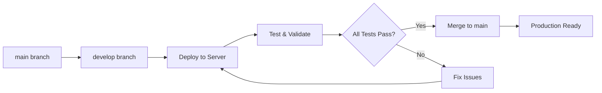

# 🚀 Development Environment Deployment Guide

This guide covers deploying the Multimodal LLM Stack to your development/testing server following DevOps best practices.

## 🎯 Deployment Strategy Overview

We'll use the **Git Flow approach** with a `develop` branch for safe testing before promoting to production.

### 🌳 Branch Strategy for Deployment



## 🔐 Prerequisites: Passwordless Sudo Setup

### Why Passwordless Sudo?

The deployment scripts need sudo access for:
- **NVMe storage management** (`/mnt/nvme/` directories)
- **Package installation** (jq for benchmarking)
- **Docker group management**
- **Firewall configuration** (production)

### Setup Passwordless Sudo

```bash
# On your RTX 3090 server, run:
./scripts/setup-passwordless-sudo.sh
```

This configures **specific, limited sudo permissions** for:
- ✅ NVMe directory creation and ownership
- ✅ Package installation (jq, curl)
- ✅ Docker service management
- ✅ Firewall management
- ✅ SSL certificate management

**Security Note**: Only grants specific permissions needed for deployment, not full sudo access.

## 🚀 Step-by-Step Deployment Process

### Step 1: Create Development Branch

```bash
# On your local machine
cd /home/marktacular/git-repos/llm-multimodal-stack
git checkout -b develop
git push -u origin develop
```

### Step 2: Server Preparation

```bash
# SSH to your RTX 3090 server
ssh your-server

# Clone the repository
git clone https://github.com/markwoitaszek/llm-multimodal-stack.git
cd llm-multimodal-stack

# Switch to develop branch
git checkout develop

# Set up passwordless sudo (one-time setup)
./scripts/setup-passwordless-sudo.sh

# Log out and back in to apply group changes
exit
ssh your-server
cd llm-multimodal-stack
```

### Step 3: Environment Setup

```bash
# Run the main setup script (now with passwordless operations)
./scripts/setup.sh

# This will:
# ✅ Check Docker and NVIDIA runtime
# ✅ Create .env with secure passwords
# ✅ Configure NVMe storage paths (if available)
# ✅ Set up GPU optimization
# ✅ Create necessary directories
```

### Step 4: Configuration Review

```bash
# Review the generated configuration
cat .env

# Key settings to verify for RTX 3090:
# VLLM_MODEL=microsoft/DialoGPT-medium  # Start with smaller model
# CUDA_VISIBLE_DEVICES=0
# GPU memory and storage paths should be configured automatically
```

### Step 5: Staged Deployment

```bash
# Start infrastructure services first
echo "🏗️ Starting infrastructure services..."
docker-compose up -d postgres qdrant minio redis

# Wait and check health
sleep 30
./scripts/health-check.sh

# Start compute services (this will download models)
echo "🧠 Starting compute services..."
docker-compose up -d vllm litellm

# Wait for model loading (can take 5-10 minutes first time)
echo "⏳ Waiting for models to load..."
sleep 120
./scripts/health-check.sh

# Start application services
echo "🎭 Starting application services..."
docker-compose up -d multimodal-worker retrieval-proxy

# Wait and check
sleep 60
./scripts/health-check.sh

# Start web interface
echo "🌐 Starting web interface..."
docker-compose up -d openwebui

# Final health check
sleep 30
./scripts/health-check.sh
```

### Step 6: Comprehensive Testing

```bash
# Run full test suite
./scripts/test-multimodal.sh

# Run performance benchmarks
./scripts/benchmark.sh

# Manual verification
curl http://localhost:4000/health  # LiteLLM
curl http://localhost:8001/health  # Multimodal Worker
curl http://localhost:8002/health  # Retrieval Proxy

# Check web interface
curl http://localhost:3000  # OpenWebUI
```

### Step 7: Monitor and Validate

```bash
# Monitor GPU usage during operation
watch -n 5 nvidia-smi

# Monitor Docker resources
docker stats

# Check service logs
docker-compose logs --tail=50 -f

# Verify all services are stable
docker-compose ps
```

## 🛡️ Troubleshooting Development Deployment

### Common Issues and Solutions

#### 1. **GPU Not Detected**
```bash
# Check NVIDIA Docker runtime
docker info | grep nvidia

# If not found, install nvidia-container-toolkit
sudo apt-get update
sudo apt-get install nvidia-container-toolkit
sudo systemctl restart docker
```

#### 2. **Permission Issues with NVMe**
```bash
# Re-run passwordless sudo setup
./scripts/setup-passwordless-sudo.sh

# Manually fix permissions if needed
sudo chown -R $USER:$USER /mnt/nvme/
```

#### 3. **Model Download Issues**
```bash
# Check internet connectivity
curl -I https://huggingface.co

# Pre-download models manually
docker-compose run --rm multimodal-worker python -c "
from transformers import CLIPModel
model = CLIPModel.from_pretrained('openai/clip-vit-base-patch32')
print('CLIP model downloaded successfully')
"
```

#### 4. **Memory Issues**
```bash
# Check system memory
free -h

# Reduce GPU memory utilization if needed
sed -i 's/gpu-memory-utilization 0.8/gpu-memory-utilization 0.6/' docker-compose.yml
docker-compose restart vllm
```

#### 5. **Port Conflicts**
```bash
# Check for port conflicts
netstat -tulpn | grep -E ':(3000|4000|5432|6333|8001|8002|9000)'

# Kill conflicting processes if needed
sudo fuser -k 8001/tcp  # Example for port 8001
```

## 🔄 Development Workflow

### Making Changes During Development

```bash
# Make configuration changes
nano .env
nano docker-compose.yml

# Apply changes
docker-compose down
docker-compose up -d

# Test changes
./scripts/health-check.sh
./scripts/test-multimodal.sh
```

### Committing Development Changes

```bash
# Commit successful configurations
git add .
git commit -m "🔧 feat: configure deployment for RTX 3090 server

- Optimize GPU memory utilization for 24GB VRAM
- Configure NVMe storage paths
- Adjust model selection for development
- Add server-specific optimizations"

# Push to develop branch
git push origin develop
```

### Promoting to Production

```bash
# After successful testing, merge to main
git checkout main
git merge develop --no-ff -m "🚀 deploy: promote tested configuration to main

Tested and validated on RTX 3090 server:
- All services healthy
- GPU optimization confirmed
- NVMe storage working
- Performance benchmarks passed"

git push origin main
```

## 📊 Monitoring Development Deployment

### Real-time Monitoring

```bash
# GPU monitoring
watch -n 1 'nvidia-smi --query-gpu=utilization.gpu,memory.used,memory.total,temperature.gpu --format=csv,noheader,nounits'

# Service monitoring
watch -n 5 'docker-compose ps && echo "=== Resource Usage ===" && docker stats --no-stream'

# Log monitoring
tail -f logs/*.log 2>/dev/null || echo "No log files yet"
```

### Performance Validation

```bash
# Automated performance tests
./scripts/benchmark.sh

# Manual performance tests
time curl -X POST http://localhost:8001/api/v1/process/text \
  -H "Content-Type: application/json" \
  -d '{"text": "Test performance", "document_name": "perf_test.txt"}'

# Load testing (if needed)
for i in {1..10}; do
  curl -s http://localhost:4000/health &
done
wait
```

## 🔧 Development Environment Optimizations

### RTX 3090 Specific Settings

```bash
# Optimize for 24GB VRAM
echo 'VLLM_GPU_MEMORY_UTILIZATION=0.85' >> .env

# Use larger models if desired
echo 'VLLM_MODEL=EleutherAI/gpt-neo-2.7B' >> .env  # ~11GB model

# Enable all GPU features
echo 'CUDA_VISIBLE_DEVICES=0' >> .env
```

### NVMe Storage Optimization

```bash
# Verify NVMe is being used
df -h | grep nvme

# Check I/O performance
sudo iotop -o  # Monitor disk I/O

# Test storage performance
dd if=/dev/zero of=/mnt/nvme/test_file bs=1G count=1 oflag=direct
rm /mnt/nvme/test_file
```

## 📋 Development Deployment Checklist

### Pre-Deployment
- [ ] Passwordless sudo configured
- [ ] Docker and NVIDIA runtime installed
- [ ] NVMe storage available and mounted
- [ ] Git repository cloned
- [ ] Develop branch checked out

### Deployment
- [ ] `./scripts/setup-passwordless-sudo.sh` completed
- [ ] `./scripts/setup.sh` completed successfully
- [ ] Infrastructure services started and healthy
- [ ] Compute services started and models loaded
- [ ] Application services started and responsive
- [ ] Web interface accessible

### Validation
- [ ] All health checks pass
- [ ] Performance tests complete
- [ ] GPU utilization optimal
- [ ] NVMe storage being used
- [ ] All APIs responding correctly
- [ ] Web interface functional

### Post-Deployment
- [ ] Monitor for 24 hours
- [ ] Document any issues found
- [ ] Commit working configuration
- [ ] Plan production promotion

## 🚨 Emergency Procedures

### Quick Rollback
```bash
# Stop all services
docker-compose down

# Reset to last known good state
git reset --hard HEAD^

# Restart with previous configuration
docker-compose up -d
```

### Complete Reset
```bash
# Nuclear option - complete reset
docker-compose down -v
docker system prune -af
git clean -fdx
./scripts/setup.sh
```

### Backup Before Deployment
```bash
# Backup current state before major changes
tar -czf "backup-$(date +%Y%m%d_%H%M%S).tar.gz" .env docker-compose.override.yml

# Backup data volumes
docker run --rm -v llm-multimodal-stack_postgres_data:/data -v $(pwd):/backup alpine tar czf /backup/postgres-backup.tar.gz -C /data .
```

---

This development deployment approach ensures **maximum safety** while following **enterprise DevOps best practices**. The passwordless sudo setup streamlines operations while maintaining security through specific, limited permissions.

Ready to start the deployment? 🚀
