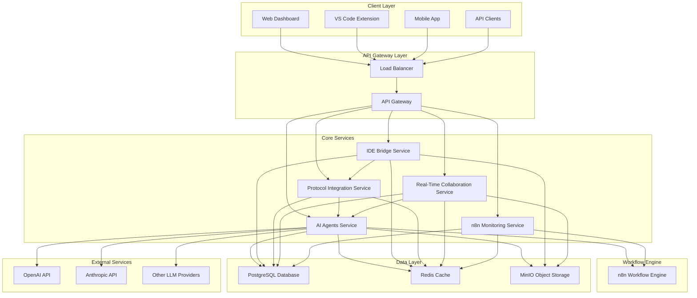
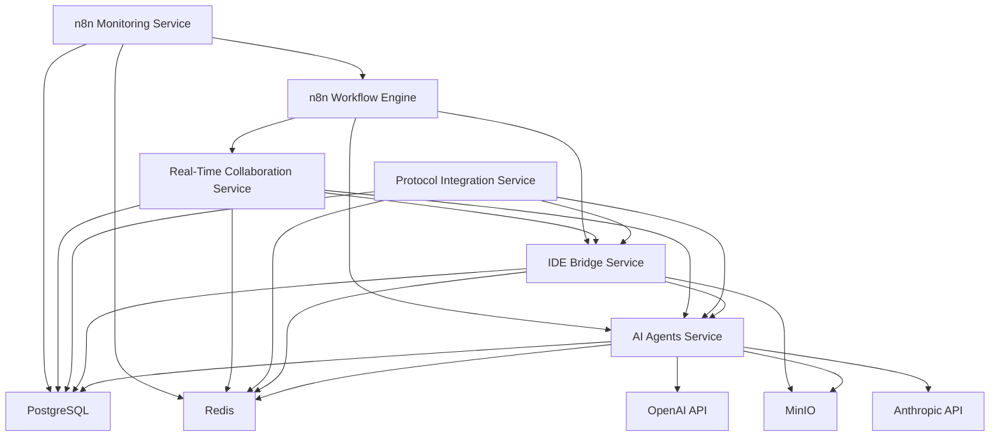
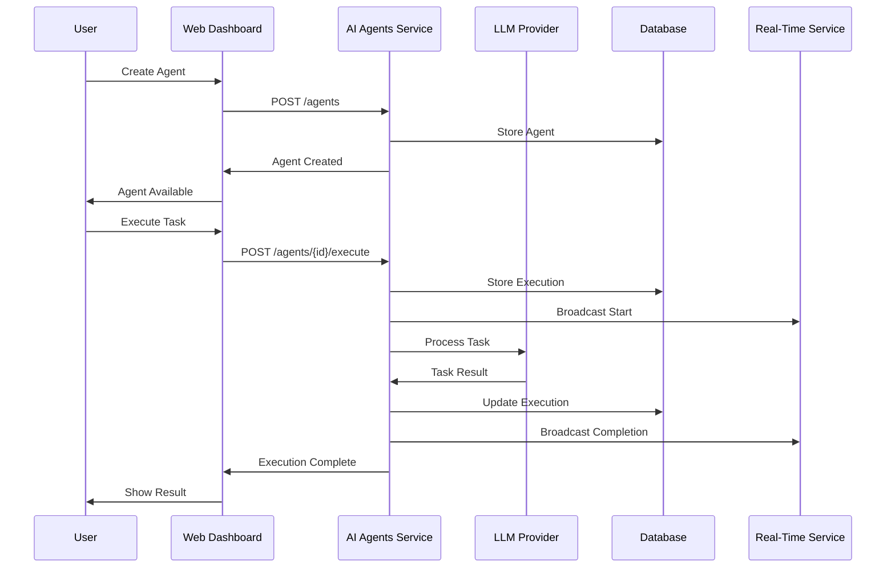
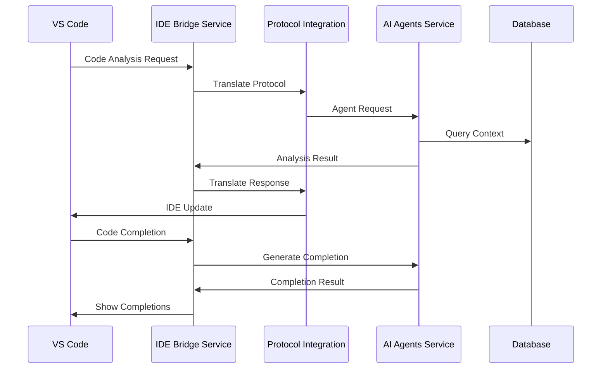
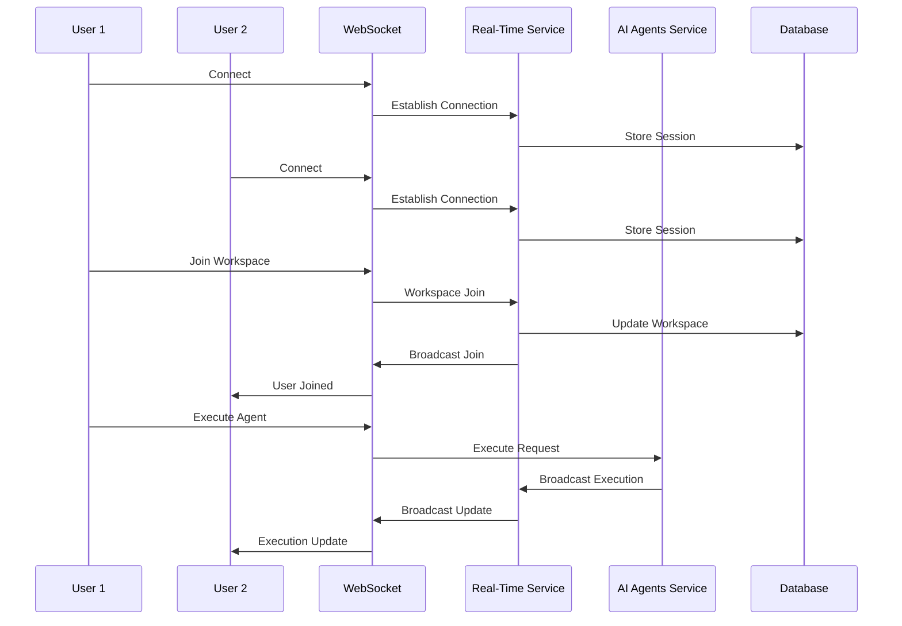
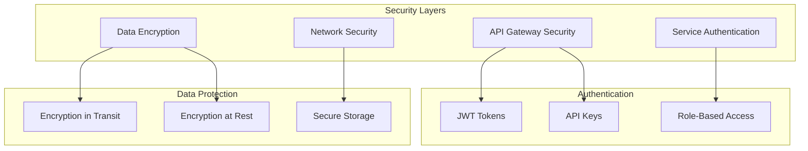
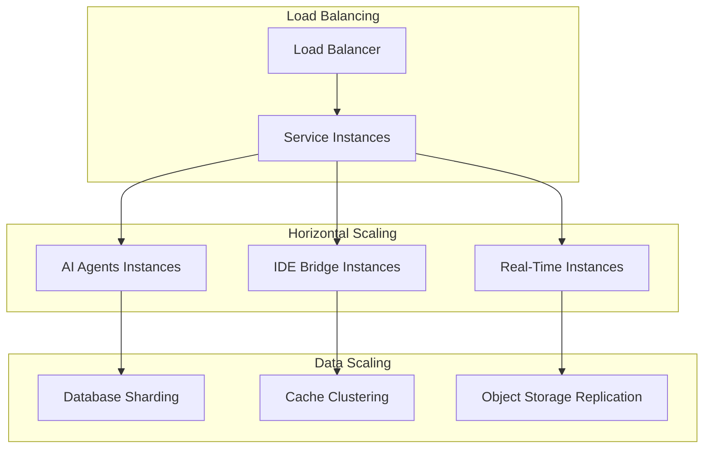
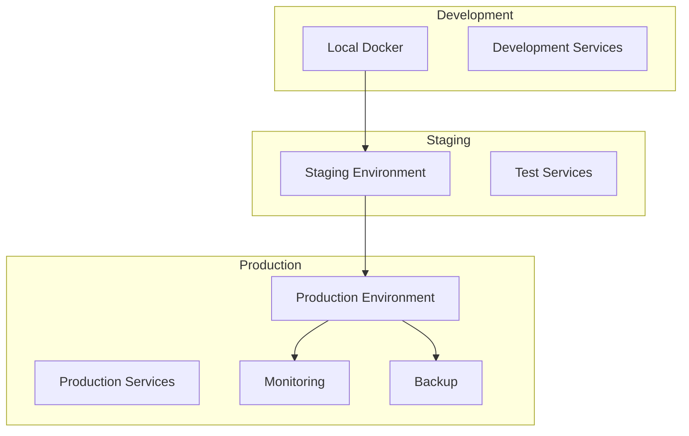
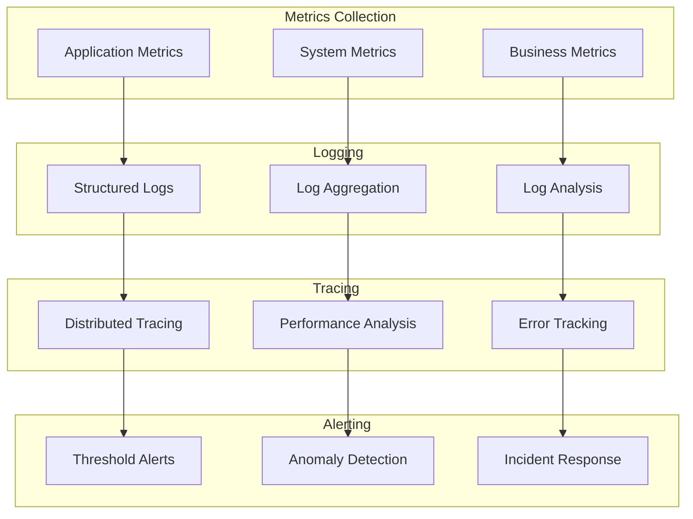

# Overall System Architecture

## System Overview

The Multimodal LLM Stack is a comprehensive platform that provides AI agent capabilities, IDE integration, workflow automation, and real-time collaboration. The system is built using a microservices architecture with clear separation of concerns and well-defined interfaces.

## High-Level Architecture

## Service Dependencies

## Data Flow Architecture

### 1. Agent Execution Flow

### 2. IDE Integration Flow

### 3. Real-Time Collaboration Flow

## Component Details

### Core Services

#### AI Agents Service
- **Port**: 3000
- **Technology**: FastAPI, Python
- **Responsibilities**:
  - Agent lifecycle management
  - Task execution and monitoring
  - Performance analytics
  - LLM integration

#### IDE Bridge Service
- **Port**: 3004
- **Technology**: FastAPI, Python, TypeScript
- **Responsibilities**:
  - Code analysis and understanding
  - IDE plugin development
  - Language server protocol support
  - Model context protocol support

#### Protocol Integration Service
- **Port**: 3005
- **Technology**: FastAPI, Python
- **Responsibilities**:
  - Protocol translation and conversion
  - Universal IDE compatibility
  - Message routing and transformation
  - Protocol validation

#### Real-Time Collaboration Service
- **Port**: 3006
- **Technology**: FastAPI, WebSockets, Python
- **Responsibilities**:
  - WebSocket connection management
  - Real-time message broadcasting
  - Workspace collaboration
  - Live agent monitoring

#### n8n Monitoring Service
- **Port**: 3007
- **Technology**: FastAPI, Python
- **Responsibilities**:
  - Workflow monitoring and management
  - Performance tracking
  - Error handling and alerting
  - Integration with n8n

### Data Layer

#### PostgreSQL Database
- **Port**: 5432
- **Technology**: PostgreSQL
- **Responsibilities**:
  - Persistent data storage
  - Transaction management
  - Data consistency
  - Backup and recovery

#### Redis Cache
- **Port**: 6379
- **Technology**: Redis
- **Responsibilities**:
  - Session storage
  - Cache management
  - Message queuing
  - Rate limiting

#### MinIO Object Storage
- **Port**: 9000
- **Technology**: MinIO
- **Responsibilities**:
  - File storage
  - Object management
  - Backup storage
  - Media handling

## Security Architecture

## Scalability Architecture

## Deployment Architecture

## Monitoring and Observability

## Technology Stack

### Backend Services
- **Python**: FastAPI, asyncio, pydantic
- **Database**: PostgreSQL, Redis
- **Storage**: MinIO
- **Workflow**: n8n
- **Authentication**: JWT, OAuth2

### Frontend
- **Web Dashboard**: React, TypeScript, Tailwind CSS
- **VS Code Extension**: TypeScript, VS Code API
- **Mobile App**: React Native (future)

### Infrastructure
- **Containerization**: Docker, Docker Compose
- **Orchestration**: Kubernetes (production)
- **Monitoring**: Prometheus, Grafana
- **Logging**: ELK Stack
- **CI/CD**: GitHub Actions

## Performance Characteristics

### Response Times
- **API Endpoints**: < 200ms average
- **Agent Execution**: 2-30 seconds depending on complexity
- **Real-Time Updates**: < 100ms
- **Database Queries**: < 50ms average

### Throughput
- **API Requests**: 1000+ requests/second
- **Concurrent Users**: 100+ simultaneous users
- **Agent Executions**: 50+ concurrent executions
- **WebSocket Connections**: 500+ concurrent connections

### Scalability
- **Horizontal Scaling**: All services can be scaled horizontally
- **Database Scaling**: Read replicas and sharding support
- **Cache Scaling**: Redis clustering support
- **Storage Scaling**: MinIO distributed mode support

## Conclusion

The Multimodal LLM Stack architecture provides a robust, scalable, and maintainable platform for AI agent development and deployment. The microservices architecture ensures flexibility and independence, while the comprehensive monitoring and observability features provide insights into system performance and health.

The system is designed to handle growing user demands while maintaining high availability and performance. The clear separation of concerns and well-defined interfaces make it easy to extend and modify individual components without affecting the entire system.