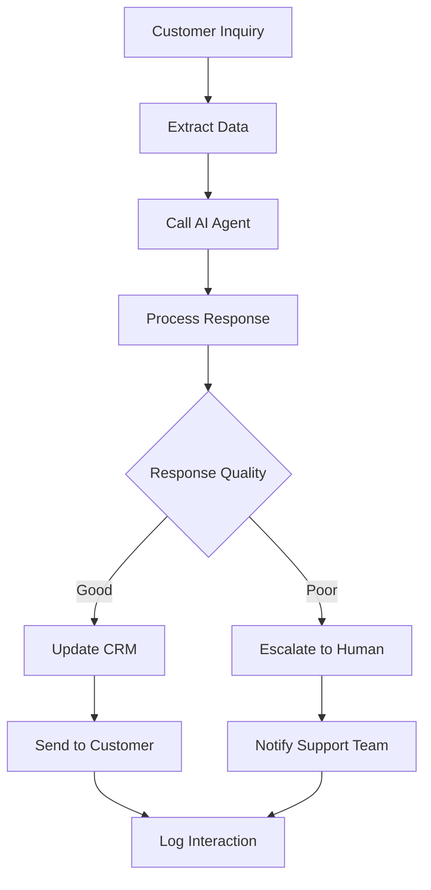
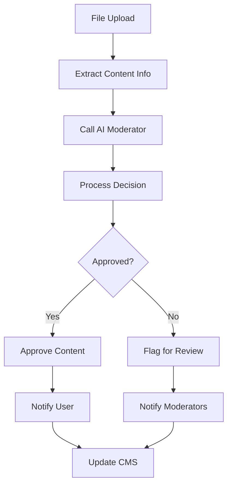
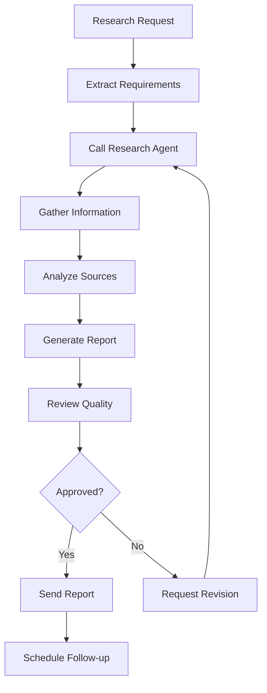

# n8n Integration Guide for AI Agents Service

## Overview

This guide explains how to integrate the AI Agents service with n8n workflows for powerful automation and orchestration capabilities.

## Why Integrate AI Agents with n8n?

### Current Setup Benefits:
- ✅ **Custom Control**: Full programmatic control over agent behavior
- ✅ **Production Ready**: Robust, scalable implementation
- ✅ **Tool Integration**: Seamless integration with existing services
- ✅ **Persistent Memory**: PostgreSQL-backed conversation history

### n8n Integration Benefits:
- 🔄 **Workflow Orchestration**: Complex business process automation
- 🔗 **Service Integration**: Connect with 400+ external services
- ⚡ **Event-Driven**: Trigger agents based on various events
- 📊 **Monitoring**: Built-in workflow monitoring and logging

## Integration Architecture

```
┌─────────────────┐    ┌─────────────────┐    ┌─────────────────┐
│   n8n Workflows │────│  AI Agents API  │────│  External APIs  │
│   (Orchestration)│    │  (Your Current) │    │  (CRM, Email,   │
│                 │    │                 │    │   Slack, etc.)  │
└─────────────────┘    └─────────────────┘    └─────────────────┘
```

## Integration Patterns

### 1. Event-Triggered AI Agents
```json
{
  "trigger": "new_customer_ticket",
  "action": "create_ai_response",
  "follow_up": "update_crm_and_notify"
}
```

### 2. Scheduled AI Tasks
```json
{
  "schedule": "daily_at_9am",
  "action": "generate_daily_reports",
  "output": "send_to_management"
}
```

### 3. Multi-Step AI Workflows
```json
{
  "step1": "analyze_data",
  "step2": "generate_insights", 
  "step3": "create_presentation",
  "step4": "schedule_meeting"
}
```

## API Endpoints for n8n Integration

### Agent Management
```bash
# Create agent
POST /agents
{
  "name": "workflow-agent",
  "goal": "Execute n8n workflow tasks",
  "tools": ["search_content", "generate_text"]
}

# List agents
GET /agents

# Get agent details
GET /agents/{agent_id}
```

### Agent Execution
```bash
# Execute agent task
POST /agents/{agent_id}/execute
{
  "task": "Process customer inquiry",
  "user_id": "n8n-system"
}

# Get execution history
GET /agents/{agent_id}/history

# Get agent statistics
GET /agents/{agent_id}/stats
```

### Template Management
```bash
# List templates
GET /templates

# Create from template
POST /agents/from-template
{
  "template_name": "customer_support_bot",
  "custom_name": "support-agent-001"
}
```

## n8n Node Configurations

### HTTP Request Node for AI Agents
```json
{
  "name": "Call AI Agent",
  "type": "n8n-nodes-base.httpRequest",
  "parameters": {
    "url": "http://ai-agents:8003/agents/{agent_id}/execute",
    "method": "POST",
    "headers": {
      "Content-Type": "application/json"
    },
    "body": {
      "task": "{{ $json.task_description }}",
      "user_id": "n8n-system"
    }
  }
}
```

### Conditional Logic for AI Responses
```json
{
  "name": "Check AI Response Quality",
  "type": "n8n-nodes-base.if",
  "parameters": {
    "conditions": {
      "string": [
        {
          "value1": "={{ $json.success }}",
          "operation": "equal",
          "value2": "true"
        }
      ]
    }
  }
}
```

## Example Workflows

### 1. Customer Support Automation


### 2. Content Moderation


### 3. Research Assistant


## Environment Variables for n8n

Add these to your n8n environment:

```bash
# AI Agents Service
AI_AGENTS_URL=http://ai-agents:8003
AI_AGENTS_API_KEY=your-api-key-if-needed

# External Services
CRM_API_KEY=your-crm-api-key
EMAIL_API_KEY=your-email-service-key
SLACK_WEBHOOK_URL=your-slack-webhook-url
CMS_API_KEY=your-cms-api-key
```

## Best Practices

### 1. Error Handling
- Always check AI agent response success status
- Implement fallback mechanisms for failed AI calls
- Log all AI interactions for debugging

### 2. Performance Optimization
- Use async HTTP requests for AI agent calls
- Implement caching for repeated queries
- Set appropriate timeouts for AI operations

### 3. Security
- Use dedicated service accounts for n8n
- Implement rate limiting for AI agent calls
- Validate all inputs before sending to AI agents

### 4. Monitoring
- Track AI agent execution times
- Monitor success/failure rates
- Set up alerts for critical failures

## Troubleshooting

### Common Issues

1. **Connection Refused**
   - Check if AI Agents service is running
   - Verify network connectivity between n8n and AI Agents

2. **Authentication Errors**
   - Verify API keys and credentials
   - Check user permissions for AI agent access

3. **Timeout Errors**
   - Increase timeout values for long-running AI tasks
   - Consider implementing async processing

4. **Memory Issues**
   - Monitor AI agent memory usage
   - Implement memory cleanup for long-running workflows

## Advanced Integration Patterns

### 1. Multi-Agent Workflows
```json
{
  "workflow": "complex_analysis",
  "agents": [
    {"role": "data_analyzer", "task": "analyze_data"},
    {"role": "report_writer", "task": "write_report"},
    {"role": "quality_checker", "task": "review_output"}
  ]
}
```

### 2. Agent Chaining
```json
{
  "chain": [
    "agent1_output → agent2_input",
    "agent2_output → agent3_input",
    "agent3_output → final_result"
  ]
}
```

### 3. Parallel Processing
```json
{
  "parallel_agents": [
    "analyze_sentiment",
    "extract_keywords", 
    "detect_language"
  ],
  "merge_strategy": "combine_results"
}
```

## Conclusion

Integrating your AI Agents service with n8n provides powerful orchestration capabilities while maintaining the flexibility and control of your custom implementation. This hybrid approach gives you the best of both worlds:

- **Custom AI Agents**: Full control over agent behavior and capabilities
- **n8n Orchestration**: Powerful workflow automation and service integration
- **Scalable Architecture**: Production-ready system that can grow with your needs

Start with simple workflows and gradually build more complex automation patterns as you become comfortable with the integration.
