# Multimodal LLM Stack - Implementation Workflow Diagram

## Architecture Overview

```mermaid
graph TB
    %% External Systems
    subgraph ExternalSys[External Systems]
        Vault["OpenBao Vault<br/>Secret Management"]
        Semaphore["Semaphore CI/CD<br/>Control Plane"]
        K8s["Kubernetes<br/>Production Runtime"]
    end

    %% Development Workflow
    subgraph DevWorkflow[Development Workflow]
        Dev["Developer"]
        SchemaEdit["Edit compose-schema.yaml"]
        Validate["make validate-schema"]
        Generate["make generate-compose"]
        DevStart["make start-dev"]
    end

    %% Schema Management
    subgraph SchemaSystem[Unified Schema System]
        Schema["compose-schema.yaml<br/>Single Source of Truth"]
        Generator["compose-generator.py<br/>Schema Processor"]
        GeneratedFiles["Generated Compose Files<br/>compose.yml, compose.development.yml<br/>compose.staging.yml, compose.production.yml"]
    end

    %% Environment Templates
    subgraph EnvTemplate[Environment Templates]
        EnvTemplates["env-templates/*.env.j2<br/>Jinja2 Templates"]
        AnsiblePlay["ansible/render-env-templates.yml<br/>Template Renderer"]
        RenderedEnv["Rendered Environment Files<br/>/etc/llm-ms/.env.d/"]
    end

    %% Service Categories
    subgraph CoreSvc[Core Services]
        Postgres[("PostgreSQL<br/>Database")]
        Redis[("Redis<br/>Cache")]
        Qdrant[("Qdrant<br/>Vector DB")]
        Minio[("MinIO<br/>Object Storage")]
    end

    subgraph InferenceSvc[Inference Services]
        VLLM["vLLM<br/>Model Server<br/>:8000"]
        LiteLLM["LiteLLM<br/>API Gateway<br/>:4000"]
    end

    subgraph MultimodalSvc[Multimodal Services]
        MultiWorker["Multimodal Worker<br/>Processing<br/>:8001"]
        RetrievalProxy["Retrieval Proxy<br/>Search<br/>:8002"]
    end

    subgraph AISvc[AI Services]
        AIAgents["AI Agents<br/>Orchestration<br/>:8003"]
        MemorySystem["Memory System<br/>Persistence<br/>:8005"]
        SearchEngine["Search Engine<br/>Query Processing<br/>:8004"]
        UserMgmt["User Management<br/>Authentication<br/>:8006"]
    end

    subgraph UIWorkflow[UI & Workflow]
        OpenWebUI["OpenWebUI<br/>Interface<br/>:3030"]
        N8N["n8n<br/>Workflow Engine<br/>:5678"]
        N8NMonitor["n8n Monitoring<br/>Dashboard<br/>:8008"]
    end

    subgraph MonitorStack[Monitoring Stack]
        ELK["ELK Stack<br/>Logging & Analytics"]
        Prometheus["Prometheus<br/>Metrics"]
        Grafana["Grafana<br/>Dashboards"]
    end

    %% Deployment Environments
    subgraph DeploymentEnvs[Deployment Environments]
        DevEnv["Development<br/>Core Services Only<br/>Debug Mode<br/>Local Development"]
        StagingEnv["Staging<br/>Full Stack<br/>Testing Environment<br/>Profile-based Services"]
        ProdEnv["Production<br/>Production Optimized<br/>Resource Limits<br/>High Availability"]
    end

    %% Workflow Connections
    Dev --> SchemaEdit
    SchemaEdit --> Validate
    Validate --> Generate
    Generate --> DevStart

    Schema --> Generator
    Generator --> GeneratedFiles

    Vault --> EnvTemplates
    EnvTemplates --> AnsiblePlay
    AnsiblePlay --> RenderedEnv

    Semaphore --> AnsiblePlay
    Semaphore --> GeneratedFiles

    %% Service Dependencies
    Postgres --> AIAgents
    Postgres --> UserMgmt
    Redis --> MultiWorker
    Redis --> MemorySystem
    Qdrant --> RetrievalProxy
    Qdrant --> SearchEngine
    Minio --> MultiWorker

    VLLM --> LiteLLM
    LiteLLM --> MultiWorker
    LiteLLM --> AIAgents

    MultiWorker --> RetrievalProxy
    AIAgents --> MemorySystem
    AIAgents --> SearchEngine
    AIAgents --> UserMgmt

    OpenWebUI --> LiteLLM
    N8N --> AIAgents
    N8NMonitor --> N8N

    %% Environment Deployments
    GeneratedFiles --> DevEnv
    GeneratedFiles --> StagingEnv
    GeneratedFiles --> ProdEnv

    RenderedEnv --> DevEnv
    RenderedEnv --> StagingEnv
    RenderedEnv --> ProdEnv

    %% Production Deployment
    ProdEnv --> K8s

    %% Monitoring
    ELK --> ProdEnv
    Prometheus --> ProdEnv
    Grafana --> ProdEnv

    %% Styling
    classDef coreService fill:#e1f5fe
    classDef inferenceService fill:#f3e5f5
    classDef multimodalService fill:#e8f5e8
    classDef aiService fill:#fff3e0
    classDef uiService fill:#fce4ec
    classDef monitoringService fill:#f1f8e9
    classDef externalService fill:#ffebee
    classDef environment fill:#e0f2f1

    class Postgres,Redis,Qdrant,Minio coreService
    class VLLM,LiteLLM inferenceService
    class MultiWorker,RetrievalProxy multimodalService
    class AIAgents,MemorySystem,SearchEngine,UserMgmt aiService
    class OpenWebUI,N8N,N8NMonitor uiService
    class ELK,Prometheus,Grafana monitoringService
    class Vault,Semaphore,K8s externalService
    class DevEnv,StagingEnv,ProdEnv environment
```

## Key Implementation Features

### 1. Unified Schema Architecture
- **Single Source of Truth**: All Docker Compose configurations defined in `schemas/compose-schema.yaml`
- **Code Generation**: Python script generates all compose files from schema
- **Environment Overrides**: Environment-specific configurations and profiles
- **Validation**: Schema validation prevents configuration errors

### 2. Environment Template System
- **Jinja2 Templates**: Environment variables managed through templates
- **OpenBao Integration**: Secrets managed through vault with `vault_` prefix
- **Service-Specific Templates**: Individual templates per service category
- **Ansible Rendering**: Automated template rendering and deployment

### 3. Service Architecture
- **Core Services**: PostgreSQL, Redis, Qdrant, MinIO (essential infrastructure)
- **Inference Services**: vLLM, LiteLLM (AI model serving)
- **Multimodal Services**: Multimodal Worker, Retrieval Proxy (content processing)
- **AI Services**: AI Agents, Memory System, Search Engine, User Management
- **UI & Workflow**: OpenWebUI, n8n, n8n Monitoring (user interfaces)
- **Monitoring**: ELK Stack, Prometheus, Grafana (observability)

### 4. Deployment Workflow
- **Development**: Local development with debug mode and core services
- **Staging**: Full stack testing with profile-based service selection
- **Production**: Optimized deployment with resource limits and high availability
- **Automation**: Ansible playbooks for automated deployment and configuration

### 5. Control Plane Integration
- **Semaphore CI/CD**: Automated deployment pipeline
- **OpenBao Vault**: Centralized secret management
- **Kubernetes**: Production runtime environment
- **Profile Management**: Flexible service deployment based on environment needs